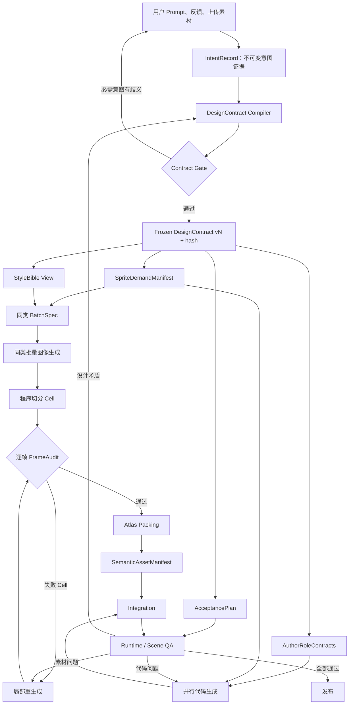

# Design Contract 驱动的游戏生成流水线方案

> 文档状态：方案稿（Proposal）  
> 版本：v0.1  
> 创建时间：2026-07-18 11:26:50 -04:00  
> 时区：America/New_York  
> 适用项目：当前仓库
> 说明：本文档基于当前项目的规划、素材、代码生成、Author Contract、QA 和修复节点整理；本次仅创建文档，没有修改业务代码。

## 1. 一句话结论

不让图像模型直接负责最终雪碧图，也不让每个 agent 重新解释用户 prompt。

采用以下分工：

> 原始意图完整留档，Design Contract 作为唯一执行事实源；语义上逐帧管理，生成上同类批量，工程上程序切分、验证和打包，运行时按 semantic ID 引用。

这里的“唯一事实源”指所有下游设计、素材、代码和 QA 决策都必须来自冻结的 Design Contract；原始 prompt 仍然保留为可追溯证据，但不作为下游 agent 的旁路输入。

## 2. 当前项目结构与问题

当前项目已经具备目标架构的大部分基础：

| 当前结构 | 在目标方案中的位置 |
|---|---|
| `intent_spec_node`、`gameplay_planning_node` | IntentRecord 和前置意图解析 |
| `game_design_node`、`content_plan_node`、`balance_plan_node` | DesignContract Compiler 的输入 |
| `build_sprite_demand_manifest()` | SpriteDemandCompiler 的已有基础 |
| `asset_processing_node`、`game_assets.py` | 素材规划、生成和处理 |
| `author_contract.py` | 代码实现层的 AuthorRoleContract |
| `author_orchestration.py` | Contract 冻结和多角色代码编排 |
| `codegen.py` | 代码生成下游 |
| `validation_nodes.py`、`repair.py` | Acceptance、QA 和修复路由 |
| `graph.py` | 总体流水线编排 |

当前存在的关键缺口：

1. Design Contract 在代码 author team 内部生成，晚于素材处理；
2. 素材和代码流程仍直接读取 `game_spec`、`game_design` 和 prompt；
3. 现有 Author Contract 主要描述 state、events、modules、ownership 和 acceptance，不是完整的领域设计合同；
4. 现有 sprite demand 已有 semantic ID、consumer、required、batch group、anchor、variant strategy 等字段，但还没有成为所有下游的唯一来源；
5. 合同中存在结构性裁剪，不能让重要意图被静默截断。

当前图执行顺序是：

```text
intent_spec
→ gameplay_planning
→ archetype_router
→ asset_processing
→ game_design
→ content_plan
→ balance_plan
→ asset_generation
→ code_generation
```

目标是将 Contract 冻结移动到资产处理之前。

## 3. 总体架构



## 4. 事实来源分层

### 4.1 IntentRecord

`IntentRecord` 是不可变的意图证据层，保存：

- 用户原始 prompt；
- normalized prompt；
- 用户反馈和修改；
- 上传素材描述；
- 来源位置和段落引用；
- 规划阶段的解释和决策依据。

它只被以下角色读取：

- Intent/Planning Agent；
- DesignContract Compiler；
- Contract Auditor；
- 用户修改后的 Contract Recompiler。

它不是代码、素材或 QA agent 的执行输入。

### 4.2 Frozen DesignContract

DesignContract 是唯一的设计执行权威，必须：

- 结构化；
- 严格 schema 校验；
- 带版本、父版本和 hash；
- 冻结后不可原地修改；
- 所有必需意图可追踪到来源和验收项；
- 所有派生视图携带 `contract_hash`。

### 4.3 派生视图

由 DesignContract 生成以下只读视图：

- `SpriteDemandManifest`：需要哪些语义帧；
- `StyleBible`：视觉风格和一致性规则；
- `AuthorRoleContracts`：每个代码角色的实现边界；
- `AcceptancePlan`：可观察的验收测试；
- `RuntimeAssetRequirements`：运行时需要哪些 semantic ID。

派生视图不能引入新的实体、状态、系统或需求。

## 5. DesignContract 建议结构

```json
{
  "meta": {
    "schema_version": 1,
    "contract_id": "city-builder",
    "revision": 3,
    "parent_hash": "sha256:...",
    "source_intent_hash": "sha256:...",
    "status": "frozen"
  },
  "intent": {
    "experience_pillars": ["visible_growth", "low_punishment"],
    "must_haves": ["REQ-001", "REQ-002"],
    "must_not_haves": ["REQ-NEG-001"],
    "preferences": [],
    "unresolved": []
  },
  "core_loop": {
    "verbs": ["place", "connect", "upgrade", "repair"],
    "success_signal": "reach_five_stars",
    "failure_signal": "bankruptcy"
  },
  "entities": [],
  "systems": [],
  "scenes": [],
  "visual_style": {},
  "requirements": [],
  "acceptance_tests": []
}
```

实体必须细化到代码和素材真正使用的语义状态：

```json
{
  "id": "residential",
  "role": "placeable_building",
  "footprint": [1, 1],
  "interactions": ["place", "inspect", "upgrade", "demolish"],
  "states": [
    {
      "id": "level_1",
      "semantic_id": "residential.level_1",
      "render_strategy": "generated",
      "structure_change": true
    },
    {
      "id": "level_2",
      "semantic_id": "residential.level_2",
      "render_strategy": "generated",
      "structure_change": true
    },
    {
      "id": "selected",
      "semantic_id": "residential.selected",
      "render_strategy": "procedural",
      "base": "residential.current_level"
    }
  ],
  "visual_requirements": [
    "one_building_per_frame",
    "transparent_background",
    "no_edge_bleed",
    "stable_ground_anchor"
  ],
  "runtime_consumers": [
    "main_city.building_renderer",
    "review.city_summary"
  ]
}
```

每条必需意图必须具备来源和验收映射：

```json
{
  "id": "REQ-017",
  "statement": "住宅必须具有三个结构明显不同的等级",
  "priority": "required",
  "source_refs": ["intent:paragraph_3"],
  "resolved_as": [
    "residential.level_1",
    "residential.level_2",
    "residential.level_3"
  ],
  "acceptance_ids": ["AT-009"]
}
```

## 6. Contract Gate

Contract 只有通过以下检查才能冻结：

- schema 合法，未知字段拒绝；
- 所有 ID 唯一且引用有效；
- `required intent coverage = 100%`；
- `must_not_haves` 已转成明确约束；
- 必需需求不存在 `unresolved`；
- 每个必需实体状态有运行时消费者；
- 每个需求至少对应一个 acceptance test；
- 每个 acceptance test 有 observable 和 verification；
- 玩法、素材、场景和运行时能力不存在矛盾；
- 不允许静默数组裁剪或文本截断；
- 复杂度超限时返回 `scope_exceeded`，而不是删除内容。

如果 Contract 不足，正确行为是返回 `contract_gap` 并重新编译，不是让下游 agent 回头猜测原始 prompt。

## 7. Agent 输入边界

| Agent/Compiler | 原始 prompt | DesignContract | 派生视图 | 职责 |
|---|---:|---:|---:|---|
| IntentRecord | 是 | 否 | 否 | 保存用户意图证据 |
| DesignContract Compiler | 间接/只读 | 生成中 | 可读规划上下文 | 解释意图并做结构化决策 |
| Contract Auditor | 是，只读 | 是 | 是 | 检查遗漏和冲突 |
| SpriteDemandCompiler | 否 | 是 | 生成 | 推导语义帧需求 |
| StyleBibleCompiler | 否 | 是 | 生成 | 推导视觉约束 |
| AuthorRoleCompiler | 否 | 是 | 生成 | 生成角色实现合同 |
| Asset Generator | 否 | 否 | SpriteDemand + StyleBible + BatchSpec | 生成视觉内容 |
| Code Generator | 否 | 否 | RoleContract + semantic IDs | 生成代码 |
| QA/Repair | 否 | 是 | AcceptancePlan + runtime evidence | 验证和精准修复 |

原始 prompt 只在 Contract 编译和审计阶段存在；下游不得把它作为旁路事实源。

## 8. SpriteDemandManifest

每个需求帧至少包含：

```json
{
  "semantic_id": "residential.level_3",
  "entity_id": "residential",
  "state_id": "level_3",
  "required": true,
  "consumers": ["main_city.building_renderer"],
  "render_strategy": "generated",
  "batch_group": "residential.levels",
  "expected_object_count": 1,
  "cell_size": [128, 128],
  "anchor": [0.5, 1.0],
  "visual_requirements": ["no_edge_bleed"]
}
```

规则：

- 没有消费者的素材不进入正式 required manifest；
- optional 素材单独管理；
- 不为填满雪碧图生成 filler；
- `required asset coverage = 100%`；
- `unused required frame = 0`；
- 结构未改变的状态优先使用程序化变体。

## 9. 同类批量生成

批次只能包含语义和视觉同类资产：

- 独特大型资产：单图；
- 同一建筑的多个等级：一次 3～6 个；
- 同一角色同一动作动画：一次 4～8 个；
- 道路、地形、UI 图标：一次 8～16 个；
- 不同建筑、敌人、爆炸效果不得混批。

硬约束：

> 一个 cell = 一个明确的 `semantic_id`。

图像模型只负责视觉内容；程序负责网格切分、尺寸统一、透明背景、padding、anchor、atlas packing 和 manifest 生成。

## 10. FrameAudit 与局部重生成

每个 cell 独立验证：

- 尺寸；
- alpha 透明度；
- cell 边界和 edge bleed；
- 主体数量；
- 语义匹配；
- 同组风格一致性；
- anchor 稳定性；
- 动画轮廓抖动；
- 是否存在运行时消费者。

示例失败记录：

```json
{
  "semantic_id": "residential.level_2",
  "status": "failed",
  "failures": [
    {
      "rule": "expected_object_count",
      "expected": 1,
      "actual": 3
    }
  ]
}
```

只重生成失败 cell，并复用同一 StyleBible、BatchSpec 和同组参考帧。

## 11. Atlas 与运行时绑定

程序生成 `SemanticAssetManifest`：

```json
{
  "residential.level_3": {
    "sheet": "city-atlas-01",
    "frame": "f_005",
    "anchor": [0.5, 1.0]
  }
}
```

运行时只允许：

```ts
spriteFrame("residential.level_3")
```

禁止业务代码依赖：

```ts
sheetFrameIndex(15)
```

集成阶段必须比较：

- Contract 声明的 semantic IDs；
- SpriteDemandManifest；
- Atlas Manifest；
- 实际代码引用。

## 12. 代码生成、QA 与修复

素材生成和代码生成可以在 Contract 冻结后并行：

```text
DesignContract
├── SpriteDemand → Asset Pipeline
└── AuthorRoleContract → Code Pipeline
```

代码不依赖物理 atlas 的 frame index，只依赖稳定的 semantic ID。

失败路由：

| 失败类型 | 修复目标 |
|---|---|
| 主体数量、透明度、风格错误 | 单个 Frame |
| padding、anchor、切分错误 | Atlas Packager |
| semantic ID 不存在 | Manifest/Integration |
| 有素材但代码未引用 | Code Agent |
| 玩法与需求不一致 | DesignContract revision |
| 用户要求未覆盖 | Intent → Contract revision |
| 场景交互失败 | 对应 RoleContract 或 Integration |

QA 和 Repair 只读取 Contract、AcceptancePlan、当前实现和运行时证据，不重新解释原始 prompt。

## 13. Contract 大小策略

完整 DesignContract 不设置固定总字符上限。

建议：

- 完整 Contract 持久化为结构化 JSON；
- 按实体、系统、场景、需求分区；
- 下游读取由 Contract 生成的 Role View；
- Role View 可以有软 token 预算；
- 超过预算时按模块拆分；
- 禁止静默截断；
- 当前 `24,000` 字符只能作为精简 AuthorRoleContract 的软预算。

完整 Contract 以完整性为优先，Role View 以相关性和紧凑性为优先。

## 14. 版本、反馈和缓存失效

用户修改不得直接改代码或素材，而是走：

```text
用户反馈
→ IntentRecord Amendment
→ DesignContract vN+1
→ Semantic Diff
→ 精准失效资产、代码和测试
```

失效规则示例：

- 文案变化：只更新 UI 文案；
- visual style 变化：重生成受影响素材；
- 实体状态变化：更新 SpriteDemand、代码和 QA；
- 规则变化：更新代码和 acceptance；
- semantic ID 删除：清理运行时孤儿引用；
- 未变化内容继续复用。

旧版本 Contract、hash 和生成证据保留，用于审计、回滚和问题定位。

## 15. 迁移步骤

### Phase 0：建立新 schema 和兼容适配器

增加完整 DesignContract schema、版本、hash、来源追踪和 Contract Gate。

暂时保留现有 `GameSpec/GameDesign`，由适配器编译成 Contract，避免一次性重写。

### Phase 1：提前冻结 Contract

将 DesignContract 放到素材处理之前：

```text
planning
→ game_design/content/balance
→ design_contract
→ contract_gate
→ asset_processing
```

### Phase 2：切换素材管线

让 `game_assets.py` 只接收：

- SpriteDemandManifest；
- StyleBible；
- BatchSpec；
- contract hash。

加入 BatchSpec、Cell Split、FrameAudit、局部重生成和 Atlas Packing。

### Phase 3：切换代码和 QA

让代码 agent 接收 AuthorRoleContract，让 QA 接收 AcceptancePlan 和 runtime evidence。

删除实现角色对原始 prompt、`game_spec` 和独立 `game_design` 的旁路读取。

### Phase 4：加架构约束

增加静态检查和测试，确保：

- Contract 冻结后下游不能读取原始 prompt；
- 所有派生 artifact 的 hash 一致；
- 所有 required asset 都有消费者；
- 所有 runtime 引用都能解析；
- 不存在静默截断。

### Phase 5：移除旧路径

旧的 `GameSpec/GameDesign` 只保留在 Intent/Contract 编译边界内，不再作为全局下游状态。

## 16. 发布指标与完成标准

发布门槛：

```text
required intent coverage = 100%
required asset coverage = 100%
required acceptance pass = 100%
unused required frame = 0
orphan semantic ID = 0
missing runtime reference = 0
invalid required frame = 0
contract hash mismatch = 0
silent truncation = 0
```

当以下条件同时满足时，才算完成这次架构改造：

1. DesignContract 在素材和代码之前冻结；
2. 所有下游 agent 只读取 Contract 或其派生视图；
3. 用户意图全部可通过 `source_refs → requirement → acceptance` 追踪；
4. 素材按 semantic ID 管理，而非按雪碧图 index 管理；
5. 失败素材可以按 cell 局部重生成；
6. 程序负责切分、验证、打包和 manifest；
7. 运行时引用检查和场景 QA 全部通过。

## 17. 最终决策

推荐采用以下边界：

> 原始 prompt 是不可变意图证据；Design Contract 是唯一执行事实源；SpriteDemand、StyleBible、AuthorRoleContract 和 AcceptancePlan 都是由 Contract 派生的只读视图；资产、代码、QA 和 Repair 不得重新解释原始 prompt。

这套方案保留当前项目已有的 planning、sprite pipeline、Author Contract、codegen 和 QA 结构，只把 Contract 的生成位置、语义范围和下游输入边界统一起来。
