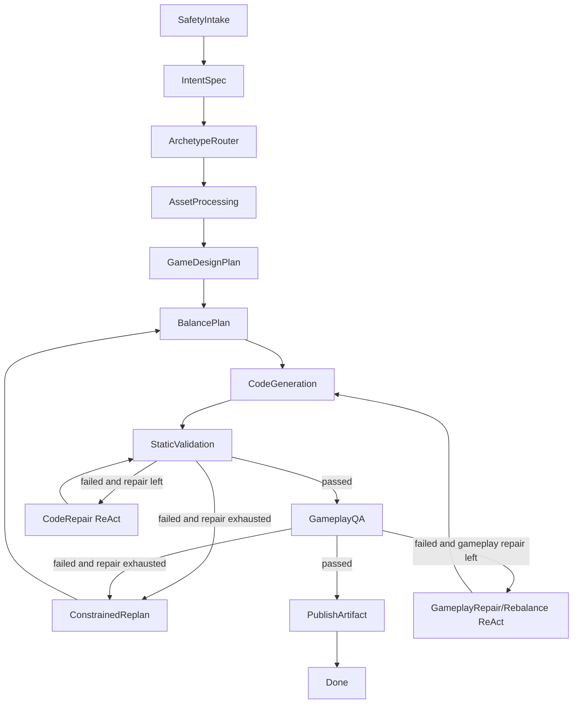

# GameWeave Multi-Agent Gameplay Quality Redesign

> **状态：历史 RFC（已落地并被超越）。** 本文记录从“生成可运行游戏”升级到“生成可玩 + 可验证 + 可修复”的设计思路，其核心（ArchetypeRouter / Balance / GameplayQA / GameplayRepair / ConstrainedReplan + 两个 bounded ReAct 循环）均已实现。但实现之后又进一步演进，与本文有两点出入：
> 1. **新增 2 个规划节点**：`gameplay_planning`（一次产出简报与机制）/ `content_plan`（本文未列）。
> 2. **3D 与模型优先**：实现支持 3D WebGL（Three.js）且代码生成改为**模型优先**——这与本文 §5.7「template-first」与 §12「3D rendering 为 non-goal」直接相反。
>
> 当前真实实现以 [multi-agent_design.md](multi-agent_design.md) 为准（与 `backend/app/agents/` 同步）。本文保留作设计演进记录，不再更新。

## 1. Goal

当前 Create 链路已经能完成端到端闭环：用户输入创意，后端 Multi-Agent 生成 `index.html / style.css / game.js`，上传到对象存储，写入数据库，再由 Play 页面通过 `manifest.json` 动态加载运行。

但生成出的小游戏仍然存在三个明显问题：

1. 玩法太简单，同质化严重。
2. 逻辑质量不稳定，容易出现太快、太难、无解、重开状态不干净等问题。
3. 现有校验主要验证“代码能不能跑、是否安全”，没有验证“游戏是否好玩、是否可解、难度是否合理”。

本设计目标是把 Create multi-agent 从“生成可运行游戏”升级为“生成可玩、可验证、可修复的小游戏”。

## 2. Current Problems

### 2.1 Single-template bottleneck

当前真实生成链路里主要使用 `backend/game_templates/canvas_arcade`：

```text
index.html
style.css
game.js
```

`GameDesignAgent` 虽然输出了设计 JSON，但模板实际只消费少量配置：

```text
title
accent
duration
hazard_speed
star_speed
hint
```

结果是不同 prompt 最后经常变成同一种“躲障碍 + 捡星星”的游戏。

### 2.2 GameDesign contract is too soft

当前 `GameDesign` 只描述实体和规则，没有明确约束：

- 玩家每 5 秒会做什么。
- 第一局前 10 秒是否足够简单。
- 障碍物是否可躲。
- 收集物是否可达。
- 胜利条件是否可达。
- 重开是否完整重置。
- 失败反馈是否清晰。

这导致模型或模板即使输出合法 JSON，也不代表游戏真的好玩。

### 2.3 Validation only checks build and safety

当前 `BuildValidateAgent` 主要检查：

- 必需文件是否存在。
- `index.html` 是否引用 `game.js`。
- 是否使用 forbidden API。
- 文件体积是否超限。

它不检查：

- 游戏会不会 3 秒内必死。
- 玩家是否永远无法得分。
- 难度是否突然飙升。
- 随机生成是否产生不可躲局面。
- restart 是否清空所有状态。
- 操作输入是否真的影响游戏。

### 2.4 Repair only fixes code-level issues

当前 `repair_code` 主要根据 validation error 修复 `game.js`。它适合修：

- JS 语法错误。
- forbidden API。
- 缺文件或引用错误。

但它不擅长修：

- 太难。
- 太简单。
- 无目标感。
- 规则不可解。
- 生成位置不合理。
- 反馈不足。

## 3. Architecture Decision

采用：

```text
Fixed top-level workflow
+ local Plan-and-Execute in planning nodes
+ bounded ReAct repair loops after validation and gameplay QA
```

不使用全局自由 ReAct。原因：

- Create 是产品流程，需要稳定进度和可观测状态。
- 前端需要展示当前步骤，不能让 Agent 自由跳转。
- 任务需要可恢复、可重试、可解释。
- 生成代码必须受安全边界约束。

也不使用完全固定、没有反馈循环的流程。原因：

- 玩法问题通常只有运行或模拟后才暴露。
- 难度、死局、重开状态、输入响应都需要观察结果后修复。

因此采用固定主干，局部允许 bounded ReAct。

## 4. Proposed Workflow

```text
SafetyIntake
  -> IntentSpec
  -> ArchetypeRouter
  -> AssetProcessing
  -> GameDesignPlan
  -> BalancePlan
  -> CodeGeneration
  -> StaticValidation
  -> GameplayQA
  -> PublishArtifact
  -> Done
```

Failure branches:

```text
StaticValidation failed
  -> CodeRepair ReAct <= 2
  -> StaticValidation

GameplayQA failed
  -> GameplayRepair / Rebalance ReAct <= 2
  -> CodeGeneration
  -> StaticValidation
  -> GameplayQA

Design not feasible or repeated QA failure
  -> ConstrainedReplan <= 1
  -> BalancePlan
  -> CodeGeneration
  -> StaticValidation
  -> GameplayQA

All repair budgets exhausted
  -> Failed
```

Graph sketch:



## 5. Agent Responsibilities

### 5.1 SafetyIntakeAgent

Existing role remains:

- Reject empty or too long prompts.
- Block prompt injection and unsafe instructions.
- Normalize user prompt.
- Record accepted assets.

### 5.2 IntentSpecAgent

Converts user idea into a structured `GameSpecV2`.

Required output:

```json
{
  "title": "string",
  "summary": "string",
  "genre": "arcade | puzzle | runner | shooter | strategy | timing",
  "theme": "string",
  "target_runtime": "iframe-html-canvas",
  "core_loop": "string",
  "player_fantasy": "string",
  "controls": {
    "keyboard": ["string"],
    "pointer": ["string"],
    "hint": "string"
  },
  "win_condition": "string",
  "lose_condition": "string",
  "score_rule": "string",
  "difficulty_intent": "easy-start | normal | challenge",
  "visual_style": "string",
  "tags": ["string"]
}
```

The prompt remains a game requirement, not a system instruction.

### 5.3 ArchetypeRouterAgent

Selects a supported gameplay archetype before detailed design.

Initial supported archetypes:

| Archetype | Best for | Core interaction | Initial priority |
| --- | --- | --- | --- |
| `lane_runner` | runner, dodge, racing | switch lanes, dodge hazards | High |
| `topdown_collect` | collect, avoid, maze-lite | move freely, collect goals | High |
| `logic_grid` | pipe, circuit, puzzle | rotate/connect tiles | High |
| `memory_match` | memory, color, sequence | repeat pattern | Medium |
| `one_tap_timing` | orbit, rhythm, jump | timed input | Medium |
| `physics_catcher` | falling objects, miner, catcher | aim/catch/avoid | Medium |
| `shooter_dodge` | space shooter, defense | shoot and dodge | Medium |
| `tower_defense_lite` | tower defense, lane defense | place or upgrade simple towers | Later |

Required output:

```json
{
  "archetype": "topdown_collect",
  "confidence": 0.86,
  "reason": "User asked for collecting coins while avoiding hazards.",
  "unsupported_features": ["multiplayer", "3d camera"],
  "design_constraints": {
    "single_screen": true,
    "round_seconds_max": 90,
    "max_entities": 80,
    "requires_pathfinding": false
  }
}
```

This keeps generation flexible while preventing unsupported designs from reaching codegen.

### 5.4 AssetAgent

Existing role remains, but output should become explicit about asset usage:

```json
{
  "cover": "string",
  "assets": [],
  "usable_assets": [],
  "rejected_assets": [],
  "style_cues": ["string"],
  "asset_constraints": {
    "has_player_sprite": false,
    "has_background": false,
    "fallback_required": true
  }
}
```

### 5.5 GameDesignAgent

Uses `GameSpecV2 + Archetype + AssetManifest` to create a gameplay plan, not code.

Required output:

```json
{
  "screen": {
    "width": 800,
    "height": 600
  },
  "archetype": "topdown_collect",
  "core_loop_steps": [
    "Move toward visible coins",
    "Avoid slow hazards",
    "Collect enough coins before timer ends"
  ],
  "moment_to_moment": [
    {
      "time_range": "0-10s",
      "player_action": "learn movement and collect safe items",
      "pressure": "low"
    },
    {
      "time_range": "10-30s",
      "player_action": "choose between safe and risky coins",
      "pressure": "medium"
    }
  ],
  "entities": [
    {
      "name": "player",
      "type": "avatar",
      "movement": "pointer_follow",
      "radius": 18
    },
    {
      "name": "coin",
      "type": "collectible",
      "spawn": "safe_random",
      "radius": 10
    },
    {
      "name": "hazard",
      "type": "obstacle",
      "spawn": "edge_to_center",
      "radius": 16
    }
  ],
  "rules": {
    "round_seconds": 60,
    "win_condition": "score >= target_score before timer ends",
    "lose_condition": "lives <= 0 or timer ends below target",
    "score_rule": "coin +10, rare coin +30",
    "risk_reward": "rare coins spawn closer to hazards"
  },
  "feedback": {
    "collect": "particle burst and score bump",
    "damage": "screen pulse and temporary invulnerability",
    "win": "clear victory overlay",
    "lose": "clear reason"
  }
}
```

### 5.6 BalanceAgent

Converts design intent into numeric constraints.

Required output:

```json
{
  "round_seconds": 60,
  "target_score": 120,
  "player": {
    "speed": 320,
    "radius": 18,
    "invulnerability_ms_after_hit": 900
  },
  "difficulty_curve": [
    {
      "from_second": 0,
      "hazard_speed": 90,
      "hazard_spawn_ms": 1800,
      "max_hazards": 3
    },
    {
      "from_second": 20,
      "hazard_speed": 130,
      "hazard_spawn_ms": 1300,
      "max_hazards": 6
    },
    {
      "from_second": 45,
      "hazard_speed": 170,
      "hazard_spawn_ms": 950,
      "max_hazards": 9
    }
  ],
  "spawn_rules": {
    "min_collectible_distance_from_player": 80,
    "min_hazard_distance_from_player": 180,
    "min_hazard_gap_px": 70,
    "avoid_unavoidable_spawn": true
  },
  "qa_thresholds": {
    "first_death_seconds_min": 8,
    "median_survival_seconds_min": 20,
    "score_possible_with_greedy_bot": true,
    "restart_must_reset_state": true
  }
}
```

The BalanceAgent should be deterministic when possible. It can use presets from the archetype registry rather than relying entirely on the model.

### 5.7 CodeGenerationAgent

Generates files from:

```text
GameSpecV2
Archetype
GameDesign
BalanceConfig
AssetManifest
```

For MVP stability, code generation should be template-first:

```text
backend/game_templates/<archetype>/
  index.html.j2
  style.css.j2
  game.js.j2
  qa.py
```

The model can still contribute creative text, naming, colors, entity labels, and optional small behavior variants, but the core engine should stay template-backed until QA coverage is strong.

### 5.8 StaticValidationAgent

Existing validation remains:

- Required files.
- Forbidden APIs.
- External URL scan.
- File size.
- `index.html` references `game.js`.

Add config-level validation:

- Archetype is supported.
- Required config fields exist.
- Numeric values are within safe ranges.
- Entity counts are below max.
- Round duration is within 20-90 seconds.

### 5.9 GameplayQAAgent

New node. It validates gameplay quality before publish.

For MVP, prefer archetype-level deterministic simulation over full browser automation:

```text
template config -> Python simulator / JS harness -> quality report
```

Optional later enhancement:

```text
Playwright loads generated index.html in a sandbox
  -> captures console errors
  -> simulates keyboard/pointer input
  -> validates runtime behavior
```

GameplayQA output:

```json
{
  "passed": false,
  "score": 72,
  "fatal_errors": [],
  "warnings": [
    "median survival too low",
    "collectibles rarely reachable"
  ],
  "metrics": {
    "boot_ok": true,
    "js_errors": 0,
    "restart_resets_state": true,
    "controls_affect_player": true,
    "idle_bot_median_survival": 9.4,
    "random_bot_median_survival": 18.2,
    "greedy_bot_median_survival": 34.8,
    "greedy_bot_score_p50": 80,
    "unavoidable_spawn_count": 3,
    "max_entities_seen": 42
  },
  "repair_hints": [
    {
      "type": "rebalance",
      "field": "difficulty_curve[0].hazard_spawn_ms",
      "suggestion": "increase from 900 to 1500"
    },
    {
      "type": "spawn_rule",
      "field": "min_hazard_distance_from_player",
      "suggestion": "increase to at least 180"
    }
  ]
}
```

Minimum QA checks:

| Check | Purpose | Failure type |
| --- | --- | --- |
| Boot check | Game starts without JS/runtime errors | fatal |
| Restart check | Restart clears score, timer, entities, overlay | fatal |
| Input check | Keyboard/pointer changes player state | fatal |
| Score check | Greedy bot can score | fatal |
| First-death check | Game does not kill player immediately | fatal |
| Survival check | Median survival is within acceptable range | warning/fatal |
| Unavoidable spawn check | Hazards do not spawn in impossible positions | fatal |
| Entity cap check | Object count does not grow without bound | fatal |
| Round completion check | Win/loss state is reachable | fatal |

### 5.10 GameplayRepairAgent

Uses bounded ReAct, but only inside this node.

Loop:

```text
Observation: GameplayQA report
Reason: classify failure
Action: rebalance config | patch template config | request constrained replan
Validation: rerun StaticValidation + GameplayQA
```

Allowed repair actions:

1. Rebalance numeric config.
2. Tighten spawn constraints.
3. Lower early difficulty.
4. Increase player speed or safety radius.
5. Fix restart/reset state.
6. Reduce entity cap.
7. Switch to a simpler archetype only via ConstrainedReplan.

Not allowed:

- External libraries.
- Network calls.
- Global workflow rewrites.
- Infinite repair loops.

Repair budget:

```text
static_repair_attempts <= 2
gameplay_repair_attempts <= 2
replan_attempts <= 1
```

### 5.11 ConstrainedReplanAgent

Used when current design cannot pass QA after repair.

Rules:

- Keep the user's theme and core fantasy.
- Switch to the nearest simpler supported archetype.
- Drop unsupported features.
- Preserve uploaded assets when safe.
- Reset repair counters.
- Must produce a design that the archetype registry can validate.

## 6. State Extensions

Add to `GenerationState`:

```python
class GenerationState(TypedDict, total=False):
    game_spec: dict
    archetype_result: dict
    asset_manifest: dict
    game_design: dict
    balance_config: dict
    generated_files: list
    static_validation_result: dict
    gameplay_qa_result: dict
    gameplay_repair_attempts: int
    repair_history: list
```

Existing fields remain:

```text
repair_attempts
replan_attempts
last_error
manifest_url
preview_url
```

## 7. Frontend Step Mapping

The existing Create UI can keep the same high-level steps, with one additional visible step:

| UI Step | Backend nodes |
| --- | --- |
| Idea checked | SafetyIntake |
| Game spec created | IntentSpec + ArchetypeRouter |
| Assets processed | AssetProcessing |
| Game designed | GameDesignPlan + BalancePlan |
| Files generated | CodeGeneration |
| Validating build | StaticValidation + CodeRepair |
| Playtesting game | GameplayQA + GameplayRepair |
| Preparing preview | PublishArtifact |
| Ready to publish | Done |

If adding a new visual step is too much UI churn, `GameplayQA` can be displayed under `Validating build` as a sub-status:

```text
Validating build
  - Static checks passed
  - Playtest running
  - Difficulty adjusted
```

But product-wise, showing `Playtesting game` is better because it makes quality work visible.

### 7.1 Create status UI contract

The Create progress surface should expose gameplay quality as a first-class status once the backend emits the new nodes.

Primary progress list:

```text
Idea checked
Game spec created
Assets processed
Game designed
Files generated
Validating build
Playtesting game
Preparing preview
Ready to publish
```

Compatibility rule:

- If a task does not include `gameplay_qa` or `gameplay_repair` in `step_summaries`, hide `Playtesting game`.
- This keeps existing tasks and the current backend pipeline visually unchanged.
- Once the backend starts emitting gameplay QA nodes, the row appears automatically.

Progress issue cards:

| Active step | Title | Message intent |
| --- | --- | --- |
| `gameplay_qa` running | Playtest running | Explain that restart, controls, scoring, and difficulty are being checked. |
| `gameplay_qa` failed | Gameplay issue found | Explain that balance or logic repair is needed before publish. |
| `gameplay_repair` running | Playtest repair running | Explain that spawn rules, difficulty, or reset behavior are being adjusted. |

Preview side card:

When gameplay QA exists, add a runtime row before manifest/bundle readiness:

```text
Sandbox ready
Playtest running / Playtest passed / Playtest needs repair
Manifest uploaded
Bundle ready
```

Activity drawer technical details:

Add a `Gameplay QA` field when available:

```text
Gameplay QA: Pending | Running | Passed | Needs repair
```

Recent updates:

Gameplay QA logs should be translated into readable product copy:

```text
Gameplay playtest updated
Difficulty balance adjusted
Restart behavior verified
Input response verified
```

This avoids exposing raw simulator jargon while still proving the quality agent is doing real work.

## 8. Template Registry

Introduce a registry module:

```text
backend/app/agents/archetypes.py
```

Example:

```python
ARCHETYPES = {
    "lane_runner": {
        "template": "lane_runner",
        "required_config": ["round_seconds", "lanes", "player", "difficulty_curve"],
        "supports": ["runner", "dodge", "racing"],
        "max_entities": 60,
        "qa": "simulate_lane_runner",
    },
    "topdown_collect": {
        "template": "topdown_collect",
        "required_config": ["round_seconds", "player", "collectibles", "hazards", "difficulty_curve"],
        "supports": ["collect", "avoid", "maze-lite"],
        "max_entities": 80,
        "qa": "simulate_topdown_collect",
    },
}
```

This makes it easy to add game variety without turning the whole system into unsafe freeform code generation.

## 9. Implementation Plan

### Phase 1: Quality foundation

1. Add this design doc.
2. Add `ArchetypeRouterAgent`.
3. Add `BalanceAgent`.
4. Add `GameplayQAAgent` with config-level checks.
5. Add state fields and logs.
6. Keep current `canvas_arcade` as fallback.

Expected result:

- No major gameplay variety yet.
- But games become less likely to be instantly impossible or broken.

### Phase 2: Template variety

Add 3 first-class archetype templates:

```text
lane_runner
topdown_collect
logic_grid
```

Each template includes:

```text
index.html.j2
style.css.j2
game.js.j2
qa.py
```

Expected result:

- Prompts produce visibly different game types.
- QA can reason about each archetype.

### Phase 3: Gameplay repair loop

Add `GameplayRepairAgent`:

- Reads `gameplay_qa_result`.
- Adjusts `balance_config`.
- Reruns codegen and QA.
- Falls back to constrained replan when needed.

Expected result:

- Too-hard games are softened automatically.
- Restart/input/score issues are caught before publish.

### Phase 4: Browser smoke test

Optional but valuable:

- Load generated `index.html` in Playwright.
- Capture console errors.
- Click/press keys.
- Validate overlay/restart behavior.

This can be a slower QA mode or only run for final publish.

## 10. Success Criteria

A generated game should not be published unless:

1. Static validation passes.
2. Gameplay QA passes.
3. Restart works.
4. Controls affect the game.
5. Score or objective progress is possible.
6. The first 8 seconds are not unfair.
7. No obvious unavoidable hazard spawn is detected.
8. The result has a supported archetype and clear rules.

Target quality metrics:

```text
boot_ok = true
js_errors = 0
restart_resets_state = true
controls_affect_player = true
greedy_bot_score_p50 > 0
idle_bot_median_survival >= 5s
random_bot_median_survival >= 10s
greedy_bot_median_survival >= 20s
unavoidable_spawn_count = 0
max_entities_seen <= archetype.max_entities
```

## 11. Why This Fits the Test Requirements

The test document requires:

- Multi-Agent generation chain.
- Agent process visibility.
- Remote generated files via object storage.
- Play page dynamically loading bundle/manifest/assets.
- Safe handling of generated code.
- Failure retry and observable logs as bonus items.

This redesign strengthens those points:

- `ArchetypeRouterAgent`, `BalanceAgent`, and `GameplayQAAgent` make the Agent split more defensible.
- Gameplay QA logs prove the system is not a single black-box call.
- Template-backed archetypes keep generated code safer.
- Bounded ReAct repair demonstrates practical agentic recovery without making the whole workflow unstable.

## 12. Non-goals

This redesign does not require:

- Unity, Godot, Phaser, or a full game engine.
- Multiplayer.
- 3D rendering.
- External network dependencies inside generated games.
- Fully freeform generated code for every file.

The intended runtime remains:

```text
HTML5 Canvas + vanilla JavaScript + CSS
```

The main change is not the language. The main change is adding gameplay planning, balance, QA, and repair around that runtime.
