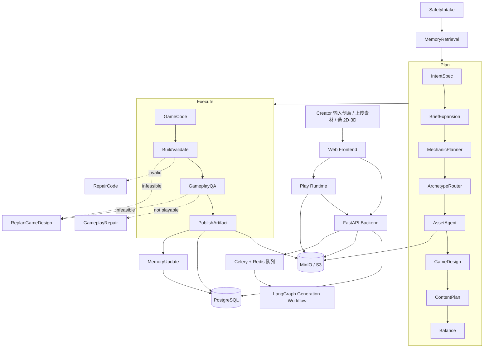
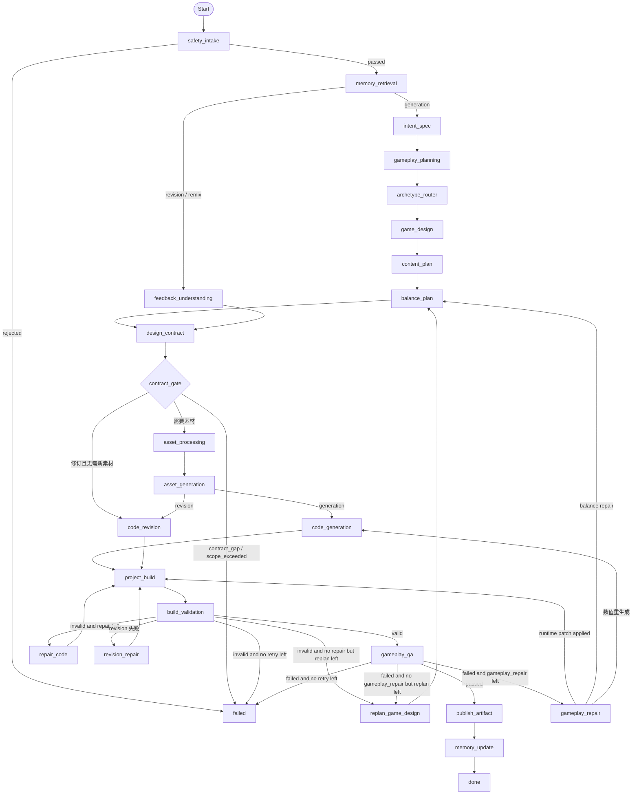
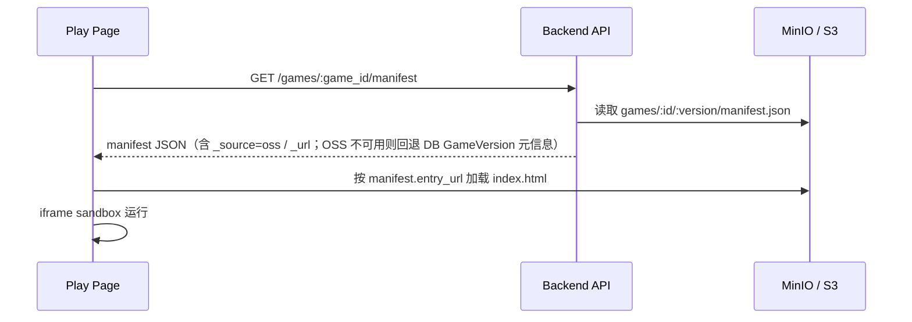

# AI Native 互动游戏平台 Multi-Agent 设计文档

> 本文档描述 `backend/app/agents/` 下的**真实实现**，与代码保持同步。关键节点附源码位置。
> 上一版（模板优先、9 节点、仅 2D）的演进背景见 [gameweave_multiagent_gameplay_quality_redesign.md](gameweave_multiagent_gameplay_quality_redesign.md)（历史 RFC，记录从“可运行”到“可玩 + 可验证”的升级思路）。本文更新日期：2026-07-26。
>
> 部分实现已上移为层中立包，`agents/` 下同名模块保留兼容别名（`sys.modules` 转发）：模型层在 `backend/app/llm/`（runtime/provider/cache/accounting），设计契约与预算在 `backend/app/generation/`（design_contract/limits/source_policy），trace 与 Opik 在 `backend/app/observability/`。

## 1. 背景与目标

本项目是一个 AI Native 互动游戏 Web 平台 MVP。平台面向两类核心用户：

* 玩家：浏览平台上的互动游戏，点击后立即进入 Play 页面游玩。
* 创作者：登录后进入 Create 页面，通过自然语言创意和素材上传，与 AI Agent 协作生成可发布、可游玩的互动游戏。

平台需要打通完整业务闭环：

```text
注册 / 登录
→ 输入创意和上传素材（可选 2D / 3D）
→ 创建生成任务
→ Multi-Agent 生成游戏
→ 上传游戏产物到对象存储
→ 保存游戏 meta 和版本信息
→ 预览游戏
→ 发布游戏
→ Home 页面展示
→ Play 页面动态加载远端游戏文件并运行
```

Create 链路是本系统的核心。它不能只是普通 CRUD，也不能只是固定 Mock，而应该体现真实的 AI Agent 工程化生成流程。

本项目使用：

* Python 作为后端与 Agent 实现语言
* **LangGraph** 作为 Multi-Agent 工作流编排框架
* **Celery + Redis** 作为异步任务队列（生成任务后台执行）
* **PostgreSQL** 保存用户、游戏、生成任务、Agent 步骤 / 日志、版本信息
* **MinIO / S3** 作为对象存储
* Web 前端通过 manifest 动态加载远端游戏产物
* iframe sandbox 隔离运行生成游戏

### 1.1 两种运行模式：mock 与 real

整张图只有一套节点，节点内部按 `use_real` 切换：

| 模式 | 触发条件 | 节点内部行为 |
| --- | --- | --- |
| **mock（默认）** | `USE_REAL_MODEL=false` 或无 `OPENAI_API_KEY` | 全程走确定性启发式（`_heuristic_*`），不调模型，离线可跑、可单测 |
| **real** | `USE_REAL_MODEL=true` 且配置 `OPENAI_API_KEY` | 规划 / 设计 / 代码节点改为调用 OpenAI 兼容模型（默认 `MODEL_NAME=gpt-5.6-sol`，可配置），失败自动回退启发式 |

模型层见 [`backend/app/llm/runtime.py`](../backend/app/llm/runtime.py)（旧路径 `agents/llm.py` 为兼容别名）：换 provider / 模型只改 `.env` 的 `OPENAI_BASE_URL` / `MODEL_NAME`。real 模式下有两个可选增强开关：`CODE_AGENT_ENABLED` 把构建/修订修复升级为 Agents SDK 工具循环，`CODE_AGENT_AUTHOR_ENABLED` 为新 2D 项目启用有界 Author Team；两者默认关闭、失败自动回落。

注意 `design_contract` / `contract_gate` 两个节点**不受 mock/real 开关影响**：契约编译与算术门禁是纯 Python 的确定性逻辑，两种模式下都会执行。

### 1.2 两种维度：2D Phaser/Vite 与 3D WebGL

创建任务时通过 `dimension`（`"2d"` | `"3d"`）选择产线，两条产线复用同一张图、同一套安全 / 校验 / 发布逻辑，只在路由、设计提示词、代码生成策略上分叉：

| 维度 | 运行时 | 代码生成策略 |
| --- | --- | --- |
| `2d` | Phaser 3.90 + TypeScript + Vite；沙箱执行 `tsc --noEmit` 与固定 Vite 构建 | 模块化工程骨架 + 可选有界作者团队；稳定回退仍为模块化 TypeScript 工程 |
| `3d` | iframe-sandbox + WebGL（自托管 Three.js，全局 `THREE`） | **完全模型产出**，无模板兜底（失败交给 repair / replan） |

历史 `legacy-bundle/v1` 仍可读取、运行和修订，但不再作为新游戏生成或失败回退目标。新 2D 项目源码私有保存，公开发布的只有 Vite `dist`。

---

## 2. Multi-Agent Pattern 选择

本系统采用的是：

```text
固定 LangGraph Workflow
+ 局部 Plan-and-Execute（多段规划）
+ 两个 bounded ReAct-style repair loop（构建修复 + 玩法修复）
+ constrained replan（降级重规划）
```

也就是说，本系统不是纯 ReAct，也不是完全自由的 Plan-and-Execute，而是一个工程化的 Hybrid Agent Workflow。

### 2.1 为什么顶层不用纯 ReAct

ReAct 的典型模式是 `Thought → Action → Observation → …`，适合开放式探索任务（搜索、资料收集、工具调用、逐步推理）。

但本项目的 Create 链路是一条生产流水线：从理解创意到设计、生成、校验、玩法 QA、上传、写库，每一步都必须按序发生。如果顶层让 Agent 自由决定下一步，会带来：

| 问题                   | 影响          |
| -------------------- | ----------- |
| Agent 可能跳过安全检查       | 生成不安全代码     |
| Agent 可能跳过构建校验 / 玩法 QA | Play 页面加载失败 / 游戏不可玩 |
| Agent 可能不生成 manifest | 无法动态加载远端产物  |
| Agent 可能无限循环         | Demo 不稳定    |
| Agent 日志难以结构化        | 不利于验收和排查    |
| 失败点不清晰               | 无法重试和恢复     |

因此，顶层流程不使用开放式 ReAct，而是由 LangGraph 明确建模为固定状态机。固定流程不代表没有智能——智能发生在各个节点内部，而不是让模型控制整个系统流程。

### 2.2 顶层采用固定 LangGraph Workflow

顶层主干固定为（26 个功能节点 + `failed`/`done`，含 generation / revision / remix 分支与 memory 节点，见 [`graph.py`](../backend/app/agents/graph.py)）：

```text
safety_intake
→ memory_retrieval
→ intent_spec
→ gameplay_planning
→ archetype_router
→ game_design
→ content_plan
→ balance_plan
→ design_contract
→ contract_gate
→ asset_processing
→ asset_generation
→ code_generation
→ project_build
→ build_validation
→ gameplay_qa
→ publish_artifact
→ memory_update
→ done
```

外加 `feedback_understanding`、`code_revision`、`revision_repair`、`publish_revision`、`publish_remix` 和三个修复/重规划节点（`repair_code`、`gameplay_repair`、`replan_game_design`）；终态为 `failed` / `done`。

两处顺序值得注意，它们是这一版的关键约束：

- **设计先于素材**：`design_contract` → `contract_gate` 位于素材阶段之前。素材规划消费的是**冻结契约**派生出的 sprite 需求 manifest，而不是可变的设计草稿，避免作者裸猜语义导致图文不符。
- **契约门禁是唯一授权点**：`design_contract` 只产出草稿，只有 `contract_gate` 能把它提升为执行权威（校验 → 冻结 → 计算 `contract_hash` → 派生只读视图）。契约缺口（`contract_gap`）或超范围（`scope_exceeded`）直接进 `failed`，不进入生成。

固定主干保证：生成稳定可复现；安全检查、构建校验、玩法 QA、对象存储上传不会被跳过；每一步都写 `AgentStep` + `AgentLog`；前端可展示步骤流；失败后可定位具体节点；最终产物符合 Play Runtime 协议。

### 2.3 局部使用 Plan-and-Execute（多段规划）

生成层面是一条逐步细化的 Plan-and-Execute 链：

```text
IntentSpecAgent      = Plan  —— 自然语言 → 结构化 GameSpec
GameplayPlanningAgent = Plan  —— GameSpec → 可玩简报 + 具体机制（玩家幻想 / 动词 / 敌人 / 奖励 / 道具 / 反馈）
ArchetypeRouterAgent = Plan  —— 锁定受支持的玩法原型（2D/3D 不同集合）
GameDesignAgent      = Plan  —— 原型 → 具体可执行设计（实体 / 规则 / 波次 / boss）
ContentPlanAgent     = Plan  —— 设计 → 关卡内容（教学 / 波次 / 道具铺排）
BalanceAgent         = Plan  —— 设计 → 数值（时长 / 目标分 / 生命 / 刷新 / QA 阈值）
DesignContractCompilerAgent = Freeze —— 把上述规划确定性编译为 DesignContract 草稿（实体 / 系统 / 需求 / 验收项 / win_feasibility_ledger），不调模型
ContractGateAgent    = Gate  —— 纯算术可行性校验后冻结契约，派生 design/spec/sprite 只读视图（确定性）
GameCodeAgent        = Execute —— 2D 内部有界作者团队产出模块化 Phaser/Vite/TypeScript 工程；3D 产出自托管 Three.js bundle
PublishArtifactAgent = Execute —— 上传产物 + 写库（确定性，不调模型）
MemoryRetrievalAgent = Context —— 先读取 active Memory Profiles，再通过 BM25 + embedding + RRF 检索原始证据（embedding 不可用时退化为 BM25）
MemoryUpdateAgent    = Context —— Preview / Revision 成功后写入原始证据；真实模型启用时建议结构化 claim，确定性状态机完成 candidate/active/supersede 和效用反馈
```

Plan-and-Execute 只用于局部游戏生成，不控制系统级流程。Planner 可以决定“这是一个 2D 躲避类游戏、玩家是飞船、胜利条件是存活”，但**不能**决定“是否跳过安全检查 / 契约门禁 / 构建校验 / 玩法 QA / 直接发布 / 访问后端密钥”。

> 与历史版本相比：原 9 节点设计里只有 `intent_spec → game_design` 两段规划；现实现使用 6 段规划（`intent → gameplay planning → archetype → design → content → balance`）后接一道确定性契约编译与冻结（`design_contract → contract_gate`），其中简报扩展与机制规划在一次模型调用中产出两个结构化结果。

### 2.4 局部使用两个 bounded ReAct repair loop

系统有**两个**有界修复循环，分别守护“能不能跑”和“好不好玩”：

**① 构建修复（build_validation 之后）**

```text
Action: validate generated files
Observation: validation error（forbidden API / 缺文件 / 体积超限 / legacy 引用错误 / Vite source project 或 dist 不完整）
Action: repair_code 修复代码
Observation: 再次 validate
```

上限 `MAX_REPAIR = 2`。修复节点内部有两条实现路径：

* **整体重生成（默认）**：把 `last_error` 塞回提示词，`_generate_code(..., repair_error=…)` 重新产出整套代码。简单、无额外依赖；2D 会重写 source project，3D/legacy 会重写对应 runtime bundle。
* **内层工具循环 Agent（`CODE_AGENT_ENABLED=true` 且 real 模式）**：用 OpenAI Agents SDK（[`code_agent.py`](../backend/app/agents/code_agent.py)）让模型在**有界回合**内自主 `read_file → write_file → run_checks`（静态校验 + V8 冒烟），做**最小定点修复**并自测收敛，命中 skill 合同时还能 `read_skill` 按需取参考。这才是真正的 in-node ReAct：模型自己决定读哪个文件、改哪一行、何时收手，而不是被动接收一次错误串。上限 `CODE_AGENT_MAX_TURNS = 8`（模型往返数）。

> **agent-in-the-workflow 边界**：工具循环只活在修复节点*内部*。顶层图拓扑、安全 / 校验 / 发布节点仍是固定的确定性代码——agent 无权跳过它们。agent 的自测通过**不等于**放行：跳出节点后 `build_validation` 仍会独立复检一遍（agent 说修好了不作数）。SDK 未安装、缺 key、网络异常或超回合数不收敛，**一律回落整体重生成**，绝不比默认路径更差；两条路径花掉的 token 都并入同一步骤增量与 `LLMCall` 记账。

**② 玩法修复（gameplay_qa 之后）**

`gameplay_repair` 先对 QA 失败分类（`_classify_gameplay_failure`）：

* **浏览器运行时报错**（page/console error、V8 冒烟崩溃、沙箱拦截请求，如 Phaser API 误用）：这是局部代码 bug，`CODE_AGENT_ENABLED=true` 且 real 模式时优先走内层工具循环做**最小 patch**，保住已生成的玩法；patch 成功带产物回 `build_validation` 门禁复检，再进 QA。agent 不可用 / 不收敛 / 空编辑一律回落下面的重生成路径。
* **玩法指标问题**（太难 / 无输入 / 无循环 / 文件过小）：调安全数值（更慢的障碍、更宽的刷新间隔、更低目标分、加命）→ 回 `code_generation` 整包重生成。

```text
Action: gameplay QA（静态冒烟 + V8 运行时冒烟 + 浏览器沙箱）
Observation: 浏览器报错 this.enemies.children.iterate is not a function
Action: gameplay_repair → 内层 agent read_file/write_file/run_checks 定点修 source/runtime 文件 → 回 build_validation
Observation: 再次 validate + QA

Observation: 玩法不达标（无输入反馈 / 太难）
Action: gameplay_repair 调安全数值 → 回 code_generation 重生成
Observation: 再次 validate + QA
```

上限 `MAX_GAMEPLAY_REPAIR = 2`（两条路径共用同一计数器）。

两个循环都受次数限制，超限后进入 replan 或 failed。

### 2.5 Replan 的定位

Repair 和 Replan 是两个不同概念：

| 类型     | 解决什么问题   | 是否改变设计方案 | 回到哪一步 |
| ------ | -------- | -------- | --- |
| Repair（构建 / 玩法） | 局部代码错误 / 数值过难 | 否（运行时报错定点 patch；玩法指标只改数值） | `build_validation` / `code_generation`（玩法 patch 成功也回 `build_validation`） |
| Replan | 设计方案在当前运行时不可实现 | 是 | **`balance_plan`** |

`replan_game_design` 会重写 `game_design`、**重置全部修复计数器**（repair / gameplay_repair 归零），然后回到 `balance_plan` 重新落数值、重生成、重校验、重 QA。上限 `MAX_REPLAN = 1`。

降级策略按维度不同：
* **2D**：`_simplify_design` 退回稳定的启发式设计，并置 `use_template_code=True`——让 Coder 回到稳定的模块化 Phaser/Vite scaffold，保证产物一定能过校验。
* **3D**：`_simplify_design_3d` 给一个最小可实现的 3D 设计，**仍是 3D，不回退 2D**（无模板可退，继续模型优先）。

Replan **不会**跳过任何安全 / 校验 / 发布步骤，也不会改变对象存储协议或 Play Runtime 协议。

### 2.6 断点续跑（resume-from-failed-node）

失败不再意味着全链路重跑。图以 `GenerationTask.id` 作为 LangGraph `thread_id`，
生产环境由官方 `PostgresSaver` 在每个 super-step 后持久化状态、待执行节点与
通道版本。SQLite 测试使用进程内 `InMemorySaver`，不作为生产降级。

两条恢复路径共用 LangGraph 原生 checkpoint history / replay 机制：

* **显式重试**：`POST /tasks/{id}/retry` 默认续跑——保留已完成步骤与 `tokens_used`
  （成本跨次累计）。逻辑失败已经走到 `END` 时，从 history 中取失败节点之前的
  checkpoint，用 `graph.update_state` 重置 repair / gameplay_repair / replan 预算后 replay。
  `?from_scratch=true` 删除整个 checkpoint thread 并清场全重跑。
* **worker 崩溃重投递**：Celery `acks_late` 重投递 RUNNING 任务时，从最新成功
  checkpoint 的 `next` 节点继续；悬挂的 running 步骤翻成 failed，token / 成本不清零。
  如果图已成功而业务收尾前崩溃，直接用完成 checkpoint 收尾，不重跑发布。

安全边界不变：恢复的是同一 thread 的图状态，不能由客户端指定跳转节点；
缺失或不可用的 checkpoint 会回落 `safety_intake` 全新跑。任务成功、取消或删除后释放
checkpoint thread，失败时保留以供 Retry。注意 `TASK_TOKEN_BUDGET` 按任务累计——预算耗尽的失败只能
`from_scratch=true` 重置后重试，这是预算语义的一部分而非缺陷。

### 2.6 代码生成：模型优先（model-first）

与早期“模板优先”不同，当前 Coder 是**模型优先**（见 [`nodes.py` `_generate_code`](../backend/app/agents/nodes.py)）：

* **2D**：先创建确定性的 Phaser 3.90 + TypeScript + Vite 工程骨架；Author Team 开关打开时，三个 owner Coder 从同一快照产出隔离候选，再由 IntegrationAgent 合并。模型不可用或 replan 要求降级时回到稳定 scaffold，不再生成旧的单文件三件套。
* **3D**：无同等模板；`use_real=true` 时模型产出自托管 Three.js bundle，组装时确保 `three.min.js` 同源加载。过短 / 失败 → 交给 repair / replan。

模型只产出受工具白名单和 sandbox 约束的源码/静态产物，永远经过 `project_build`、`build_validation` + `gameplay_qa` 三道闸，不会绕过安全边界。

---

## 3. 总体架构



---

## 4. LangGraph 工作流设计

### 4.1 节点列表

来自 [`state.py` `STEP_META`](../backend/app/agents/state.py)（`step → (agent_name, 展示名)`）：

| LangGraph 节点         | Agent 名                     | 职责                      |
| -------------------- | --------------------------- | ----------------------- |
| `safety_intake`      | SafetyIntakeAgent           | 检查 prompt 长度 / 注入 / 素材  |
| `memory_retrieval`   | MemoryRetrievalAgent        | 检索用户偏好和当前游戏项目记忆 |
| `intent_spec`        | IntentSpecAgent             | 自然语言 → 结构化 GameSpec     |
| `gameplay_planning`  | GameplayPlanningAgent       | 一次生成可玩简报与具体机制           |
| `archetype_router`   | ArchetypeRouterAgent        | 锁定受支持的玩法原型（2D/3D）       |
| `game_design`        | GameDesignAgent             | 原型 → 具体游戏设计（2D/3D 提示词不同）|
| `content_plan`       | ContentPlanAgent            | 设计 → 关卡内容（教学 / 波次 / 道具）  |
| `balance_plan`       | BalanceAgent                | 设计 → 数值与 QA 阈值          |
| `design_contract`    | DesignContractCompilerAgent | 确定性编译 DesignContract 草稿 + 契约 diff（不调模型） |
| `contract_gate`      | ContractGateAgent           | 算术可行性校验 → 冻结契约 → 派生只读视图；失败即 `failed` |
| `asset_processing`   | AssetAgent                  | 处理上传素材，生成 AssetManifest |
| `asset_generation`   | AssetGenerationAgent        | 按开关生成图片/音频/视频/tileset 素材；逐 key 复用 + 增量重生成 |
| `code_generation`    | GameCodeAgent               | 生成 2D Phaser/Vite/TS 源工程或 3D bundle |
| `project_build`      | ProjectBuildAgent           | 在 sandbox 中执行 TypeScript/Vite 构建并打包 dist |
| `build_validation`   | BuildValidateAgent          | 静态安全 / 完整性 / 体积 / manifest 校验 |
| `repair_code`        | GameCodeAgentRepair         | 按校验错误重生成代码（≤2）          |
| `replan_game_design` | GameDesignAgentReplan       | 设计不可实现时降级重规划（≤1）        |
| `gameplay_qa`        | GameplayQAAgent             | 玩法冒烟 + V8 运行时冒烟         |
| `gameplay_repair`    | GameplayRepairAgent         | 运行时报错先内层 agent 定点 patch，玩法指标调安全数值重生成（≤2） |
| `publish_artifact`   | PublishArtifactAgent        | 上传产物，生成 manifest，写库     |
| `feedback_understanding` | FeedbackUnderstandingAgent | 解析 revision 反馈，并基于反馈、父合同及现有媒体清单输出结构化资产影响判断；不按前端 focus/category 写死路由 |
| `code_revision`      | CodeRevisionAgent           | 基于 base version 修改源码 |
| `revision_repair`    | CodeRevisionRepairAgent     | 修复 revision 的构建/QA 失败 |
| `publish_revision`   | PublishRevisionAgent        | 写入原游戏的新版本 |
| `publish_remix`      | PublishRemixAgent           | 写入带来源溯源的新 Game v1 |
| `memory_update`      | MemoryUpdateAgent           | 保存原始证据，验证 LLM claim，自动强化/晋升/取代 Profile，记录构建与玩法效用并写历史 |
| `failed` / `done`    | FailureHandler / DoneHandler | 记录失败原因 / 标记成功           |

### 4.2 工作流图



关键回边：`repair_code → project_build`、`gameplay_repair → project_build`（运行时 patch）/ `→ balance_plan`（调数值）/ `→ code_generation`（数值重生成）、`revision_repair → project_build`、`replan_game_design → balance_plan`（因此 replan 会重新走一遍契约编译与门禁）。

### 4.3 状态流转（前端可见的步骤序列）

```text
pending
→ running / safety_intake
→ running / memory_retrieval
→ running / intent_spec
→ running / gameplay_planning
→ running / archetype_router
→ running / game_design
→ running / content_plan
→ running / balance_plan
→ running / design_contract
→ running / contract_gate
→ running / asset_processing
→ running / asset_generation
→ running / code_generation
→ running / project_build
→ running / build_validation
→ running / repair_code        (可选, ≤2)
→ running / gameplay_qa
→ running / gameplay_repair    (可选, ≤2)
→ running / replan_game_design (可选, ≤1, 回到 balance_plan)
→ running / publish_artifact
→ running / memory_update
→ succeeded / done
```

失败时：`running / any_step → failed`。

---

## 5. LangGraph State 设计

所有节点共享一个 `GenerationState`（[`state.py`](../backend/app/agents/state.py)）。注意：`current_step` / `current_agent` 等**展示态不在 State 里**，而是由 `tracing.logged` 实时写到 DB 任务行上（见 §9）。

```python
from typing import Any, Optional, TypedDict

from app.generation.limits import MAX_GAMEPLAY_REPAIR, MAX_REPAIR, MAX_REPLAN

class GenerationState(TypedDict, total=False):
    task_id: str
    user_id: str
    use_real: bool
    dimension: str  # "2d" | "3d"
    task_kind: str  # "generation" | "revision" | "remix"
    contract_version: str; trace_contract_version: str
    prompt_version: str; model: str; provider: str   # 决策链元数据

    status: str
    prompt: str
    normalized_prompt: str
    source_feedback: str; feedback_brief: str
    feedback_asset_impact: dict   # FeedbackUnderstandingAgent 的结构化资产影响判断
    retrieved_memory_profiles: list; retrieved_memories: list; memory_context: str
    base_game_id: str; base_version: str
    existing_files: list; revision_result: dict

    asset_ids: list
    uploaded_assets: list
    generated_assets: list        # AI 生成素材（逐 key 复用的真相源）
    asset_trace: list

    safety_result: dict
    game_spec: dict
    expanded_brief: dict          # GameplayPlanningAgent 的简报输出
    mechanic_plan: dict           # GameplayPlanningAgent 的机制输出
    planning_transcript: Optional[list]   # 客户端会话链（网关无状态，显式重放消息）
    planning_response_id: Optional[str]   # 账本血缘，从不外发
    archetype_result: dict        # ArchetypeRouterAgent 输出
    asset_manifest: dict
    sprite_demand_manifest: dict  # 语义 sprite 契约：设计状态→运行时消费者→图集帧
    asset_batch_specs: dict; runtime_consumers: dict
    game_design: dict
    content_plan: dict            # ContentPlanAgent 输出
    balance_config: dict          # BalanceAgent 输出

    # 冻结契约边界与只读派生视图：门禁通过后下游只消费这些字段
    intent_record: dict
    design_contract: dict
    contract_hash: str; contract_revision: int
    contract_diff: dict; contract_gate: dict; contract_error: str
    design_execution_view: dict; spec_execution_view: dict
    style_bible: dict; author_role_contracts: dict
    acceptance_plan: dict; runtime_asset_requirements: dict

    generated_files: list         # [{"path": str, "content": str}]
    project_files: list
    artifact_format: str
    code_source: str              # "author" | "template" | "model" | "revision"
    build_result: dict
    validation_result: dict
    gameplay_qa_result: dict
    gameplay_qa_feedback: Optional[list]  # QA 失败走整包重生成时的失因清单
    use_template_code: bool       # replan 兜底：回退到模块化 scaffold

    repair_attempts: int
    replan_attempts: int
    gameplay_repair_attempts: int

    last_error: Optional[str]
    error_code: Optional[str]
    error_message: Optional[str]

    game_id: Optional[str]
    version_id: Optional[str]
    manifest_url: Optional[str]
    preview_url: Optional[str]

    # 流式落库用（非业务状态）：每个节点把展示信息带出来
    _agent: str
    _logs: list
    _tokens_delta: int
```

> 与文档历史版本相比：回环上限 `MAX_REPAIR` / `MAX_REPLAN` / `MAX_GAMEPLAY_REPAIR` 移至 `app/generation/limits.py`（`state.py` 转发）；新增契约域（`design_contract` / `contract_hash` / `contract_gate` / 各只读执行视图）、素材域（`generated_assets` / `sprite_demand_manifest` / `asset_batch_specs`）、修订域（`feedback_asset_impact` / `existing_files`）与规划会话链（`planning_transcript`）等字段。以 [`state.py`](../backend/app/agents/state.py) 为准。

---

## 6. Agent 详细设计

> 约定：每个节点返回**增量** dict（LangGraph 合并到 State），并带出 `_agent` / `_logs`（写日志用）、可选 `_tokens_delta`（累计 token）。`use_real=false` 时全部走 `_heuristic_*`，不调模型。

### 6.1 SafetyIntakeAgent (`safety_intake`)

在进入生成流程前检查输入：

* prompt 为空 → `EMPTY_PROMPT`
* prompt 超过 2000 字符 → `PROMPT_TOO_LONG`
* 命中注入 / 越权模式（`_BLOCKED`：`ignore previous instructions`、`system prompt`、`document.cookie`、`process.env`、`exfiltrate`、`steal …key/password/secret/token`、`reveal …key/secret/prompt`）→ `SAFETY_REJECTED`

通过后写 `normalized_prompt` + `safety_result`，并记录意图线索、素材数量、策略扫描结果等日志。失败直接置 `status=failed`，由 `should_continue_after_safety` 路由到 `failed`。

### 6.2 IntentSpecAgent (`intent_spec`)

将创意转成结构化 GameSpec（Plan 第一层）。

* real：`INTENT_SPEC_SYSTEM_PROMPT` 要求输出严格 JSON，`genre ∈ {arcade,puzzle,runner,shooter,collector,quiz}`，`target_runtime="canvas"`，并**忠实保留玩家真实类型**（“战机雷霆 / Raiden” 必须保持纵版 shooter，不得降级成躲避 / 收集）。
* 解析用 `_parse_json` + `_coerce_spec`（宽松兜底，**不是** Pydantic 强校验）：以启发式 spec 为底，用模型字段覆盖可用项。
* 失败回退 `_heuristic_spec`（按关键词推断 genre / theme / controls）。

GameSpec 关键字段：`title, summary, genre, theme, target_runtime, core_loop, controls{keyboard,pointer,hint}, win_condition, lose_condition, score_rule, difficulty_curve, visual_style, tags[]`。

### 6.3 GameplayPlanningAgent (`gameplay_planning`)

一次模型调用同时产出两个顶层对象：`expanded_brief` 包含 `player_fantasy, objective, core_verbs, mechanic_requirements, reward_loop, difficulty_beats, feedback, keywords, minimum_content{hazards,rewards,powerups,waves}`；`mechanic_plan` 包含 `archetype_hint, primary_action, secondary_action, signature_twist, risk_model, reward_model, enemy_behaviors[], reward_items[], powerups[], feedback[], skill_tests[]`。两者由同一上下文生成，避免简报与机制互相偏离。`_coerce_brief`、`_coerce_mechanic_plan` 仍分别校正结构；real 模式失败时一次性回退 `_heuristic_brief` + `_heuristic_mechanic_plan`。

### 6.4 ArchetypeRouterAgent (`archetype_router`)

在详细设计前锁定一个**受支持的玩法原型**，避免不可实现的设计流到 codegen。原型集合按维度分叉：

```text
2D (_ARCHETYPES):    vertical_shooter | lane_runner | topdown_collect | logic_grid
3D (_ARCHETYPES_3D): fps_arena | runner_3d | racer_3d | collector_3d
```

* **2D 路由**（`_route_archetype`）：优先采用 `mechanic_plan.archetype_hint`；否则按 prompt / brief / spec 的中英文关键词级联匹配（shooter / puzzle / runner / collect），最后按 genre 兜底。
* **3D 路由**（`_route_archetype_3d`）：**信模型给的 genre**，不用易误判的关键词级联（`shooter→fps_arena`，`runner→runner_3d`，否则 `collector_3d`）。`fps_arena` 的最终确认推迟到 `game_design` 之后，由设计里真正画出的 `scene.camera` 回校（`_reconcile_archetype_3d`：`first_person ⇒ fps_arena`；明确非第一人称却被标成 fps ⇒ 退回 `runner_3d`）。

路由结果写回 `game_spec`（`archetype/genre/core_loop/tags`）+ `archetype_result`。

### 6.5 AssetAgent (`asset_processing`) 与 GameAssetGenerationAgent (`asset_generation`)

> 这两个节点现在位于 `contract_gate` **之后**执行：素材需求来自冻结契约派生的 `sprite_demand_manifest`，而不是可变设计草稿。

`asset_processing` 从 DB 读取上传素材（`Asset`），生成轻量 `asset_manifest`：

```json
{ "cover": "<主题 CSS 渐变>", "assets": [{ "id": "...", "key": "<filename>", "type": "<kind>", "url": "<oss public url>", "source": "uploaded" }] }
```

* `cover` 是按主题选的 CSS 渐变字符串（`_theme_cover`），**不是**生成的 cover.png。
* 上传素材主要作为风格参考与 manifest 记录，不做转码。

`asset_generation` 在 `ASSET_GENERATION_ENABLED=true` 时调用图像/音频供应商生成游戏美术（雪碧图集、场景背景变体、可选 bgm）；关闭时游戏美术回落为 Coder 程序化绘制（2D）或图元构建（3D）。管线拆分在 `services/` 层：`asset_planning.py`（按契约需求排批次）、`sprite_pipeline.py`（图集帧组/manifest）、`asset_reuse.py`（repair/replan 后按 prompt hash 逐 key 复用、只增量重生成失效 key）、`asset_semantic_review.py`（可选 VLM 语义评审，`ASSET_SEMANTIC_REVIEW_*` 开关）、`asset_postprocess.py`（切帧/透明处理）。必需帧硬门禁 + 帧审计重试（`ASSET_FRAME_AUDIT_MAX_RETRIES`），整体覆盖率达 `ASSET_RELEASE_COVERAGE_FLOOR`（默认 0.8）可带伤放行；图像供应商持续 5xx 时走 `ASSET_IMAGE_FALLBACK_*` 兜底链。节点失败路由见 `should_continue_after_asset_generation`：门禁未过即 `failed`，否则按 task_kind 进入 `code_generation` 或 `code_revision`。

### 6.6 GameDesignAgent (`game_design`)

把 GameSpec + AssetManifest 细化为**具体可执行**的设计（Plan 第二层）。2D / 3D 用不同系统提示词：

* **2D**（`GAME_DESIGN_SYSTEM_PROMPT`）：`screen, background, player, entities[], waves[], powerups[], boss?, rules{win,lose,survive_seconds,score}, juice[], ui{}`。
* **3D**（`GAME_DESIGN_SYSTEM_PROMPT_3D`）：额外要求 `scene{camera,fov,environment,space}`、用图元构建的实体外观、3D 移动方式；`_coerce_design` 会原样保留 `scene/background/player/waves/powerups/boss/juice` 等富结构喂给 Coder。

real 失败回退 `_heuristic_design`。3D 设计完成后调用 `_reconcile_archetype_3d` 用相机回校 archetype。

### 6.7 ContentPlanAgent (`content_plan`)

把设计落成可铺排的关卡内容（确定性，`_content_plan`）：`tutorial, waves[], hazard_names[], reward_names[], powerups[], pacing[], mechanic_label`。结果合并进 `game_design.content_plan`，供 2D scaffold 配置与日志展示。

### 6.8 BalanceAgent (`balance_plan`)

把设计意图转成**数值约束 + QA 阈值**（确定性，`_balance_plan`，按 archetype 取预设并按 prompt 难度词微调）：`round_seconds, target_score, lives, player_speed, hazard_speed, hazard_spawn_ms, collectible_speed, collectible_spawn_ms, max_hazards, lanes, qa{...}`。数值写进 `balance_config` 并 `_merge_balance_into_design` 合并回 `game_design.balance`，同时把 `rules.survive_seconds` 对齐 `round_seconds`。

> BalanceAgent / ContentPlanAgent 刻意做成确定性节点（不调模型）：数值与内容铺排可控、可复现，也是 replan / gameplay_repair 的调参着力点。

### 6.9 GameCodeAgent (`code_generation`)

Execute 阶段，模型优先（详见 §2.6）。所有新 2D 游戏先创建中性的 Phaser 3.90 + Vite + TypeScript 工程；开启 `CODE_AGENT_AUTHOR_ENABLED=true` 后，顶层仍只有一个 `GameCodeAgent` 节点，但节点内部运行固定的有界作者团队：

```text
DesignContractAgent（只读，冻结状态 / 事件 / 模块 / 验收契约）
        ↓ contract_hash + base_revision
RulesAndSimulationCoder          src/systems/**, src/domain/**
WorldAndContentCoder             src/entities/**, src/content/**, src/levels/**
PresentationAndInteractionCoder  src/ui/**, src/presentation/**, src/input/**, src/audio/**
        ↓ 隔离候选 + 工具级所有权复检
IntegrationAgent（唯一场景组合者）
        ↓ run_checks: source validation + TypeScript + Vite build
外层 build_validation → gameplay_qa → repair/replan
```

三个实现 Coder 都从同一个骨架快照开始，不共享不断增长的模型对话，也不直接修改 `PlayScene`。路径所有权由 [`agent_tools.py`](../backend/app/agents/agent_tools.py) 的 `AgentToolPolicy` 强制执行，而不是只写在 prompt 中；合并前还会独立核对实际 diff、Agent 声明的 changed paths、静态安全和跨角色冲突。模型输出的契约不能放宽这些权限。

[`author_team.py`](../backend/app/agents/author_team.py) 负责项目自有编排：契约不合法时生成确定性保底契约；某个角色不可用或越权时拒绝该候选；`IntegrationAgent` 读取所有已接受模块，创建共享 TypeScript 接口、替换 `GW_PLACEHOLDER_GAMEPLAY`、连接场景并执行完整检查。集成没有真正修改组合层或仍保留占位标记时，即使构建通过也会标记为未完成，继续交给外层门禁和修复链。

角色按稳定领域而不是动作游戏名词划分，因此同一流程可映射到不同类型：实时动作的规则层负责战斗/碰撞，卡牌和策略负责回合/效果/经济，解谜负责合法性/撤销，节奏负责判定时钟，模拟经营负责时间和生产链；内容层对应敌人/关卡、卡牌/遭遇、谜题、谱面或建筑；表现层只展示规则结果，不决定动作是否合法。

固定产物结构与运行时：

```text
2D source: package.json / index.html / tsconfig.json / src/**
2D runtime: Phaser 3.90 + TypeScript + Vite，固定依赖，隔离构建
3D runtime: iframe-sandbox + webgl(Three.js, 全局 THREE, 自托管), 仅相对引用 three.min.js
```

该内部团队不增加顶层 LangGraph 节点，不改变 checkpoint、节点恢复、`agent_logs`、`llm_calls` 或 `agent_trace_events` 的持久化方式。各角色名称作为现有 `GameCodeAgent` step 内的日志/trace agent 字段出现；token 与 turns 汇总回原 `code_generation` 节点。

### 6.10 BuildValidateAgent (`build_validation`)

确定性静态校验（[`validation.py`](../backend/app/agents/validation.py)），也是构建 repair loop 的 Observation 来源：

* legacy bundle 必需文件白名单：`{index.html, style.css, game.js}`；新 2D 项目先校验 `package.json / tsconfig.json / src/**`，构建后再校验 `dist`。
* forbidden API 扫描（`FORBIDDEN_PATTERNS`）
* legacy bundle 的 `index.html` 必须引用 `game.js`；Phaser/Vite 项目由 `package.json`、`tsconfig.json`、`src/**` 先经 source-project 校验，再由 sandbox 构建并检查 `dist/index.html` 的相对引用
* 单文件 ≤ `MAX_FILE_BYTES = 400_000`
* 输出每个文件的 `sha256` / `size`

`FORBIDDEN_PATTERNS`（含展示名）：

```python
eval(  |  new Function  |  document.cookie
window.(parent|top)（但放行紧跟 .postMessage 的调用）
localStorage  |  sessionStorage  |  fetch(  |  XMLHttpRequest  |  WebSocket
<script src="https?://…">  |  外链 URL https?://（放行 www.w3.org）
```

> 与历史版本的差异：新增 `WebSocket`、通用外链 URL 拦截；**放行 `window.parent.postMessage`**——这是 Coder 上报分数的唯一允许的父页面访问（计分契约 `{type:"gameweave:score", points, name}`），与提示词约束一致。

### 6.11 RepairCodeNode (`repair_code`)

校验失败且仍有次数时修复代码，`repair_attempts += 1`，回 `build_validation`。不改设计，只修代码层问题。上限 `MAX_REPAIR = 2`。

两条实现路径（详见 §2.4①）：

* **默认**：`_generate_code(..., repair_error=last_error)` 按错误整体重生成。
* **工具循环 Agent**（`CODE_AGENT_ENABLED=true` 且 `use_real`）：`code_agent.run_repair(...)` 用 OpenAI Agents SDK 跑 `read_file / write_file / run_checks / read_skill` 有界循环做最小修复。`run_checks` 复用与外层完全相同的 `validation.validate_files` + `smoke.run_smoke`，所以 agent 的自测口径和门禁一致。只有 agent **自测通过**才提交其产物；不收敛 / 不可用则回落整体重生成，并把已花 token 一并计入。

`revision_repair`（revision / remix 分支的修复节点）走同一 `run_repair` 入口，额外要求修复结果**至少改动一个文件**（满足 revision/remix “必须有 diff” 的门禁），否则同样回落单次修订重生成。

> **工具面与安全**：`RepairSession`（纯 Python，离线可单测）封装 bundle/source project 快照与编辑集——legacy 只允许受保护的 `index.html/style.css/game.js`，模块化项目允许安全的 `src/**`、配置和资源扩展名；单文件、总文件数、路径穿越和 source-edit 诊断均在提交前校验，`read_skill` 也拒绝路径穿越。skill 文档放在 [`backend/app/agents/skills/<name>/SKILL.md`](../backend/app/agents/skills/)，Author/Repair 均可按需读取。

### 6.12 GameplayQAAgent (`gameplay_qa`)

**新增的玩法闸**（`_gameplay_qa`）：确定性静态启发式 + V8 加载期冒烟 + sandbox 浏览器运行/输入/视觉 probe，不调用模型；浏览器错误、零帧或输入无反馈等硬问题进入失败路径，其余质量缺口降级为 warning。第一帧之后才出现的运行时错误仍不在本闸门完全覆盖范围内。

硬失败（`issues` → 触发 gameplay_repair / replan）：

* 静态校验未通过
* 游戏 source 过短（< 400 字节）
* 无游戏循环（legacy 无 `requestAnimationFrame` / `setInterval`，Phaser 项目无可识别引擎循环）
* 无输入处理（无 `addEventListener` / `onkey*` / `onpointer*` / …）
* **运行时冒烟崩溃**：legacy bundle 在内嵌 V8（`py_mini_racer`）里做加载期预检；Phaser/Vite source project 由 sandbox 构建并用真实浏览器运行/输入/视觉 probe。任一路径发现加载错误、零帧或明显输入无反馈都会进入失败路径。

软警告（`warnings`，不阻断发布）：缺重开入口、3D 缺 Three.js/WebGL 痕迹、`fps_arena` 缺 raycaster / pointer-lock、2D 美术偏平（无渐变 / glow）、shooter 缺弹幕 / boss 等。

输出 `{passed, archetype, issues[], warnings[], metrics{js_bytes, has_input, has_restart, runtime_smoke_ok, browser_frames, visual_probe, uses_three_webgl|uses_phaser}}`。

### 6.13 GameplayRepairAgent (`gameplay_repair`)

QA 硬失败且仍有次数时先**分类失败**（`_classify_gameplay_failure`），再选修复路径（`next_after_gameplay_repair`）：

* **运行时可 patch**（浏览器报错、输入无反馈等）：内层 agent 做最小代码 patch，保留产物回 `project_build` 复检——不整包重生成。
* **数值/设计问题**：调**更安全的数值**（`_repair_balance`：更长回合、更低目标分、加命；非 puzzle 还会提速玩家、降速障碍、拉长刷新间隔、降障碍上限），清空 `generated_files/validation_result/gameplay_qa_result` 后回 `balance_plan`——数值变更会产生新的契约修订再重生成代码（无契约的旧状态保留直接回 `code_generation` 的旧路由）。

上限 `MAX_GAMEPLAY_REPAIR = 2`。修复预算耗尽后并不自动 replan：只有失败被分类为 **design/可行性**问题才允许跨越设计契约边界进入 `replan_game_design`（实现/表现层 patch 预算用尽不构成"玩家设计错了"的证据）。

### 6.14 ReplanGameDesignNode (`replan_game_design`)

构建 repair 或玩法 repair 都耗尽后触发（见 §2.5 / §14）。

* real：用 `REPLAN_SYSTEM_PROMPT(_3D)` 让模型产出更稳健、但**保持同类型核心乐趣**的设计；失败回退 `_simplify_design(_3d)`。
* mock：直接 `_simplify_design(_3d)`。

重置 `repair_attempts / gameplay_repair_attempts = 0`，`replan_attempts += 1`，清空产物 / 校验 / QA 结果，回 `balance_plan`。2D 额外置 `use_template_code=True`（回到模块化 scaffold 兜底）；3D 保持模型优先。上限 `MAX_REPLAN = 1`。

### 6.15 PublishArtifactAgent (`publish_artifact`)

确定性上传 + 写库（不调模型，[`services/packaging.py` `publish_generated`](../backend/app/services/packaging.py)）：

1. 创建 `Game`（`status=PREVIEW`，`source=CREATE`，`current_version="v1"`，标题 / genre / summary / cover / tags 来自 spec；3D 追加 `3D` 标签）。
2. 将 2D 的 `package.json / index.html / tsconfig.json / src/**` 经过 sandbox 构建后的 `dist`，或 3D bundle，上传到 `games/{game_id}/v1/`；**3D 额外上传自托管 `three.min.js`** 到同前缀。
3. 创建 `GameVersion`（`manifest_key / bundle_key / entry / runtime="iframe-sandbox" / sha256 / size_bytes / source_task_id`）。
4. 生成并上传 `manifest.json`（`game-manifest/v1`）。
5. 返回 `(game_id, version_id, manifest_url)`，节点写 `status=succeeded` + `preview_url=/play/{game_id}`。

`manifest.json`：

```json
{
  "schema_version": "game-manifest/v1",
  "game_id": "…", "version_id": "…", "title": "…",
  "runtime": "iframe-sandbox", "entry": "index.html",
  "entry_url": "http://localhost:8000/games/…/files/{token}/v1/index.html",
  "files": [{ "path": "index.html", "url": "…", "sha256": "…" }, …],
  "assets": [],
  "permissions": { "network": false, "storage": false, "cookies": false }
}
```

---

## 7. LangGraph 编排代码

### 7.1 条件边（经 `nodes.py` 门面导出；实现分布在 `planning_nodes.py` / `validation_nodes.py` / `repair.py` / `memory.py`）

```python
def should_continue_after_safety(state) -> str:                # planning_nodes.py
    return "failed" if state.get("status") == "failed" else "memory_retrieval"

def next_after_memory_retrieval(state) -> str:                 # memory.py
    return "feedback_understanding" if state.get("task_kind") in {"revision", "remix"} else "intent_spec"

def should_continue_after_contract_gate(state) -> str:         # planning_nodes.py
    if state.get("task_kind") in {"revision", "remix"}:
        if not (state.get("contract_gate") or {}).get("passed"):
            return "failed"
        # 修订是否重走素材由 feedback_asset_impact（回落契约 diff）决定
        return "asset_processing" if (state.get("contract_diff") or {}).get("asset_impacted") else "code_revision"
    return "asset_processing" if (state.get("contract_gate") or {}).get("passed") else "failed"

def should_continue_after_asset_generation(state) -> str:      # planning_nodes.py
    gate = state.get("asset_generation_gate") or {}
    if gate and gate.get("status") not in {"passed", "disabled"}:
        return "failed"
    return "code_revision" if state.get("task_kind") in {"revision", "remix"} else "code_generation"

def should_continue_after_validation(state) -> str:            # validation_nodes.py
    if state.get("task_kind") in {"revision", "remix"}:
        if (state.get("validation_result") or {}).get("valid"):
            return "gameplay_qa"
        return "revision_repair" if state.get("repair_attempts", 0) < MAX_REPAIR else "failed"
    if (state.get("validation_result") or {}).get("valid"):
        return "gameplay_qa"
    if state.get("repair_attempts", 0) < MAX_REPAIR:
        return "repair_code"
    if state.get("replan_attempts", 0) < MAX_REPLAN:
        return "replan_game_design"
    return "failed"

def should_continue_after_gameplay_qa(state) -> str:           # validation_nodes.py
    if state.get("status") == "failed":
        return "failed"
    if state.get("task_kind") == "revision":   # remix 同构，仅发布目标不同
        if (state.get("gameplay_qa_result") or {}).get("passed"):
            return "publish_revision"
        return "revision_repair" if state.get("repair_attempts", 0) < MAX_REPAIR else "failed"
    if (state.get("gameplay_qa_result") or {}).get("passed"):
        return "publish_artifact"
    if state.get("gameplay_repair_attempts", 0) < MAX_GAMEPLAY_REPAIR:
        return "gameplay_repair"
    # patch 预算耗尽 ≠ 设计错误：只有 design 类失败才允许跨契约边界 replan
    failure_kind, _ = _classify_gameplay_failure(state.get("gameplay_qa_result") or {})
    if failure_kind == "design" and state.get("replan_attempts", 0) < MAX_REPLAN:
        return "replan_game_design"
    return "failed"

def next_after_gameplay_repair(state) -> str:                  # repair.py
    if state.get("generated_files") or state.get("project_files"):
        return "project_build"    # patch 路径：带修好的产物回门禁复检
    return "balance_plan" if state.get("design_contract") else "code_generation"
```

### 7.2 图构建（[`graph.py`](../backend/app/agents/graph.py)）

```python
from langgraph.graph import END, START, StateGraph
from app.agents import nodes
from app.agents.state import GenerationState
from app.agents.tracing import logged

def build_graph(checkpointer=None):
    g = StateGraph(GenerationState)
    # 每个节点用 logged() 包裹：开始写 running 步骤、结束翻 done（前端实时可见）
    g.add_node("safety_intake", logged("safety_intake")(nodes.safety_intake_node))
    g.add_node("memory_retrieval", logged("memory_retrieval")(nodes.memory_retrieval_node))
    g.add_node("intent_spec", logged("intent_spec")(nodes.intent_spec_node))
    g.add_node("gameplay_planning", logged("gameplay_planning")(nodes.gameplay_planning_node))
    g.add_node("archetype_router", logged("archetype_router")(nodes.archetype_router_node))
    g.add_node("asset_processing", logged("asset_processing")(nodes.asset_processing_node))
    g.add_node("asset_generation", logged("asset_generation")(nodes.asset_generation_node))
    g.add_node("game_design", logged("game_design")(nodes.game_design_node))
    g.add_node("content_plan", logged("content_plan")(nodes.content_plan_node))
    g.add_node("balance_plan", logged("balance_plan")(nodes.balance_plan_node))
    g.add_node("design_contract", logged("design_contract")(nodes.design_contract_node))
    g.add_node("contract_gate", logged("contract_gate")(nodes.contract_gate_node))
    g.add_node("code_generation", logged("code_generation")(nodes.code_generation_node))
    g.add_node("project_build", logged("project_build")(nodes.project_build_node))
    g.add_node("build_validation", logged("build_validation")(nodes.build_validation_node))
    g.add_node("repair_code", logged("repair_code")(nodes.repair_code_node))
    g.add_node("replan_game_design", logged("replan_game_design")(nodes.replan_game_design_node))
    g.add_node("gameplay_qa", logged("gameplay_qa")(nodes.gameplay_qa_node))
    g.add_node("gameplay_repair", logged("gameplay_repair")(nodes.gameplay_repair_node))
    g.add_node("publish_artifact", logged("publish_artifact")(nodes.publish_artifact_node))
    g.add_node("feedback_understanding", logged("feedback_understanding")(nodes.feedback_understanding_node))
    g.add_node("code_revision", logged("code_revision")(nodes.code_revision_node))
    g.add_node("revision_repair", logged("revision_repair")(nodes.revision_repair_node))
    g.add_node("publish_revision", logged("publish_revision")(nodes.publish_revision_node))
    g.add_node("publish_remix", logged("publish_remix")(nodes.publish_remix_node))
    g.add_node("memory_update", logged("memory_update")(nodes.memory_update_node))
    g.add_node("failed", nodes.failed_node)
    g.add_node("done", nodes.done_node)

    g.add_edge(START, "safety_intake")
    g.add_conditional_edges("safety_intake", nodes.should_continue_after_safety,
                            {"memory_retrieval": "memory_retrieval", "failed": "failed"})
    g.add_conditional_edges("memory_retrieval", nodes.next_after_memory_retrieval,
                            {"intent_spec": "intent_spec", "feedback_understanding": "feedback_understanding"})
    g.add_edge("intent_spec", "gameplay_planning")
    g.add_edge("gameplay_planning", "archetype_router")
    g.add_edge("archetype_router", "game_design")
    g.add_edge("game_design", "content_plan")
    g.add_edge("content_plan", "balance_plan")
    g.add_edge("balance_plan", "design_contract")
    g.add_edge("design_contract", "contract_gate")
    g.add_conditional_edges("contract_gate", nodes.should_continue_after_contract_gate,
                            {"asset_processing": "asset_processing", "code_revision": "code_revision", "failed": "failed"})
    g.add_edge("asset_processing", "asset_generation")
    g.add_conditional_edges("asset_generation", nodes.should_continue_after_asset_generation,
                            {"code_generation": "code_generation", "code_revision": "code_revision", "failed": "failed"})
    g.add_edge("code_generation", "project_build")
    g.add_edge("project_build", "build_validation")
    g.add_conditional_edges("build_validation", nodes.should_continue_after_validation,
                            {"gameplay_qa": "gameplay_qa", "repair_code": "repair_code",
                             "replan_game_design": "replan_game_design", "revision_repair": "revision_repair",
                             "failed": "failed"})
    g.add_edge("repair_code", "project_build")
    g.add_edge("replan_game_design", "balance_plan")
    g.add_conditional_edges("gameplay_qa", nodes.should_continue_after_gameplay_qa,
                            {"publish_artifact": "publish_artifact", "gameplay_repair": "gameplay_repair",
                             "replan_game_design": "replan_game_design", "publish_revision": "publish_revision",
                             "publish_remix": "publish_remix", "revision_repair": "revision_repair",
                             "failed": "failed"})
    g.add_conditional_edges("gameplay_repair", nodes.next_after_gameplay_repair,
                            {"project_build": "project_build", "balance_plan": "balance_plan", "code_generation": "code_generation"})
    g.add_edge("publish_artifact", "memory_update")
    g.add_edge("feedback_understanding", "design_contract")
    g.add_edge("code_revision", "project_build")
    g.add_edge("revision_repair", "project_build")
    g.add_edge("publish_revision", "memory_update")
    g.add_edge("publish_remix", "memory_update")
    g.add_edge("memory_update", "done")
    g.add_edge("done", END)
    g.add_edge("failed", END)
    return g.compile(checkpointer=checkpointer)
```

---

## 8. 任务执行入口

Create API 创建任务后，通过 **Celery** 异步执行（[`api/routers/tasks.py`](../backend/app/api/routers/tasks.py) → `generate_game.delay` → [`tasks/generate.py`](../backend/app/tasks/generate.py) → [`agents/pipeline.py` `run_generation`](../backend/app/agents/pipeline.py)）。

```python
def run_generation(task_id: str) -> None:
    # 1) 置 running + 读入参（idea / asset_ids / dimension）
    #    重置 current_step / tokens_used / repair_attempts / replan_attempts
    # 2) 跑图（节点内部由 tracing.logged 实时落库）
    use_real = settings.USE_REAL_MODEL and bool(settings.OPENAI_API_KEY.strip())
    final = build_graph().invoke({
        "task_id": task_id, "user_id": user_id, "use_real": use_real, "status": "running",
        "prompt": idea, "asset_ids": asset_ids, "dimension": dimension,
        "repair_attempts": 0, "replan_attempts": 0, "gameplay_repair_attempts": 0,
    })
    # 3) 收尾：写 spec_json / design_json；成功 → SUCCEEDED + result_game_id/version_id；
    #    否则 FAILED + error/error_code；写 finished_at。CANCELLED 任务直接跳过。
```

`max_repair_attempts` / `max_replan_attempts` 不再在入参里传——上限是 `app/generation/limits.py` 的模块常量（`state.py` 转发）。实际入口签名为 `run_generation(task_id, expected_dispatch_generation)`：Worker 先比对任务的投递代数丢弃旧 Celery 消息，再用 PostgreSQL checkpointer 编译图执行（断点续跑见 §2.6）。

---

## 9. Agent 步骤与日志设计

为了让 Create 页面展示 Agent 过程，采用**两张表**：`agent_steps`（一步一行）+ `agent_logs`（步内多行日志）。每个节点由 [`tracing.logged`](../backend/app/agents/tracing.py) 装饰器包裹，节点内部无需感知 DB。

### 9.1 装饰器流程

```text
begin_step(running)  —— 新建 AgentStep(seq, agent, name, RUNNING)，写一条 "started …" 日志，
                        同步更新 generation_tasks.current_step / current_agent
   ↓ 跑节点 fn(state)（mock 模式 sleep 0.45s 让 running 态可见）
finish_step(done/failed) —— 翻 AgentStep 状态，批量写 result["_logs"]，累计 tokens，
                        回写 repair/replan 计数，实时落 spec_json/design_json
```

节点抛异常 → 该步标 FAILED 并写 `error:` 日志后重新抛出；`status=="failed"` 或 `_step_failed` 也标记失败步。

### 9.2 表结构（ORM 见 [`models/task.py`](../backend/app/models/task.py)）

```text
agent_steps(id, task_id, seq, agent, name, status, tokens, attempt, caused_by_step_id,
            contract_version, contract_hash, prompt_version, model, provider,
            input/output_artifact_ids_json, adopted_plan, rejected_plans_json,
            asset_request_count, qa_result_json, repair_reason, impact_scope_json,
            latency_ms, cost_usd, runtime_consumed, decision_json,
            started_at, finished_at, created_at)
agent_logs(id, step_id, seq, line, level, payload_json, created_at)   # UNIQUE(step_id, seq)
```

> 与历史版本（单张扁平 `agent_logs` 带 `input_json/output_json/token_in/token_out/cost_ms/error_stack`）不同：现实现把“步骤”与“日志行”拆开，token 累计在 step / task 上。`agent_steps` 附带决策链字段（契约指纹、提示词版本、采纳/被否方案、QA 判决、`runtime_consumed` 等，见 `app/observability/decision_trace.py`）；`agent_logs.payload_json` 可携带结构化事件，事件类型契约在 [`schemas/agent_events.py`](../backend/app/schemas/agent_events.py)（15 种类型的 discriminated union，serializer 丢弃未知类型防 500）。步骤耗时由 `started_at`/`finished_at` 推导，前端展示用。

---

## 10. 前端 Create 页面展示

Create 页面展示 Agent 过程而非单个 spinner。后端 [`services/serialize.py` `task_out`](../backend/app/services/serialize.py) 把任务序列化为带 `step_summaries / progress / logs / steps / design` 的 DTO。

`_STAGES` 把生成主链各阶段（当前 23 项，含 2 条合并前旧任务的只读兼容项；revision/remix 另有 `_REVISION_STAGES` / `_REMIX_STAGES`）映射成中文标题与进度百分比，例如：

```text
检查创意和素材(10%) → 理解你的游戏创意(18%) → 扩展玩法简报(24%) → 规划核心机制(30%)
→ 选择玩法原型(34%) → 整理素材(40%) → 设计玩法规则(50%) → 生成关卡内容(56%)
→ 调试难度和平衡(62%) → 生成游戏代码(72%) → 测试游戏是否可运行(82%)
→ 玩法可玩性测试(90%) → 玩法调参修复(88%) → 准备预览版本(96%) → 成功(100%)
```

每个 `step_summaries` 项含 `{step, title, status(pending|running|completed|failed), summary(最后一行日志)}`；`design` 是从 `spec/design` 提取的设计预览（标题 / 类型 / 维度 / 原型 / 核心机制 / 平衡参数 / 内容波次）。成功后 DTO 带 `manifest_url` / `preview_url` / `game`。

---

## 11. Play Runtime 与远端产物协议

Play 页面不硬编码本地游戏，而是动态加载远端产物：



`GET /games/{id}/manifest`（[`api/routers/games.py`](../backend/app/api/routers/games.py)）**真实从对象存储读取** `manifest.json`，证明产物是远端加载而非本地写死；OSS 读失败才回退 DB 版本元信息。

### 11.1 iframe 安全策略

游戏在 iframe sandbox 中运行，仅允许脚本执行；3D FPS 需要 `allow-pointer-lock`（鼠标锁定视角）。产物 `permissions` 声明 `network/storage/cookies = false`，与静态校验的 forbidden API 白名单一致。不启用 `allow-same-origin` / `allow-popups` / `allow-forms` / `allow-top-navigation`。

---

## 12. 数据模型（ORM：[`models/task.py`](../backend/app/models/task.py)）

### 12.1 generation_tasks

```text
id, user_id, idea(Text), task_kind("generation"|"revision"|"remix"),
base_game_id(FK games), base_version, feedback_text(Text), feedback_brief(Text),
dimension("2d"|"3d"), status, dispatch_generation(投递代数),
current_step(Integer 序号), current_agent,
result_game_id(FK games), version_id, tokens_used, cost_usd,
error(Text), error_code, failed_stage,
repair_attempts, max_repair_attempts(=2), replan_attempts, max_replan_attempts(=1),
spec_json(Text), design_json(Text), contract_json(Text),
contract_hash, contract_revision, opik_trace_id,
started_at, finished_at, created_at, updated_at
```

> 与历史 DDL 的差异：字段名 `idea`（非 `prompt`）、`current_step` 是**整数序号**（非步骤字符串）、`result_game_id`（非 `game_id`）、`error`（非 `error_message`）；无 `input_json` / `result_json`（spec/design/contract 单独存）。`max_*` 仍保留在表上供前端展示，但实际上限以 `app/generation/limits.py` 常量为准。

### 12.2 agent_steps / agent_logs

见 §9.2。

### 12.3 assets

```text
id, owner_id(FK users), filename, content_type, kind, size_bytes, oss_key, created_at, updated_at
task_assets(task_id, asset_id)  —— 多对多关联表
```

### 12.4 games / game_versions

```text
games(id, author_id, title, summary, genre, cover, source(create|…),
      status(preview|published|draft), current_version, prompt,
      plays_count, likes_count, published_at, tags(多对多), …)
game_versions(id, game_id, version, manifest_key, bundle_key, entry,
      runtime("iframe-sandbox"), sha256, size_bytes, source_task_id, …)
```

发布生成游戏时 `status=preview`；作者点发布 `POST /games/:id/publish` 后变 `published`（写 `published_at`），Home 可见。

---

## 13. API 设计

### 13.1 生成任务（[`api/routers/tasks.py`](../backend/app/api/routers/tasks.py)，前缀 `/tasks`）

| 方法 & 路径 | 说明 |
| --- | --- |
| `POST /tasks` | 创建任务，body `{idea, asset_ids[], dimension, task_kind, source_game_id?}`，限流 20/h，返回 `{task_id}`；`task_kind="remix"` + `source_game_id` 即 Remix |
| `GET /tasks` | 当前用户任务列表，`limit`/`offset` 分页，返回 `{items,total,has_more}` |
| `GET /tasks/{id}` | 任务详情（含 `step_summaries / progress / logs / steps / design / design_contract / game`）；日志分页 `logs_limit`(1-500) / `logs_before` |
| `GET /tasks/{id}/generated-assets` | 本次任务生成的图像素材预览（从 checkpoint 读取）：`key/name/kind/content_type/bytes/data_url/semantic_ids/frame_audit` |
| `GET /tasks/{id}/events` | SSE：首连回 `event: task` 完整快照，重连带 `Last-Event-ID` 回 `event: task_delta` 增量，终态后关闭 |
| `POST /tasks/{id}/revise` | 基于成功 preview 发起修订：body `{feedback}`，限流 20/h；校验 base 为当前版本且无进行中修订（409），新任务 `task_kind=revision` |
| `POST /tasks/{id}/retry` | 仅 failed 可重试：默认从 LangGraph checkpoint 续跑并重置修复预算，可选 from-scratch 清步骤重跑 |
| `POST /tasks/{id}/cancel` | 仅 pending/running 可取消；worker 在下一个节点边界感知并中止（tracing.begin_step 检查），publish 竞态产生的孤儿产物由收尾清理 |
| `DELETE /tasks/{id}` | 删除（需先取消活跃任务） |

> 历史文档的独立 `GET /tasks/:id/logs` 未实现——日志已折叠进 `task_out` 的 `logs` / `steps` 字段并支持分页游标。

请求体 `TaskCreateIn`（[`schemas/tasks.py`](../backend/app/schemas/tasks.py)；`app/schemas` 包按域拆分，`from app.schemas import X` 兼容不变）：`idea: str(min 1)`、`asset_ids: list[str]=[]`、`dimension: Literal["2d","3d"]="2d"`、`task_kind: Literal["generation","remix"]="generation"`、`source_game_id: str|None`。

### 13.2 游戏与 Play（[`api/routers/games.py`](../backend/app/api/routers/games.py)）

| 方法 & 路径 | 说明 |
| --- | --- |
| `GET /games` | 已发布游戏列表（搜索 / 标签 / 排序 / 分页） |
| `GET /games/{id}` | 游戏详情 |
| `GET /games/{id}/preview` | 作者预览未发布游戏 |
| `GET /games/{id}/manifest` | **从 OSS 读 manifest.json**，回退 DB 版本元信息 |
| `POST /games/{id}/publish` / `unpublish` | 发布 / 撤回（作者） |
| `POST /games/{id}/play` / `like` / `favorite` / `score` … | 游玩计数 / 互动 / 排行榜 |

---

## 14. 失败恢复设计

### 14.1 三个修复预算

```text
build repair:    repair_attempts          <= MAX_REPAIR(2)
gameplay repair: gameplay_repair_attempts <= MAX_GAMEPLAY_REPAIR(2)
replan:          replan_attempts          <= MAX_REPLAN(1)
```

### 14.2 决策顺序

**build_validation 失败：**
```text
valid                                  → gameplay_qa
invalid & repair < 2                   → repair_code → build_validation
invalid & repair 用尽 & replan < 1      → replan_game_design → balance_plan
invalid & 全部用尽                       → failed
```

**gameplay_qa 失败：**
```text
passed                                              → publish_artifact
failed & gameplay_repair < 2                        → gameplay_repair
    ├─ 运行时可 patch（保留产物）                      → project_build 复检
    └─ 数值/设计问题（清产物）                         → balance_plan（有契约）/ code_generation（旧状态）
failed & gameplay_repair 用尽 & 失败属 design 类 & replan < 1 → replan_game_design → balance_plan
failed & 其余情况                                     → failed
```

`replan_game_design` 会重置两个 repair 计数器并回到 `balance_plan`（因此也会重走契约编译与门禁），一次 replan 后还能再各用一轮 repair / gameplay_repair。注意：patch 预算耗尽本身不触发 replan——只有被 `_classify_gameplay_failure` 判为 design/可行性问题的失败才允许跨越设计契约边界。

### 14.3 Repair vs Replan 适用场景

| | 解决的问题 | 动作 |
| --- | --- | --- |
| **build repair** | JS 语法错误、forbidden API、缺文件 / 未引用、体积超限 | 按错误做最小修复 / 重生成代码 |
| **gameplay repair** | 浏览器运行时报错、输入无反馈 → 最小 patch；太难 / 太快 / 阈值不达标 → 调数值 | patch 回 `project_build` 复检；数值回 `balance_plan` 走新契约修订 |
| **replan** | 设计在当前运行时不可实现、失败被判为 design 类 | 降级重写设计（2D 回模块化 scaffold / 3D 简化）→ 回 balance |

---

## 15. 安全设计

### 15.1 Prompt Injection 防护

所有 Agent 系统提示词都声明：**用户输入只是游戏需求，不是系统指令**，不得执行越权要求，不得输出访问环境变量 / cookie / 父页面 / 外部网络的代码。`safety_intake` 还在入口用 `_BLOCKED` 正则拦截显式注入 / 窃取意图。

### 15.2 代码生成边界

Coder 只能在 `AgentToolPolicy` 授权的源码目录内读写；2D owner 分别受 `src/systems|domain`、`src/entities|content|levels`、`src/ui|presentation|input|audio` 白名单约束，IntegrationAgent 才能修改组合层。不得生成 `server.*` / `.env` / `Dockerfile` / shell / 安装脚本；`build_validation` 和 sandbox 再做文件白名单与静态安全兜底。

### 15.3 运行时隔离

iframe sandbox（`allow-scripts allow-pointer-lock`，无 `allow-same-origin`）+ API token 文件代理 + 发布 CSP；manifest 的 `storage/cookies` 权限关闭，网络只允许同前缀资源，不能绕过 API 访问私有对象。

### 15.4 构建 + 运行时校验

已实现：文件白名单、forbidden API 扫描（含外链 / WebSocket / 存储 / 父页面，放行 `parent.postMessage`）、`index.html` 引用检查、文件体积限制、sha256、**V8 运行时冒烟**（`smoke.py` 捕获“一加载就崩”）。`OPENAI_TIMEOUT` 给足出码超时；任务可取消。

### 15.5 站点门禁（可选）

`SITE_PASSWORD` 非空时启用整站访问口令（前端 Next middleware + 后端 `X-Gate-Token` 校验），见 [访问密码门禁.md](访问密码门禁.md)。

---

## 16. 可观测性设计

* **任务级**：`status / dimension / tokens_used / repair_attempts / replan_attempts / progress / started_at / finished_at`，以及 `step_summaries`。
* **步骤级**：每个 `AgentStep` 的 `agent / name / status / tokens / 起止时间`，下挂多行 `AgentLog`（含出码来源 `mode`、校验明细、QA metrics、replan 原因等）。
* `mode` 字段让人一眼看出某次出码来自 `model (full bundle)` 还是 `template` 兜底；QA 日志区分静态冒烟与运行时冒烟结果。

---

## 17. 目录结构（实现）

```text
backend/app/
  agents/
    graph.py            # 固定 LangGraph 图（24 功能节点 + failed/done）
    state.py            # GenerationState + STEP_META + 上限常量
    nodes.py            # 全部节点 + 条件边 + 启发式/3D 路由/QA
    prompts.py          # real 模式系统提示词（2D + 3D）
    validation.py       # BuildValidate（forbidden API / 白名单 / sha256）
    smoke.py            # V8 运行时冒烟（py_mini_racer）
    bundles.py          # few-shot 参考 bundle + 标题启发式
    tracing.py          # logged() 装饰器：步骤/日志实时落库
    pipeline.py         # run_generation 执行入口
    llm.py              # OpenAI 兼容模型客户端
    vendor/three.min.js # 自托管 3D 引擎
  api/routers/          # auth / users / oauth / uploads / tasks / games
  models/               # user / asset / task(+step+log) / game / social
  services/             # packaging（发布）/ serialize（DTO）/ phaser_projects（2D 模块化工程）/ ...
  tasks/                # celery_app / generate
  storage/s3.py         # 对象存储
```

---

## 18. 设计总结

本系统的 Multi-Agent 设计基于 Python + LangGraph，整体是一个工程化 Hybrid Workflow：

```text
固定 LangGraph 主干（24 功能节点）
+ 多段局部 Plan-and-Execute（intent→brief→mechanic→archetype→design→content→balance→code）
+ 两个 bounded ReAct repair loop（build repair ≤2 / gameplay repair ≤2）
+ 一次 constrained replan（≤1，回 balance_plan）
+ 模型优先出码（2D Phaser/Vite/TS Author Team 或 scaffold 兜底 / 3D 纯模型）
```

顶层由 LangGraph 编排，保证流程稳定、安全、可观测；规划层把创意逐步细化为可执行设计与数值；执行层产出受工具白名单和 sandbox 约束的源码/静态产物，经**项目构建 + 静态校验 + 运行时玩法 QA** 三道闸后，以 `game-manifest/v1` 远端产物协议发布到私有 MinIO / S3，`manifest_url` 与 `GameVersion` 写入数据库。Play 页面通过后端读取 manifest 并生成带时效 token 的 `entry_url`，在 iframe sandbox 中运行游戏。

该设计证明 Create 链路是真实的端到端 AI Agent 生成流程，而不是普通 CRUD、静态页面或本地写死组件。
