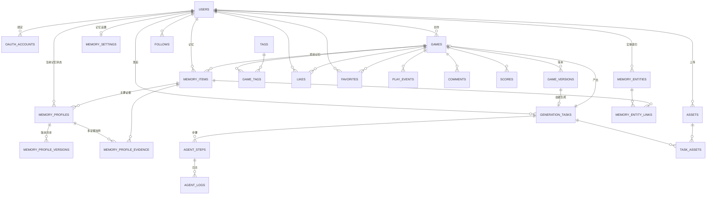

# 数据模型与核心接口

> 配套：[技术选型](技术选型.md) · [系统架构](系统架构.md)
> 字段与流程以当前 SQLAlchemy 模型、Pydantic schema 和路由为准；设计稿只作为页面背景，不再作为接口真源。
> 当前覆盖 Home / Detail / Auth / Create / Play / Studio Memory，以及 generation / revision / remix 三类任务。
> 更新日期：2026-07-26
> 请求体 Schema 位于 `backend/app/schemas/` 包（按域拆分：`common` / `users` / `games` / `uploads` / `memory` / `agent_events` / `tasks`）；响应统一由 `backend/app/services/serialize.py` 输出。

---

## 1. 实体关系总览



**核心表**（需求点名要建模的）：`users` `oauth_accounts` `games` `game_versions` `assets` `generation_tasks` `agent_steps` `agent_logs`
**AI 扩展表**：`memory_items` / `memory_settings`（原始记忆证据与设置）、`memory_profiles` / `memory_profile_versions`（当前生效状态、冲突和历史）、`memory_profile_evidence`（同一 Profile 的多条独立证据）、`memory_entities` / `memory_entity_links`（实体归一与实体级检索）
**运行与审计表**：`generation_dispatch_outbox`（可靠投递）、`agent_trace_events`（可选高保真 trace）、`llm_calls`（模型响应/Token/成本账本）、`moderation_events`（文本审核审计）
**加分表**：`tags` / `game_tags`（标签筛选）、`likes`（点赞）、`favorites`（收藏）、`comments`（评论）、`play_events`（游玩埋点）、`scores`（排行榜）

> 主键统一用 `UUID`（`game.id` 即对象存储路径中的 `<id>`）；时间戳统一 `timestamptz`；金额/计数 `bigint`。

---

## 2. 数据模型（逐表）

### 2.1 users — 用户
| 字段 | 类型 | 说明 |
| --- | --- | --- |
| id | uuid PK | |
| email | citext UNIQUE | 登录邮箱 |
| password_hash | text NULL | 邮箱注册才有；纯 OAuth 用户为空 |
| display_name | text | 展示名（设计稿 `userName`） |
| avatar_initial | text | 头像首字母（`userInit`，由 display_name 派生并冗余存储） |
| is_active | bool | fastapi-users 标准字段 |
| created_at / updated_at | timestamptz | |

### 2.2 oauth_accounts — 第三方账号绑定
| 字段 | 类型 | 说明 |
| --- | --- | --- |
| id | uuid PK | |
| user_id | uuid FK→users | |
| provider | enum(`google`,`github`) | |
| provider_account_id | text | 第三方唯一 ID |
| account_email | text | 第三方返回邮箱 |
| created_at | timestamptz | |
| | | UNIQUE(provider, provider_account_id) — 支持「授权回调 + 账号绑定」 |

> fastapi-users + httpx-oauth 直接落这张表；一个 user 可绑定多个 provider。

### 2.3 games — 游戏（含发布状态）
| 字段 | 类型 | 说明 |
| --- | --- | --- |
| id | uuid PK | OSS 路径中的 `<id>` |
| author_id | uuid FK→users | 作者 |
| title | text | 标题 |
| summary | text | 简介 |
| genre | text | 类型（`ENDLESS RUNNER` / `CASUAL · COZY`…） |
| cover | text | 封面：渐变串或封面图 OSS key |
| source | enum(`seed`,`create`) | 种子数据 / Create 生成 |
| status | enum(`draft`,`preview`,`published`,`archived`) | 发布状态机 |
| current_version | text | 当前展示版本（如 `v1`、`v2`） |
| prompt | text NULL | 若 source=create，记录原始创意（Detail 页展示） |
| plays_count | bigint | 冗余计数（游玩次数统计） |
| likes_count | bigint | 冗余计数 |
| created_at | timestamptz | |
| published_at | timestamptz NULL | 进入 Home 的时间（卡片「发布时间」） |
| remixed_from_game_id | uuid FK→games NULL | Remix 来源游戏 |
| remixed_from_version | text NULL | Remix 来源版本 |

### 2.4 game_versions — 游戏版本（远端产物）
| 字段 | 类型 | 说明 |
| --- | --- | --- |
| id | uuid PK | |
| game_id | uuid FK→games | |
| version | text | `v1` `v2`…（版本管理 / Remix） |
| manifest_key | text | OSS key：`games/{id}/{ver}/manifest.json` |
| entry | text | 入口，默认 `index.html` |
| bundle_key | text | 入口文件 OSS key |
| cover_key | text NULL | 封面 OSS key |
| runtime | text | 运行时，默认 `iframe-sandbox` |
| sha256 | text | 入口包完整性校验值 |
| size_bytes | bigint | 包大小 |
| source_task_id | uuid FK→generation_tasks NULL | 由哪个生成任务产出 |
| created_at | timestamptz | |

### 2.5 assets — 上传素材
| 字段 | 类型 | 说明 |
| --- | --- | --- |
| id | uuid PK | |
| owner_id | uuid FK→users | |
| filename | text | 原始文件名 |
| content_type | text | MIME |
| kind | enum(`image`,`video`,`file`) | 设计稿 `f.type` |
| size_bytes | bigint | |
| oss_key | text | `uploads/{userId}/{assetId}/{filename}` |
| created_at | timestamptz | |

### 2.6 task_assets — 任务↔素材（M2M）
| 字段 | 类型 | 说明 |
| --- | --- | --- |
| task_id | uuid FK→generation_tasks | |
| asset_id | uuid FK→assets | |
| | | PK(task_id, asset_id) — 「上传后能在任务中被引用」 |

### 2.7 generation_tasks — 生成任务
| 字段 | 类型 | 说明 |
| --- | --- | --- |
| id | uuid PK | |
| user_id | uuid FK→users | |
| idea | text | 创意 brief（设计稿 `idea`） |
| status | enum(`pending`,`running`,`succeeded`,`failed`) | 任务状态机 |
| task_kind | text | `generation` / `revision` / `remix` |
| base_game_id / base_version | uuid / text NULL | revision/remix 的不可变基线 |
| feedback_text / feedback_brief | text NULL | revision 原始反馈及结构化摘要 |
| dimension | text | `2d` / `3d` |
| status | enum | 见状态机；`cancelled` 也走同一列 |
| dispatch_generation | int | 任务级单调投递代数，旧 Celery 消息据此丢弃 |
| current_step / current_agent | int / text NULL | 当前节点位置 |
| result_game_id | uuid FK→games NULL | 成功后产出的游戏 |
| version_id | uuid NULL | 产出的版本 |
| tokens_used | bigint | 成本统计（设计稿 `tokens`） |
| cost_usd | numeric NULL | 按模型调用汇总的成本 |
| error | text NULL | 失败原因 |
| error_code / failed_stage | text NULL | 机器可读错误和失败节点 |
| repair_attempts / replan_attempts | int | 当前修复与重规划次数 |
| max_repair_attempts / max_replan_attempts | int | 该任务的预算上限（默认 2 / 1） |
| spec_json / design_json | text NULL | 规划与设计中间产物快照 |
| contract_json | text NULL | 冻结后的设计契约快照 |
| contract_hash / contract_revision | text / int NULL | 契约指纹与修订号，用于跨步骤/账本关联 |
| opik_trace_id | uuid NULL | Opik 生成 trace 分组 ID |
| created_at / started_at / finished_at | timestamptz | |

### 2.8 agent_steps — LangGraph 节点步骤
| 字段 | 类型 | 说明 |
| --- | --- | --- |
| id | uuid PK | |
| task_id | uuid FK→generation_tasks | |
| seq | int | 节点执行顺序；repair/replay 会产生新的 step |
| agent | text | 逻辑 Agent 名称，如 `MemoryRetrievalAgent`、`GameCodeAgent` |
| name | text | 步骤描述 |
| status | enum(`pending`,`running`,`done`,`failed`) | |
| tokens | bigint | 该步 token |
| attempt | int | 同一节点的尝试次数 |
| caused_by_step_id | uuid NULL | repair/retry 由哪个步骤触发 |
| contract_version / contract_hash | text NULL | 该步依据的契约版本与指纹 |
| prompt_version / model / provider | text NULL | 决策链：提示词版本与实际路由 |
| input_artifact_ids_json / output_artifact_ids_json | text NULL | 输入输出工件 ID 列表（同名 synonym 供 trace 消费） |
| adopted_plan / rejected_plans_json | text NULL | 采纳与被否方案 |
| asset_request_count | int | 该步发起的素材请求数 |
| qa_result_json / repair_reason / impact_scope_json | text NULL | QA 判决、修复原因与影响面 |
| latency_ms / cost_usd | int / numeric NULL | 该步耗时与成本 |
| runtime_consumed | bool NULL | 产物是否被运行时真实消费（防"写而不接线"） |
| decision_json | text NULL | 结构化决策记录 |
| started_at / finished_at | timestamptz NULL | |

> `agent_steps` 的决策链字段与 `backend/app/observability/decision_trace.py` 配套：JSON 一律存 text，使 PostgreSQL 与 SQLite 测试库共用同一套模型。

### 2.9 agent_logs — Agent 日志（可见步骤流）
| 字段 | 类型 | 说明 |
| --- | --- | --- |
| id | bigint PK | |
| step_id | uuid FK→agent_steps | |
| seq | int | 行序号；UNIQUE(step_id, seq) |
| line | text | 日志行（设计稿 `st.logs[]`） |
| level | enum(`info`,`warn`,`error`) | |
| payload_json | text NULL | 结构化事件（见下）；无结构化内容时为空 |
| created_at | timestamptz | 支持按时间排序并随任务 SSE 快照展示 |

**结构化事件契约**：`payload_json` 反序列化后按 `type` 字段判别，模型定义在 `backend/app/schemas/agent_events.py`（`AgentLogEventOut` discriminated union）。当前允许的 15 种类型：

```text
file_change · turn_state · heartbeat · check · tool · usage · usage_progress
error · notice · role_budget_exhausted · repair_attempt_started
author_team · validation_rejection · retry · role_stream_failed_partial
```

`AGENT_LOG_EVENT_TYPES` 是 serializer 的唯一真相源：未列出的类型在响应校验前被丢弃，因此 Agent 开始发新事件时不会 500 任务端点。新增事件类型必须同步三处（事件类、union、类型集合）。

### 2.10 memory_items — 记忆条目

用于保存用户长期偏好、当前游戏项目约束和历史反馈。详细设计见 [Memory System 设计](memory_system_design.md)。

| 字段 | 类型 | 说明 |
| --- | --- | --- |
| id | uuid PK | |
| user_id | uuid FK→users | 记忆归属用户 |
| scope_type | enum(`user`,`game`,`task`) | 用户级 / 游戏级 / 任务级 |
| scope_id | uuid NULL | `game_id` / `task_id`；用户级为空 |
| category | enum(`style`,`mechanics`,`controls`,`difficulty`,`content`,`constraints`,`feedback`) | 记忆分类 |
| raw_text | text | 原始文本，不能被摘要替代 |
| extracted_text | text NULL | 模型提取的偏好/约束，只作辅助检索 |
| source_type | enum(`idea`,`feedback`,`manual`,`publish`,`system`) | 来源 |
| source_task_id | uuid FK→generation_tasks NULL | 来源任务 |
| source_game_id | uuid FK→games NULL | 来源游戏 |
| source_version | text NULL | 来源版本，如 `v2` |
| importance | smallint | 1-5，默认 3 |
| confidence | numeric | 0-1 |
| pinned | bool | 用户置顶，检索时提升 |
| status | enum(`active`,`superseded`,`deleted`) | 软删除/取代 |
| supersedes_id | uuid FK→memory_items NULL | 新记忆取代旧记忆 |
| embedding | json NULL | OpenAI 兼容 embedding；仅内部检索使用 |
| embedding_model | varchar(100) NULL | 向量模型，用于模型切换后的懒更新 |
| embedding_updated_at | timestamptz NULL | 向量更新时间 |
| created_at / updated_at | timestamptz | |

推荐索引：

```sql
CREATE INDEX idx_memory_scope ON memory_items(user_id, scope_type, scope_id, status);
CREATE INDEX idx_memory_category ON memory_items(user_id, category, status);
CREATE INDEX idx_memory_source_task ON memory_items(source_task_id);
CREATE INDEX idx_memory_source_game ON memory_items(source_game_id);
```

### 2.11 memory_settings — 记忆设置

| 字段 | 类型 | 说明 |
| --- | --- | --- |
| user_id | uuid PK FK→users | |
| enabled | bool | 是否启用记忆 |
| allow_cross_game_memory | bool | 是否允许跨游戏使用用户长期偏好 |
| allow_memory_extraction | bool | 是否允许从反馈中自动提取记忆 |
| retention_days | int NULL | 自动保留天数；空表示长期保留 |
| created_at / updated_at | timestamptz | |

### 2.12 memory_profiles — 当前生效记忆状态

`memory_items` 是证据，`memory_profiles` 是从证据中得到的当前可用状态。冲突只在相同用户、相同 scope、相同 `profile_key` 内发生。

| 字段 | 类型 | 说明 |
| --- | --- | --- |
| id | uuid PK | Profile ID |
| user_id | uuid FK→users | 用户隔离 |
| scope_type | enum(`user`,`game`,`task`) | 作用范围 |
| scope_id | uuid NULL | game/task ID；user 为空 |
| profile_key | varchar(160) | 同范围冲突键 |
| category | varchar(40) | 记忆分类 |
| value_text | text | 归一化值，不替代原文 |
| summary_text | text | 注入模型的可读总结 |
| evidence_span | text | 可在原文中定位的证据片段 |
| confidence | numeric(4,3) | 基于证据的内容可信度，不直接采用 LLM 自评分 |
| scope_confidence | numeric(4,3) | 范围可信度 |
| explicitness | enum(`manual`,`explicit`,`inferred`) | 明确程度 |
| status | enum(`active`,`candidate`,`superseded`,`deleted`) | 生命周期；candidate 仅后台观察 |
| source_memory_id | uuid FK→memory_items | 当前主要证据 |
| conflicts_with_id | uuid FK→memory_profiles NULL | candidate 所冲突的当前状态 |
| support_count | int | 不同证据来源的累计支持次数 |
| utility_score | numeric(4,3) | 后续任务效用 EWMA，默认 0.5 |
| utility_observation_count | int | 已记录效用结果次数 |
| last_supported_at | timestamptz | 最近一次一致证据时间 |
| expires_at | timestamptz NULL | candidate 自动过期时间 |
| version | int | 当前版本 |
| created_at / updated_at | timestamptz | |

```sql
CREATE INDEX idx_memory_profile_lookup
ON memory_profiles(user_id, scope_type, scope_id, status, category);

CREATE INDEX idx_memory_profile_conflict
ON memory_profiles(user_id, scope_type, scope_id, profile_key, status);
```

### 2.13 memory_profile_versions — Profile 历史

| 字段 | 类型 | 说明 |
| --- | --- | --- |
| id | uuid PK | |
| profile_id | uuid FK→memory_profiles | 所属 Profile |
| version | int | 版本号 |
| operation | enum | `created/candidate/reinforced/auto_promoted/superseded/corrected/utility_updated/expired/deleted` |
| snapshot_json | jsonb | 更新后的完整快照 |
| source_memory_id | uuid FK→memory_items NULL | 触发本版本的证据 |
| reason | text NULL | 决策原因 |
| created_at | timestamptz | |

### 2.14 memory_profile_evidence / memory_entities / memory_entity_links

`memory_profiles` 只保存"当前主要证据"，而同一状态往往有多条独立来源。这三张表把"支持度"和"实体"从单行 Profile 中拆出来：

| 表 | 关键字段 | 用途 |
| --- | --- | --- |
| `memory_profile_evidence` | `profile_id`, `memory_id`, `evidence_span`, `value_text`, `summary_text`, `confidence`, `scope_confidence`, `explicitness`, `is_active`；UNIQUE(profile_id, memory_id) | 同一 Profile 的多条独立证据；支持度由不同来源累计，而不是同一句话反复计数 |
| `memory_entities` | `user_id`, `entity_type`, `canonical_name`, `normalized_name`, `embedding`；UNIQUE(user_id, entity_type, normalized_name) | 实体归一表；PostgreSQL 上对 `embedding` 建 HNSW（`vector_cosine_ops`）索引 |
| `memory_entity_links` | `entity_id`, `memory_id`, `confidence`, `source`；UNIQUE(entity_id, memory_id) | 实体↔记忆关联，供实体级排名参与 RRF 融合 |

### 2.15 加分表
| 表 | 关键字段 | 用途 |
| --- | --- | --- |
| tags | id, name UNIQUE | 标签字典 |
| game_tags | game_id, tag_id（PK 组合） | 游戏↔标签，支撑标签筛选 |
| likes | user_id, game_id（PK 组合）, created_at | 点赞 |
| favorites | user_id, game_id（PK 组合）, created_at | 收藏 |
| play_events | id, game_id, user_id NULL, created_at | 游玩埋点（匿名可空），聚合出 plays_count |

### 2.16 运行与审计表

| 表 | 关键字段 | 用途 |
| --- | --- | --- |
| `generation_dispatch_outbox` | `task_id`, `dispatch_generation`, `attempts`, `published_at` | 将任务状态提交和 Celery 投递意图放在同一事务，beat/outbox-worker 负责补偿 |
| `agent_trace_events` | `task_id`, `step_id`, `run_id`, `seq`, `source`, `event_type`, `agent`, `payload_json` | 详细追踪开启时保存规划、Author/Repair 和 pipeline 的高保真事件；`CODE_AGENT_TRACE_MAX_PAYLOAD_CHARS=0` 保存完整 payload，不进入普通任务 DTO |
| `llm_calls` | `run_id`, `provider_response_id`, `request_index`, `agent`, `workflow_name`, `provider_route`, `prompt_version`, `contract_hash/revision`, `prompt_cache_*`, `cache_prefix_hash`, `toolset_hash`, tokens、上报标记、latency、cost | 按 provider response 幂等记账；支持流式重连、合同关联、缓存命中/写入/绕过原因和稳定前缀漂移分析 |
| `moderation_events` | `surface`, `action`, `categories`, `provider`, `input_sha256` | 记录 prompt、评论、资料等文本审核结果，不保存完整敏感正文 |

---

## 3. 枚举与状态机

```
game.status     : draft → preview → published → (archived)
                  Packager 写入 preview；用户点 Publish 置 published
task.kind       : generation | revision | remix
task.status     : pending → running → succeeded | failed | cancelled
agent_step.status: pending → running → done | failed
asset.kind      : image | video | file
game.source     : seed | create
oauth.provider  : google | github
```

**当前 LangGraph 主链**（`backend/app/agents/graph.py`）：

| 阶段 | 当前节点 |
| --- | --- |
| 安全与上下文 | `safety_intake` → `memory_retrieval` |
| 规划与路由 | `intent_spec` → `gameplay_planning` → `archetype_router` |
| 设计 | `game_design` → `content_plan` → `balance_plan` |
| 契约 | `design_contract` → `contract_gate`（校验+冻结，唯一能授予执行权威的节点） |
| 素材 | `asset_processing` → `asset_generation`（消费冻结契约派生的素材需求） |
| 生成与门禁 | `code_generation` → `project_build` → `build_validation` → `gameplay_qa` |
| 自愈 | `repair_code` / `revision_repair` / `gameplay_repair` / `replan_game_design` |
| 发布与记忆 | `publish_artifact` / `publish_revision` / `publish_remix` → `memory_update` |
| 任务分支 | `feedback_understanding` → `design_contract` → …（revision/remix）；`failed` / `done` 为终态 |

顶层共 26 个功能节点；Author Team 和 Repair 工具循环发生在 `code_generation` / repair 节点内部，不新增顶层 LangGraph 节点。注意素材阶段在契约门禁**之后**：修订任务是否重走素材由 `contract_gate` 依据 `feedback_asset_impact`（缺失时回落契约 diff）路由。

---

## 4. 远端产物协议（OSS + manifest）

**对象存储布局**（bucket `gameweave`）：
```
gameweave/
├── games/{gameId}/{version}/               # Play 读取的浏览器运行时产物
│   ├── manifest.json      # game-manifest/v1：入口 / 文件清单 / 运行时 / 权限
│   ├── index.html         # iframe 入口，发布时注入 CSP
│   ├── assets/…           # 图片、图集、tilemap、音频与构建后的 JS/CSS
│   └── cover.png          # 封面
├── game-sources/{gameId}/{version}/        # Worker 修订读取的私有源码
│   ├── manifest.json      # game-source/v1
│   ├── package.json · tsconfig.json
│   └── src/… · public/…
└── uploads/{userId}/{assetId}/{filename}   # 上传素材
```

**manifest.json**（`game-manifest/v1`，由 `services/packaging.py` 写入）：
```json
{
  "schema_version": "game-manifest/v1",
  "game_id": "…",
  "version_id": "…",
  "title": "Star Catcher",
  "runtime": "phaser-vite-dist",
  "entry": "index.html",
  "files": [{ "path": "index.html", "sha256": "9f2c…", "size": 1234 }],
  "assets": [],
  "permissions": { "network": false, "storage": false, "cookies": false },
  "artifact_format": "phaser-vite/v1",
  "build": { "ok": true }
}
```

`runtime` 取值：2D 模块化工程为 `phaser-vite-dist`，legacy/3D 单文件产物为 `iframe-html`；`artifact_format` 相应为 `phaser-vite/v1` 或 `legacy-bundle/v1`。`permissions.storage=false` 表示生成游戏不能直接访问浏览器存储，需要持久化时只能通过宿主 GameWeaveBridge。

**Play 加载路径**（当前实现）：
```
1) GET `/games/{id}/manifest[?version=…]` → API 从私有 S3 读取并生成文件 token
2) 解析 `entry` / `files` / `runtime` / `permissions`
3) iframe 请求 `/games/{id}/files/{token}/{version}/{path}` → API 校验签名、版本和路径
4) API 从 `games/{id}/{version}/…` 读取对象并返回正确 MIME/CORS
5) 启动 `<iframe sandbox="allow-scripts allow-pointer-lock">`
```
逻辑对象仍位于 `games/<id>/<version>/…`，但浏览器不直接访问 bucket；manifest/file URL 由 `runtime_urls.py` 生成，token 默认 1 小时有效并绑定 `game_id + version`。

---

## 5. 核心接口（REST）

> 约定：JSON over HTTPS；鉴权用 fastapi-users 签发的 HttpOnly/SameSite JWT Cookie，受保护写请求同时校验 `Origin`。`🔒` = 需登录。

### 5.1 Auth
| Method | Path | 说明 | 鉴权 |
| --- | --- | --- | --- |
| POST | `/auth/register` | 邮箱注册 `{email,password,display_name}` | — |
| POST | `/auth/login` | 邮箱登录 → 设置 HttpOnly Cookie，返回 user | — |
| POST | `/auth/logout` | 退出，失效 session | 🔒 |
| GET | `/auth/me` | 当前用户（刷新后识别登录态） | 🔒 |
| GET | `/auth/oauth/providers` | 返回 provider 是否已配置 | — |
| GET | `/auth/oauth/{provider}/start` | 跳转 Google/GitHub 授权 | — |
| GET | `/auth/oauth/{provider}/callback` | 回调：建/绑账号 + 建 session | — |

### 5.2 Home / Games
| Method | Path | 说明 | 鉴权 |
| --- | --- | --- | --- |
| GET | `/games` | 列表，仅 `published`；query：`q`(搜索) `tag`(筛选) `sort` `page` | — |
| GET | `/games/{id}` | 详情：meta + `manifest_url` + tokenized `bundle_url`，含 prompt(若 create) | — |
| GET | `/stats` | 首页 hero：`{game_count, total_plays}` | — |
| GET | `/tags` | 标签 chips | — |
| GET | `/me/games` · `/me/favorites` | Studio：我的作品与收藏，`limit`/`offset` 分页 | 🔒 |
| GET | `/games/{id}/related` | 相关推荐（`limit` 默认 6） | — |
| GET | `/games/{id}/comments` · POST · DELETE `…/{commentId}` | 评论读写与删除 | —/🔒 |
| GET | `/games/{id}/leaderboard` · POST `/games/{id}/score` | 排行榜读取与提分（iframe bridge 转发） | — |
| POST | `/games/{id}/play` | 记录游玩埋点 + plays_count++ | — |
| POST/DELETE | `/games/{id}/like` | 点赞 / 取消 | 🔒 |
| POST/DELETE | `/games/{id}/favorite` | 收藏 / 取消 | 🔒 |
| PATCH · DELETE | `/games/{id}` | 修改元数据 / 删除游戏 | 🔒 |

**GET /games 卡片响应**：
`id, title, author, author_init, genre, summary, tags[], cover, version, plays_str, likes, from_create, published_at, manifest_url, oss_path, remixed_from_*`

### 5.3 Create / 生成
| Method | Path | 说明 | 鉴权 |
| --- | --- | --- | --- |
| POST | `/uploads` | 上传素材（multipart）→ `{id,url,kind,name,size}`；生产改预签名 PUT | 🔒 |
| POST | `/tasks` | 建 generation/remix 任务 `{idea, asset_ids[], dimension, task_kind, source_game_id?}` → 入队 → `{task_id}`；`task_kind="remix"` + `source_game_id` 即 Remix（没有独立 remix 端点）| 🔒 |
| GET | `/tasks/{id}` | 任务状态快照：包含 `task_kind`、基线版本、节点 attempts、结构化 logs、`contract_hash/revision`、`design_contract`、tokens/cost 和 game；日志分页参数 `logs_limit`(1-500) / `logs_before` | 🔒 |
| GET | `/tasks/{id}/generated-assets` | 读取本次任务生成的图像素材预览（从 LangGraph checkpoint 取值）：`key/name/kind/content_type/bytes/data_url/semantic_ids/frame_audit` | 🔒 |
| GET | `/tasks/{id}/events` | SSE 任务事件流；先返回完整快照，随后推送 `task` 或带 `cursor` 的 `delta`，终态后关闭 | 🔒 |
| GET | `/tasks` | 生成历史；`limit`/`offset` 分页，返回 `{items,total,has_more}` | 🔒 |
| POST | `/tasks/{id}/retry` | 失败重试；默认从 checkpoint 续跑，可选 from-scratch | 🔒 |
| POST | `/tasks/{id}/cancel` | 在下一个节点边界取消任务并清理孤立产物 | 🔒 |
| DELETE | `/tasks/{id}` | 删除已终态任务及其 checkpoint/日志 | 🔒 |
| GET | `/games/{id}/preview` | 发布前预览生成产物（作者可见） | 🔒 |
| GET | `/games/{id}/versions` | 查看版本列表和当前版本 | 🔒 |
| POST | `/games/{id}/versions/{version}/activate` | 将历史版本切回当前版本（回滚） | 🔒 |
| GET | `/games/{id}/manifest` | 读取指定版本 manifest；返回带时效文件 URL | — |
| GET | `/games/{id}/files/{token}/{version}/{path}` | 校验 token/version 后代理私有对象存储文件 | — |
| POST | `/games/{id}/publish` · `/games/{id}/unpublish` | preview → published（写 published_at，进 Home）/ 撤回发布 | 🔒 |
| POST | `/tasks/{id}/revise` | 保存用户原始反馈，基于该任务的 Preview 创建增量修改任务 | 🔒 |

### 5.4 Memory

| Method | Path | 说明 | 鉴权 |
| --- | --- | --- | --- |
| GET | `/memory` | 查看自己的记忆；支持 `scope_type` / `scope_id` / `category` 过滤 | 🔒 |
| POST | `/memory` | 用户手动新增记忆 | 🔒 |
| PATCH | `/memory/{id}` | 修改分类、置顶、软删除、编辑提取文本 | 🔒 |
| DELETE | `/memory/{id}` | 软删除记忆 | 🔒 |
| GET | `/memory/settings` | 查看记忆开关 | 🔒 |
| PATCH | `/memory/settings` | 开关长期记忆、跨游戏记忆、自动提取 | 🔒 |
| GET | `/memory/profiles` | 查看当前 Profile；可按 `status` 诊断 candidate | 🔒 |
| GET | `/memory/profiles/{id}/history` | 查看自动创建、强化、晋升、取代和修正历史 | 🔒 |
| PATCH | `/memory/profiles/{id}` | 手动修正当前 Profile；立即作为最高优先级证据生效 | 🔒 |

---

## 6. 字段 → 页面映射（可追溯到设计稿）

| 设计稿页面 | 用到的表 / 字段 |
| --- | --- |
| **Nav** | users.display_name / avatar_initial；登录态 `/auth/me` |
| **Home 卡片** | games.{title,summary,genre,cover,plays_count,version,source}、author、game_tags、published_at |
| **Home hero** | `/stats`：games 计数、Σplays_count |
| **Detail** | games.* + prompt + game_versions(version)、likes_count、oss_path |
| **Auth** | users、oauth_accounts；邮箱校验(≥6 位密码)、Google/GitHub |
| **Create 左栏** | generation_tasks.idea、assets（拖拽上传）、examples |
| **Create 右栏** | agent_steps（按 LangGraph 节点动态展开）、agent_logs（结构化事件/日志流）、tokens_used、cost_usd、status 药丸 |
| **Create 结果** | game_versions(oss_path)、genGame → Preview/Publish/Regenerate |
| **Memory 管理** | memory_items、memory_settings；用户查看、置顶、删除、关闭记忆 |
| **Play 顶栏** | games.{title,author,version}、oss_path |
| **Play 加载** | manifest 加载路径、play_log；sha256；loading/ready/error 三态 |

---

## 7. 已知取舍

- **tags**：用 `tags`+`game_tags` 规范化以支撑筛选；若赶工期可临时用 `games.tags text[]` + GIN 索引，接口形态不变。
- **session**：JWT 仍为无状态，但只放在 HttpOnly Cookie 中，不向 JavaScript 暴露；如需「服务端可吊销」可加 `access_tokens` 表（fastapi-users DB 策略）。
- **Sandbox**：Compose 默认使用独立 Playwright/Chromium 服务执行构建和玩法 QA；`SANDBOX_REQUIRED=true` 时不可达会使任务失败。gVisor 通过生产 `SANDBOX_RUNTIME=runsc` 可选启用，裸 pytest 才允许 V8 降级。
- **plays_count**：先在 `/games/{id}/play` 同步自增；高并发再改为 `play_events` 异步聚合。
- **memory**：使用 PostgreSQL 范围过滤、BM25、embedding 和实体排名，再通过 RRF 融合；生产 PostgreSQL 使用 `pgvector`，SQLite 测试环境退化为 JSON/纯 Python。
