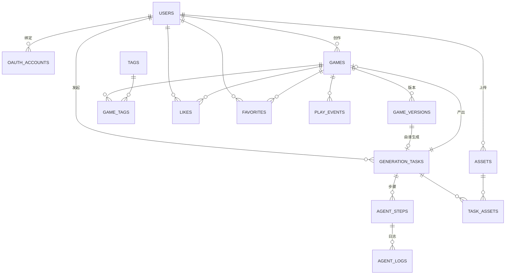

# 数据模型与核心接口

> 配套：[技术选型](技术选型.md) · [系统架构](系统架构.md)
> 字段与流程对齐设计稿 `PlayForge.dc.html`（Home / Detail / Auth / Create / Play 五页面 + 5-Agent 流水线）。
> 更新日期：2026-06-18

---

## 1. 实体关系总览



**核心表**（需求点名要建模的）：`users` `oauth_accounts` `games` `game_versions` `assets` `generation_tasks` `agent_steps` `agent_logs`
**加分表**：`tags` / `game_tags`（标签筛选）、`likes`（点赞）、`favorites`（收藏）、`play_events`（游玩埋点）

> 主键统一用 `UUID`（`game.id` 即对象存储路径中的 `<id>`）；时间戳统一 `timestamptz`；金额/计数 `bigint`。

---

## 2. 数据模型（逐表）

### 2.1 users — 用户
| 字段 | 类型 | 说明 |
| --- | --- | --- |
| id | uuid PK | |
| email | citext UNIQUE | 登录邮箱 |
| password_hash | text NULL | 邮箱注册才有；纯 OAuth 用户为空 |
| display_name | text | 展示名（设计稿 `userName`） |
| avatar_initial | text | 头像首字母（`userInit`，由 display_name 派生并冗余存储） |
| is_active | bool | fastapi-users 标准字段 |
| created_at / updated_at | timestamptz | |

### 2.2 oauth_accounts — 第三方账号绑定
| 字段 | 类型 | 说明 |
| --- | --- | --- |
| id | uuid PK | |
| user_id | uuid FK→users | |
| provider | enum(`google`,`github`) | |
| provider_account_id | text | 第三方唯一 ID |
| account_email | text | 第三方返回邮箱 |
| created_at | timestamptz | |
| | | UNIQUE(provider, provider_account_id) — 支持「授权回调 + 账号绑定」 |

> fastapi-users + httpx-oauth 直接落这张表；一个 user 可绑定多个 provider。

### 2.3 games — 游戏（含发布状态）
| 字段 | 类型 | 说明 |
| --- | --- | --- |
| id | uuid PK | OSS 路径中的 `<id>` |
| author_id | uuid FK→users | 作者 |
| title | text | 标题 |
| summary | text | 简介 |
| genre | text | 类型（`ENDLESS RUNNER` / `CASUAL · COZY`…） |
| cover | text | 封面：渐变串或封面图 OSS key |
| source | enum(`seed`,`create`) | 种子数据 / Create 生成 |
| status | enum(`draft`,`preview`,`published`,`archived`) | 发布状态机 |
| current_version_id | uuid FK→game_versions NULL | 当前展示版本 |
| prompt | text NULL | 若 source=create，记录原始创意（Detail 页展示） |
| plays_count | bigint | 冗余计数（游玩次数统计） |
| likes_count | bigint | 冗余计数 |
| created_at | timestamptz | |
| published_at | timestamptz NULL | 进入 Home 的时间（卡片「发布时间」） |

### 2.4 game_versions — 游戏版本（远端产物）
| 字段 | 类型 | 说明 |
| --- | --- | --- |
| id | uuid PK | |
| game_id | uuid FK→games | |
| version | text | `v1` `v2`…（版本管理 / Remix） |
| manifest_key | text | OSS key：`games/{id}/{ver}/manifest.json` |
| entry | text | 入口，默认 `index.html` |
| bundle_key | text | 入口文件 OSS key |
| cover_key | text NULL | 封面 OSS key |
| runtime | text | 运行时，默认 `iframe-sandbox` |
| sha256 | text | 入口包完整性校验值 |
| size_bytes | bigint | 包大小 |
| source_task_id | uuid FK→generation_tasks NULL | 由哪个生成任务产出 |
| created_at | timestamptz | |

### 2.5 assets — 上传素材
| 字段 | 类型 | 说明 |
| --- | --- | --- |
| id | uuid PK | |
| owner_id | uuid FK→users | |
| filename | text | 原始文件名 |
| content_type | text | MIME |
| kind | enum(`image`,`video`,`file`) | 设计稿 `f.type` |
| size_bytes | bigint | |
| oss_key | text | `uploads/{userId}/{assetId}/{filename}` |
| created_at | timestamptz | |

### 2.6 task_assets — 任务↔素材（M2M）
| 字段 | 类型 | 说明 |
| --- | --- | --- |
| task_id | uuid FK→generation_tasks | |
| asset_id | uuid FK→assets | |
| | | PK(task_id, asset_id) — 「上传后能在任务中被引用」 |

### 2.7 generation_tasks — 生成任务
| 字段 | 类型 | 说明 |
| --- | --- | --- |
| id | uuid PK | |
| user_id | uuid FK→users | |
| idea | text | 创意 brief（设计稿 `idea`） |
| status | enum(`pending`,`running`,`succeeded`,`failed`) | 任务状态机 |
| current_step | smallint | 当前步骤序号（1–5） |
| result_game_id | uuid FK→games NULL | 成功后产出的游戏 |
| tokens_used | bigint | 成本统计（设计稿 `tokens`） |
| error | text NULL | 失败原因 |
| created_at / started_at / finished_at | timestamptz | |

### 2.8 agent_steps — Agent 步骤（5-Agent 流水线）
| 字段 | 类型 | 说明 |
| --- | --- | --- |
| id | uuid PK | |
| task_id | uuid FK→generation_tasks | |
| seq | smallint | 1..5 |
| agent | enum(`planner`,`designer`,`coder`,`sandbox_qa`,`packager`) | |
| name | text | 步骤描述 |
| status | enum(`pending`,`running`,`done`,`failed`) | |
| tokens | bigint | 该步 token |
| started_at / finished_at | timestamptz NULL | |

### 2.9 agent_logs — Agent 日志（可见步骤流）
| 字段 | 类型 | 说明 |
| --- | --- | --- |
| id | bigint PK | |
| step_id | uuid FK→agent_steps | |
| seq | int | 行序号 |
| line | text | 日志行（设计稿 `st.logs[]`） |
| level | enum(`info`,`warn`,`error`) | |
| created_at | timestamptz | 支持轮询 / SSE 增量拉取 |

### 2.10 加分表
| 表 | 关键字段 | 用途 |
| --- | --- | --- |
| tags | id, name UNIQUE | 标签字典 |
| game_tags | game_id, tag_id（PK 组合） | 游戏↔标签，支撑标签筛选 |
| likes | user_id, game_id（PK 组合）, created_at | 点赞 |
| favorites | user_id, game_id（PK 组合）, created_at | 收藏 |
| play_events | id, game_id, user_id NULL, created_at | 游玩埋点（匿名可空），聚合出 plays_count |

---

## 3. 枚举与状态机

```
game.status     : draft → preview → published → (archived)
                  Packager 写入 preview；用户点 Publish 置 published
task.status     : pending → running → succeeded | failed
agent_step.status: pending → running → done | failed
asset.kind      : image | video | file
game.source     : seed | create
oauth.provider  : google | github
```

**5-Agent 流水线**（对齐设计稿 Create 页）：

| # | agent | 职责 | 典型日志 / 产物 |
| --- | --- | --- | --- |
| 1 | Planner | 解析创意 + 素材 → 拆解 game spec | `game-spec.json`（目标/操作/胜负/主题） |
| 2 | Designer | 机制、美术方向与数值平衡 | `design-doc.md`、调好的刷新曲线 |
| 3 | Coder | 产出可运行 bundle | `index.html`（canvas 运行时 + 计分 + 碰撞） |
| 4 | Sandbox QA | 沙箱执行 + 安全扫描 | gVisor `cpu=1 mem=256MB net=deny`，冒烟测试、prompt-injection 扫描 |
| 5 | Packager | 上传 OSS + 写 meta | PUT index.html/manifest.json/cover.png，sha256 戳记，INSERT games(status=preview) |

> 这取代了 [系统架构](系统架构.md) 早期的 4 节点草图（已同步更新）。

---

## 4. 远端产物协议（OSS + manifest）

**对象存储布局**（bucket `playforge`）：
```
playforge/
├── games/{gameId}/{version}/
│   ├── manifest.json      # 入口 / 资源清单 / 运行时 / sha256
│   ├── index.html         # 自包含 HTML5 入口
│   ├── cover.png          # 封面
│   └── assets/…           # 可选附加资源
└── uploads/{userId}/{assetId}/{filename}   # 上传素材
```

**manifest.json**：
```json
{
  "schemaVersion": 1,
  "id": "g_star",
  "title": "Star Catcher",
  "version": "v1",
  "entry": "index.html",
  "runtime": "iframe-sandbox",
  "sandbox": "allow-scripts allow-pointer-lock",
  "assets": ["index.html", "cover.png"],
  "cover": "cover.png",
  "sha256": "9f2c…",
  "createdBy": "PlayForge AI",
  "createdAt": "2026-06-14T08:00:00Z"
}
```

**Play 加载路径**（对齐设计稿 `runLoad`）：
```
1) GET …/manifest.json            → 200
2) 解析 manifest（entry / assets / runtime）
3) GET …/index.html               → 200
4) 校验 sha256                     → 通过 / 拒绝(error 态)
5) 启动 <iframe sandbox="allow-scripts allow-pointer-lock">
   生产：src = 预签名/公网 entry URL；Demo：srcdoc = 拉取到的 HTML
```
逻辑地址 `oss://playforge/games/<id>/<version>/manifest.json`；HTTP 访问 `https://<oss-endpoint>/games/<id>/<version>/…`。换真 S3/OSS 仅改 endpoint。

---

## 5. 核心接口（REST）

> 约定：JSON over HTTPS；鉴权用 fastapi-users 签发的 JWT（Bearer/Cookie）。`🔒` = 需登录。

### 5.1 Auth
| Method | Path | 说明 | 鉴权 |
| --- | --- | --- | --- |
| POST | `/auth/register` | 邮箱注册 `{email,password,display_name}` | — |
| POST | `/auth/login` | 邮箱登录 → 返回 token + user | — |
| POST | `/auth/logout` | 退出，失效 session | 🔒 |
| GET | `/auth/me` | 当前用户（刷新后识别登录态） | 🔒 |
| GET | `/auth/oauth/{provider}/authorize` | 跳转 Google/GitHub 授权 | — |
| GET | `/auth/oauth/{provider}/callback` | 回调：建/绑账号 + 建 session | — |

### 5.2 Home / Games
| Method | Path | 说明 | 鉴权 |
| --- | --- | --- | --- |
| GET | `/games` | 列表，仅 `published`；query：`q`(搜索) `tag`(筛选) `sort` `page` | — |
| GET | `/games/{id}` | 详情：meta + `manifest_url` + `oss_path`，含 prompt(若 create) | — |
| GET | `/stats` | 首页 hero：`{game_count, total_plays}` | — |
| GET | `/tags` | 标签 chips | — |
| POST | `/games/{id}/play` | 记录游玩埋点 + plays_count++ | — |
| POST/DELETE | `/games/{id}/like` | 点赞 / 取消 | 🔒 |
| POST/DELETE | `/games/{id}/favorite` | 收藏 / 取消 | 🔒 |

**GET /games 卡片响应**（对齐设计稿 `decorate`）：
`id, title, author, author_init, genre, summary, tags[], cover, version, plays_str, likes, from_create, published_at, oss_path`

### 5.3 Create / 生成
| Method | Path | 说明 | 鉴权 |
| --- | --- | --- | --- |
| POST | `/uploads` | 上传素材（multipart）→ `{id,url,kind,name,size}`；生产改预签名 PUT | 🔒 |
| POST | `/tasks` | 建生成任务 `{idea, asset_ids[]}` → 入队 → `{task_id}` | 🔒 |
| GET | `/tasks/{id}` | 任务状态：`{status,current_step,steps[{agent,name,status,logs[]}],tokens,error,game?}`（轮询） | 🔒 |
| GET | `/tasks/{id}/logs` | 日志增量（`?after=seq`），或 SSE `/tasks/{id}/stream` | 🔒 |
| GET | `/tasks` | 生成历史（加分） | 🔒 |
| POST | `/tasks/{id}/retry` | 失败重试（加分） | 🔒 |
| GET | `/games/{id}/preview` | 发布前预览生成产物（作者可见） | 🔒 |
| POST | `/games/{id}/publish` | preview → published，写 published_at，进 Home | 🔒 |
| POST | `/games/{id}/remix` | 由已有游戏派生新任务（加分） | 🔒 |

---

## 6. 字段 → 页面映射（可追溯到设计稿）

| 设计稿页面 | 用到的表 / 字段 |
| --- | --- |
| **Nav** | users.display_name / avatar_initial；登录态 `/auth/me` |
| **Home 卡片** | games.{title,summary,genre,cover,plays_count,version,source}、author、game_tags、published_at |
| **Home hero** | `/stats`：games 计数、Σplays_count |
| **Detail** | games.* + prompt + game_versions(version)、likes_count、oss_path |
| **Auth** | users、oauth_accounts；邮箱校验(≥6 位密码)、Google/GitHub |
| **Create 左栏** | generation_tasks.idea、assets（拖拽上传）、examples |
| **Create 右栏** | agent_steps（5 步时间线）、agent_logs（黑底日志流）、tokens_used、status 药丸 |
| **Create 结果** | game_versions(oss_path)、genGame → Preview/Publish/Regenerate |
| **Play 顶栏** | games.{title,author,version}、oss_path |
| **Play 加载** | manifest 加载路径、play_log；sha256；loading/ready/error 三态 |

---

## 7. 已知取舍

- **tags**：用 `tags`+`game_tags` 规范化以支撑筛选；若赶工期可临时用 `games.tags text[]` + GIN 索引，接口形态不变。
- **session**：MVP 用 JWT 无状态；如需「服务端可吊销」可加 `access_tokens` 表（fastapi-users DB 策略）。
- **gVisor 沙箱**：Sandbox QA 步骤的真实隔离执行可先 Mock（返回固定冒烟结果），但 `agent_steps` 已为其留位，边界可平滑替换为真容器沙箱。
- **plays_count**：先在 `/games/{id}/play` 同步自增；高并发再改为 `play_events` 异步聚合。
