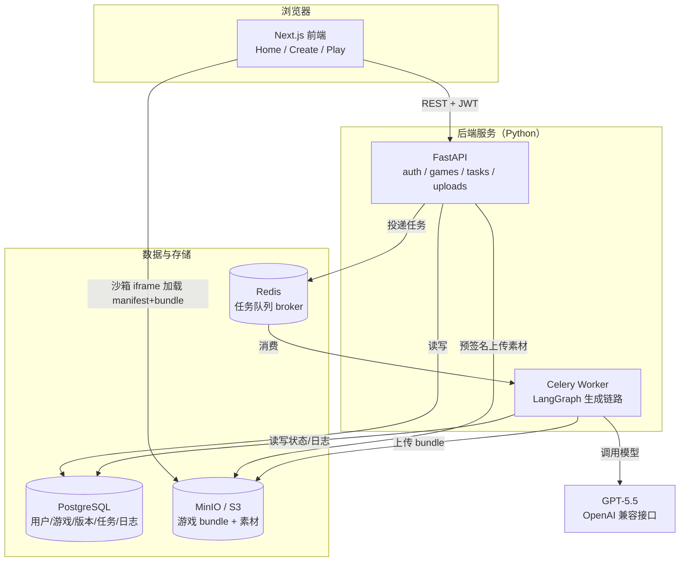
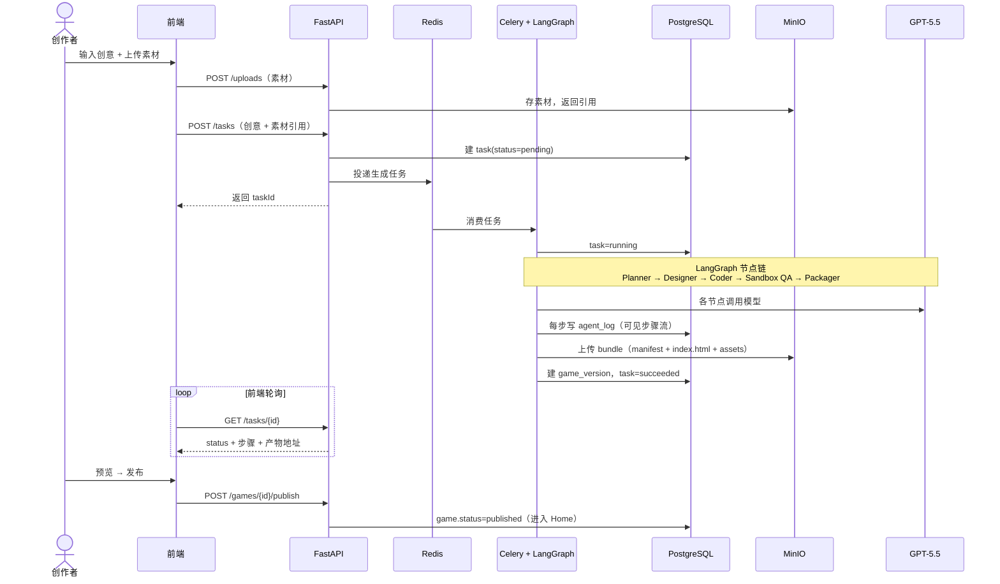
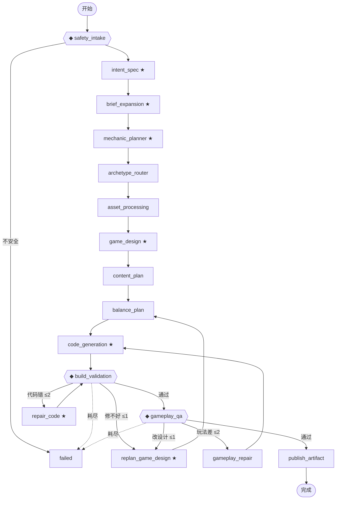
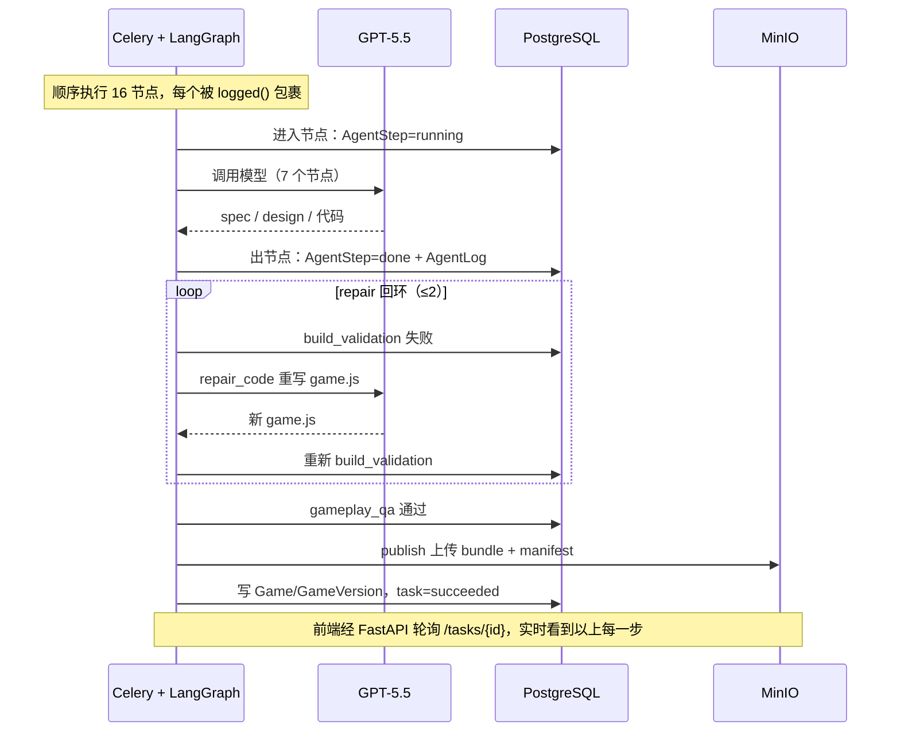
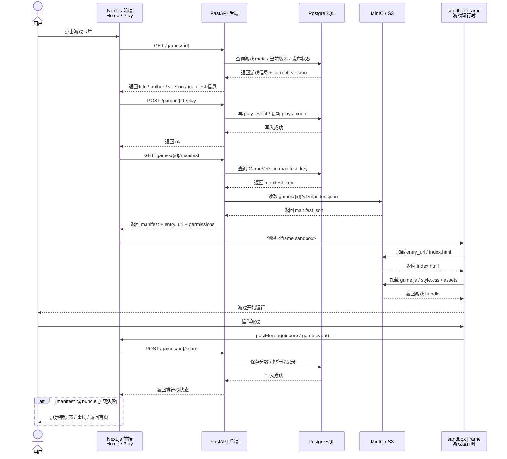

# 系统架构

> 配套文档：[技术选型](技术选型.md)
> 更新日期：2026-06-18
> 说明：以下 Mermaid 图在 GitHub 上可直接渲染。

---

## 技术选型

整体技术栈如下（取舍理由详见 [技术选型](技术选型.md)）：

- **前端**：Next.js 15 + React 19（TypeScript）、TanStack Query、Tailwind CSS v4 + shadcn/ui
- **后端**：Python + FastAPI、SQLAlchemy 2.0 + Alembic、Pydantic v2
- **多智能体**：LangGraph（固定状态图）→ GPT-5.5（OpenAI 兼容接口）
- **异步任务**：Celery + Redis（任务队列 broker）
- **数据库**：PostgreSQL
- **对象存储**：MinIO / S3（boto3，存 bundle + 素材）
- **鉴权**：JWT + bcrypt、OAuth（Google / GitHub）
- **测试 / CI**：pytest + GitHub Actions（后端 pytest + 前端 tsc）
- **部署**：Docker Compose（web / api / worker / postgres / redis / minio）、Zeabur

---

## 1. 总体架构图



**关键边界**

- 前端**不直接读写数据库**，全部走 FastAPI REST 接口（JWT 鉴权）。
- 前端 Play 页**直接从 OSS 拉远端 bundle**（沙箱 iframe），证明产物来自远端地址。
- 所有 OSS 访问走 `boto3`（S3 SDK），换真 S3/OSS 仅改 endpoint。
- 耗时的生成逻辑放在 **Celery Worker**，API 立即返回 `taskId`，前端轮询进度。

---

## 2. 组件职责

| 组件 | 职责 | 关键技术 |
| --- | --- | --- |
| **Next.js 前端** | Home 浏览、Create 多模态输入、Play 沙箱运行、登录态管理 | Next.js 15 / TanStack Query |
| **FastAPI** | REST 接口、鉴权、任务投递、素材预签名上传、发布流程 | FastAPI / fastapi-users / SQLAlchemy |
| **Celery Worker** | 跑 LangGraph 生成链路、写步骤日志、上传产物、回写任务状态 | Celery / LangGraph |
| **PostgreSQL** | 用户、游戏、版本、素材、生成任务、Agent 日志 | SQLAlchemy 2.0 / Alembic |
| **Redis** | Celery broker / 结果后端 | — |
| **MinIO** | 游戏 bundle、上传素材；S3 兼容 | boto3 |
| **GPT-5.5** | Planner / Designer / Coder 等节点的模型推理 | langchain-openai |

---

## 3. Create 生成时序图



---

## 4. 多智能体生成流水线（LangGraph）

Create 链路的核心是一张**顶层固定的 LangGraph 状态图**：16 个功能节点 + `done` / `failed`，3 道条件闸门（`safety_intake` / `build_validation` / `gameplay_qa`）与 3 条自愈回环（`repair` / `gameplay_repair` / `replan`）。顶层固定保证安全检查、构建校验、上传发布不被跳过；16 个节点里仅 7 个调用模型，"智能"被约束在节点内部；闸门不过则回环重试，把模型偶发的坏产出在管线内消化。

### 4.1 状态图（节点与回环）



**图例与说明**

- `★` = 调用 GPT-5.5 的节点（共 7 个）：`intent_spec` / `brief_expansion` / `mechanic_planner` / `game_design` / `code_generation` / `repair_code` / `replan_game_design`，其余为确定性 Python。
- `◆` = 条件闸门：`safety_intake`（安全拦截）、`build_validation`（静态校验 + V8 冒烟）、`gameplay_qa`（玩法验收）。
- 三条回环各自回到不同步骤：`repair_code` → `build_validation`（改代码，≤2 次）；`gameplay_repair` → `code_generation`（调数值，≤2 次）；`replan_game_design` → `balance_plan`（改设计，≤1 次）。
- 回环上限定义在 `backend/app/agents/state.py`，节点连边在 `backend/app/agents/graph.py`。

### 4.2 状态累积（每个节点追加的内容）

以创意「躲避陨石、射击敌人的太空飞船」为例，看 16 个节点依次往共享状态 `GenerationState`（`backend/app/agents/state.py`）追加了什么。下表数值取自确定性兜底路径（`use_real=False`，可精确复现）；开真模型时字段形状一致、内容更丰富。

| # | 节点 | 调模型 | 作用 | 往 state 追加（太空射击示例） |
| --- | --- | --- | --- | --- |
| 1 | `safety_intake` ◆ | 否 | 入口安全检查。检查 prompt 是否为空、过长，是否包含 prompt injection、读取 cookie / 环境变量、窃取密钥等越权意图；不通过就直接进入失败态，不让危险输入流入后续 Agent。 | `normalized_prompt`、`safety_result`{passed:true} |
| 2 | `intent_spec` | 是 | 理解用户创意。把自然语言 prompt 转成结构化 GameSpec，确定标题、类型、主题、核心循环、操作方式、胜负条件和标签，让后续节点不再直接面对模糊文本。 | `game_spec`{title:Space Fortress, genre:shooter, theme:space} |
| 3 | `brief_expansion` | 是 | 扩展玩法简报。把一句话创意补成更完整的可玩 brief，明确玩家幻想、目标、核心动词、奖励循环、难度节奏、反馈方式和最小内容量。 | `expanded_brief`{core_verbs:[fly,dodge,shoot], min_content} |
| 4 | `mechanic_planner` | 是 | 规划核心机制。决定游戏具体怎么玩，包括主要操作、次要操作、敌人行为、奖励物、道具、风险模型和玩家技能考验。 | `mechanic_plan`{enemies:[swarm,gunship,boss], powerups×3} |
| 5 | `archetype_router` | 否 | 选择玩法原型。把创意路由到系统支持的类型，例如纵版射击、跑酷、俯视角收集或逻辑解谜，限制生成范围，提升代码生成和 QA 的稳定性。 | `archetype_result`=vertical_shooter（写回 `game_spec.archetype`） |
| 6 | `asset_processing` | 否 | 处理上传素材。把用户上传的图片、视频或文件整理成素材清单，生成封面或素材引用，让素材能被后续设计、代码生成和打包阶段消费。 | `asset_manifest`{cover:渐变, assets:[]} |
| 7 | `game_design` | 是 | 生成具体游戏设计。基于 spec、brief、机制和原型，设计游戏实体、规则、关卡、敌人、Boss、反馈、界面结构和运行时约束。 | `game_design`{900×600, entities, waves, boss:mothership} |
| 8 | `content_plan` | 否 | 安排内容节奏。决定教学如何出现、波次如何推进、奖励和风险如何分布，让游戏不是只有一个空循环，而是有阶段、有变化。 | `content_plan`{tutorial, waves[4], hazard/reward 名} |
| 9 | `balance_plan` | 否 | 生成数值配置。确定游戏时长、目标分、生命值、玩家速度、敌人速度、刷新间隔、最大敌人数等参数，直接影响游戏是否可玩、是否过难。 | `balance_config`{65s · target170 · lives4 · spawn1750ms} |
| 10 | `code_generation` | 是 | 生成可运行代码。根据前面累计的设计和数值产出 `index.html`、`style.css`、`game.js`；2D 模型优先并有模板兜底，3D 则围绕 WebGL / Three.js 产物生成。 | `generated_files`[index.html · style.css · game.js] |
| 11 | `build_validation` ◆ | 否 | 构建与安全校验。检查文件是否齐全、HTML 是否正确引用 JS、是否包含危险 API 或外链、文件体积是否超限，并计算产物 hash；不通过就触发修复。 | `validation_result`{valid, 每文件 sha256/size} |
| 12 | `repair_code` ↻ | 是 | 代码修复回环。只在构建校验失败时触发，根据错误原因局部重写或修复代码，然后回到 `build_validation` 再检查；次数有上限，避免无限修。 | 重写 `game.js`（带报错），`repair_attempts++` |
| 13 | `replan_game_design` ↻ | 是 | 降级重规划。当前设计反复无法实现时，重新生成更简单、更稳定的方案，再回到 `balance_plan` 重跑后半段；2D 场景会启用模板兜底。 | 简化 `game_design`，`use_template_code=true` |
| 14 | `gameplay_qa` ◆ | 否 | 玩法 QA。检查游戏不只是代码没报错，而是真的有循环、输入、目标、得分、失败 / 重开机制，并通过运行时冒烟测试。 | `gameplay_qa_result`{passed, runtime_smoke_ok} |
| 15 | `gameplay_repair` ↻ | 否 | 玩法修复回环。玩法 QA 不通过时，不推翻整个设计，而是调安全数值，例如降低难度、放慢障碍、增加生命或降低目标分，再回到代码生成。 | 放宽 `balance_config`（hazard 变慢 / +命） |
| 16 | `publish_artifact` | 否 | 产物发布。这个节点不调模型，只做确定性工程动作：上传 bundle 到 MinIO / S3，生成 manifest，写入 `Game` 和 `GameVersion`，返回预览地址。 | `game_id`、`version_id`、`manifest_url`、`/play/{id}` |

> `◆` = 条件闸门；`↻` = 失败时才触发的回环（不新增字段，只重写已有状态）。前 9 个节点把一句话逐层翻译成越来越具体的设计，第 10 个变成代码，11 / 14 把关，12 / 13 / 15 出问题时回头修。

几个关键节点产出的真实 JSON（兜底值）：

**`intent_spec` → `game_spec`**

```json
{ "title": "Space Fortress", "genre": "shooter", "theme": "space",
  "core_loop": "fly, shoot waves of enemies, dodge bullets, grab power-ups, beat the boss",
  "win_condition": "reach_target_score", "lose_condition": "timer_or_lives_depleted",
  "tags": ["space", "shooter", "casual"] }
```

**`mechanic_planner` → `mechanic_plan`**（并给出 archetype 暗示）

```json
{ "archetype_hint": "vertical_shooter",
  "enemy_behaviors": [
    { "name": "swarm fighter", "behavior": "weaves downward firing aimed shots" },
    { "name": "gunship", "behavior": "strafes the top and lays bullet spreads" },
    { "name": "boss carrier", "behavior": "multi-phase, telegraphed barrages" } ],
  "powerups": [
    { "name": "spread shot", "effect": "wider fire arc" },
    { "name": "shield", "effect": "absorbs one hit" },
    { "name": "wingman", "effect": "adds a side gun" } ] }
```

**`game_design` → `game_design`**

```json
{ "archetype": "vertical_shooter", "screen": { "width": 900, "height": 600 },
  "entities": [
    { "name": "fighter", "role": "enemy", "movement": "weaves downward", "behavior": "fires aimed bursts" },
    { "name": "gunship", "role": "enemy", "movement": "strafes from top", "behavior": "bullet spreads" } ],
  "waves": [ { "t": 0, "note": "safe opening" }, { "t": 12, "note": "ramp up" }, { "t": 28, "note": "climax" } ],
  "boss": { "name": "mothership", "attacks": ["laser sweeps", "homing missiles"], "hp": 100 },
  "rules": { "survive_seconds": 65 } }
```

**`balance_plan` → `balance_config`**

```json
{ "round_seconds": 65, "target_score": 170, "lives": 4,
  "player_speed": 330, "hazard_speed": 92, "hazard_spawn_ms": 1750, "max_hazards": 6, "lanes": 3 }
```

`code_generation` 把以上 `game_spec` + `game_design` + `balance_config` + `asset_manifest` 一起喂给模型 / 模板，产出 `index.html / style.css / game.js`——前面 9 层累积到这里第一次变成可运行代码。

### 4.3 一次运行时序



---

## 5. Play 加载时序图



---

## 6. 远端产物协议（bundle 结构）

OSS 路径：`games/{gameId}/{version}/`

```
games/{gameId}/{version}/
├── manifest.json     # 入口、资源列表、运行时要求、封面
├── index.html        # 游戏入口（自包含 HTML5）
├── assets/           # 图片/音频/脚本等
└── cover.png         # 封面图
```

`manifest.json` 示例字段：`entry` `assets[]` `runtime` `title` `cover` `createdBy` `version`。Play 页只认 manifest，与具体游戏实现解耦。

---

## 7. Monorepo 目录结构

```
yahaha/
├── docs/                       # 系统设计文档
│   ├── 技术选型.md
│   └── 系统架构.md
├── frontend/                   # Next.js（仅 UI，调后端 API）
│   ├── app/
│   │   ├── (auth)/             # 登录 / 注册
│   │   ├── page.tsx            # Home
│   │   ├── create/            # Create
│   │   ├── games/[id]/        # 游戏详情
│   │   └── play/[id]/         # Play（沙箱 iframe）
│   ├── components/             # UI 组件（shadcn/ui）
│   ├── lib/                    # api client、query hooks、auth
│   ├── package.json
│   └── Dockerfile
├── backend/                    # FastAPI + Celery
│   ├── app/
│   │   ├── main.py             # FastAPI 入口
│   │   ├── core/               # 配置、安全、依赖
│   │   ├── api/                # 路由：auth/games/tasks/uploads
│   │   ├── models/             # SQLAlchemy 模型
│   │   ├── schemas/            # Pydantic 模型
│   │   ├── services/           # 业务逻辑
│   │   ├── auth/               # fastapi-users 配置 + OAuth
│   │   ├── storage/            # boto3 S3 封装
│   │   ├── agents/             # LangGraph 生成链路
│   │   │   ├── graph.py        # 图定义
│   │   │   ├── state.py        # 状态结构
│   │   │   └── nodes/          # planner/asset/codegen/validator
│   │   ├── tasks/              # Celery app + 生成任务
│   │   └── db/                 # session、base
│   ├── alembic/                # 数据库迁移
│   ├── requirements.txt
│   └── Dockerfile
├── docker-compose.yml          # web/api/worker/postgres/redis/minio
├── .env.example                # 必需环境变量
└── README.md                   # 启动方式、测试数据说明
```

---

## 8. 依赖清单

### 8.1 后端 `backend/requirements.txt`

```
# Web 框架
fastapi>=0.115
uvicorn[standard]>=0.30
pydantic>=2.9
pydantic-settings>=2.5
python-multipart>=0.0.9      # 文件上传

# 数据库
sqlalchemy>=2.0
alembic>=1.13
psycopg[binary]>=3.2

# 认证（邮箱 + OAuth）
fastapi-users[sqlalchemy]>=13.0
httpx-oauth>=0.15

# 异步任务
celery>=5.4
redis>=5.0

# 对象存储（S3 兼容）
boto3>=1.35

# Agent / 模型
langgraph>=0.2
langchain-core>=0.3
langchain-openai>=0.2

# 素材处理
pillow>=10.4
```

### 8.2 前端 `frontend/package.json`（dependencies 摘要）

```jsonc
{
  "dependencies": {
    "next": "^15",
    "react": "^19",
    "react-dom": "^19",
    "@tanstack/react-query": "^5",
    "axios": "^1.7",
    "zod": "^3.23",
    "react-hook-form": "^7",
    "lucide-react": "^0.4",
    "class-variance-authority": "^0.7",
    "clsx": "^2",
    "tailwind-merge": "^2"
  },
  "devDependencies": {
    "typescript": "^5",
    "@types/react": "^19",
    "@types/node": "^22",
    "tailwindcss": "^4",
    "eslint": "^9",
    "eslint-config-next": "^15"
  }
}
```

> shadcn/ui 通过 CLI 按需生成组件，不作为单一 npm 包，依赖落在上面的 `cva / clsx / tailwind-merge / lucide-react`。
