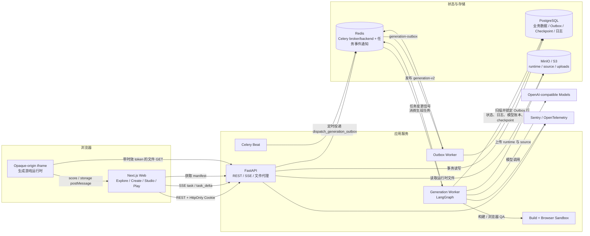
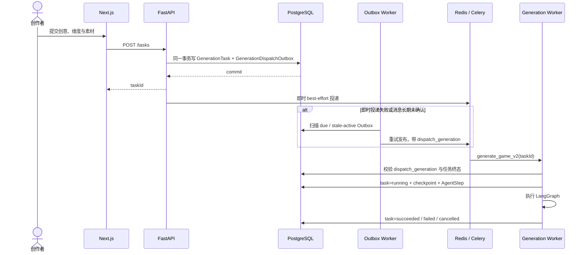
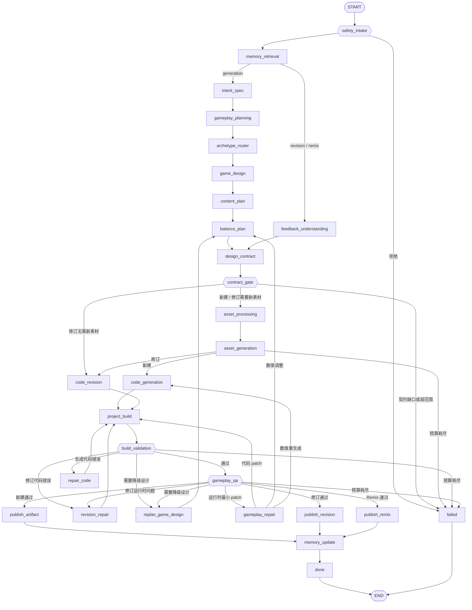
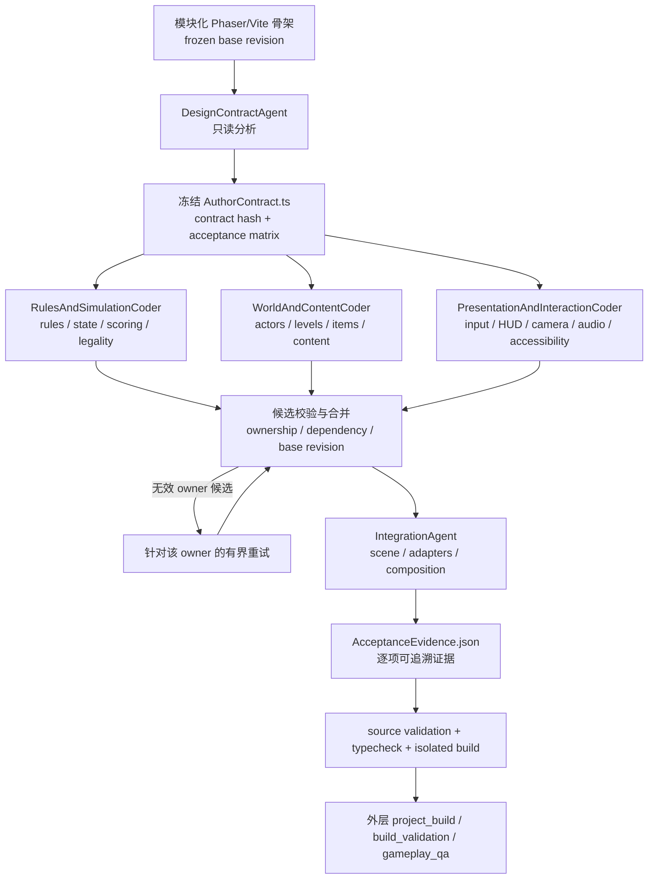
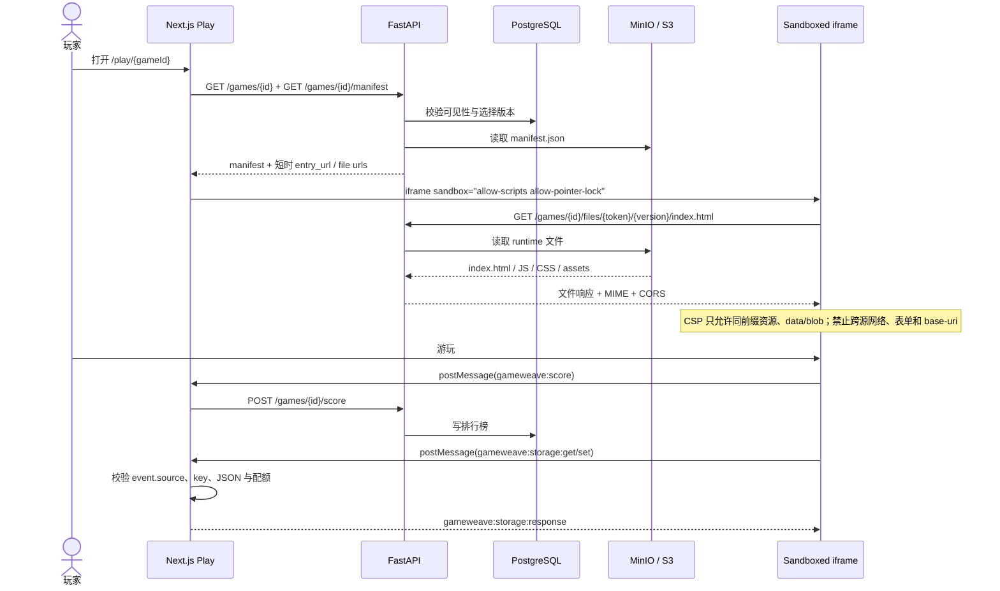

# 系统架构

> 更新日期：2026-07-26
>
> 配套文档：[技术选型](技术选型.md) · [Multi-Agent 设计](multi-agent_design.md) · [Memory System 设计](memory_system_design.md) · [安全与可观测性](安全与可观测性.md) · [数据模型与核心接口](数据模型与接口.md)
>
> 本文以当前代码为准；关键事实分别来自 `backend/app/agents/graph.py`、`backend/app/agents/planning_nodes.py`、`backend/app/agents/pipeline.py`、`backend/app/generation/design_contract.py`、`backend/app/agents/author_team.py`、`backend/app/services/task_dispatch.py`、`backend/app/services/packaging.py`、`backend/app/services/game_actions.py` 与 Docker Compose 配置。

---

## 1. 架构原则

GameWeave 是一个 AI Native 互动游戏平台。系统既要支持普通 Web 产品能力，也要把长时间、非确定性的游戏生成过程约束为可恢复、可审计的生产流水线。

当前架构遵循六条原则：

1. **PostgreSQL 是业务真相源**：任务状态、步骤、日志、模型账本、游戏版本、记忆和事务型 Outbox 都落在 PostgreSQL；Redis 不保存不可恢复的业务真相。
2. **外层固定、内层智能**：顶层由固定 LangGraph 状态图控制，模型不能跳过安全、构建、玩法 QA 和发布节点；开放式工具循环只发生在代码生成与修复节点内部。
3. **任务投递不丢失**：任务记录与投递意图在同一数据库事务中提交，事务型 Outbox 负责即时投递失败后的重试。
4. **源码与运行时产物分离**：2D 游戏的私有 Phaser/Vite/TypeScript 源码和可播放运行时 `dist` 分开存储；修订读取源码，Play 只加载运行时文件。
5. **生成代码零信任**：生成项目必须经过源码策略校验、隔离 Vite 构建、浏览器沙箱玩法 QA、CSP 注入和 iframe capability 限制。
6. **失败可恢复、重复可幂等**：LangGraph 使用 PostgreSQL checkpointer；Celery 重投递、Retry、发布和 SSE 重连都具有明确的去重或续跑语义。

---

## 2. 技术栈

| 层 | 当前实现 |
| --- | --- |
| Web 前端 | Next.js 15.5、React 19、TypeScript、TanStack Query、Tailwind CSS v4、shadcn/ui |
| API | Python、FastAPI、Pydantic v2、fastapi-users、HttpOnly JWT Cookie、Google/GitHub OAuth |
| 数据库 | PostgreSQL 16 + pgvector、SQLAlchemy 2、Alembic、psycopg 3 |
| 异步任务 | Celery 5 + Redis 7；生成队列、Outbox 队列、Beat 定时扫描 |
| Agent 编排 | LangGraph 1.0 固定状态图 + PostgreSQL checkpointer |
| 模型与工具循环 | OpenAI 兼容接口、LangChain OpenAI、OpenAI Agents SDK；默认模型名由 `MODEL_NAME` 配置 |
| 2D 生成运行时 | Phaser 3.90 + TypeScript 5.8 + Vite 6.4；模块化源码工程 |
| 3D 生成运行时 | 自托管 Three.js + WebGL；模型生成 iframe HTML 产物 |
| 构建与 QA | 独立 Sandbox 服务；固定 Vite 构建、浏览器运行时检查、静态安全校验 |
| 对象存储 | MinIO / S3，boto3；运行时 bundle、私有源码、上传素材 |
| 可观测性 | structlog、Sentry、OpenTelemetry、Opik、AgentStep/AgentLog、AgentTraceEvent、LLMCall 账本 |
| 部署 | Docker Compose；Caddy 边缘代理；可选 ClamAV 与 Jaeger |

真实依赖清单以 `backend/requirements.txt`、`frontend/package.json` 和生成项目白名单 `backend/app/services/vite_projects.py` 为准。

---

## 3. 总体架构



### 3.1 关键边界

- 前端不直接读写 PostgreSQL，所有产品数据都通过 FastAPI。
- Redis 同时承担 Celery broker/result backend 和任务事件 Pub/Sub，但 SSE 的最终内容始终从 PostgreSQL 重读。
- API 不把“写任务”和“发队列消息”当成一个不可靠的跨系统操作；它先提交任务与 Outbox，再做即时 best-effort 投递，Beat/Outbox Worker 负责兜底。
- 生成 Worker 不在主进程直接执行不可信构建或浏览器脚本，而是调用独立 Sandbox 服务。
- Play 不把公开 S3 URL当作权限边界。API 检查游戏可见性后返回短时 token 文件 URL，iframe 再通过 API 文件路由读取对象存储。
- 生成 iframe 没有 `allow-same-origin`，其 origin 为 opaque；宿主通过 `MessageEvent.source === iframe.contentWindow` 验证消息来自当前活动 frame。

---

## 4. 组件职责

| 组件 | 主要职责 | 不负责什么 |
| --- | --- | --- |
| Next.js Web | 登录态、Explore/Create/Studio/Play UI、SSE 合并、iframe 宿主、排行榜与存储桥 | 不直接访问数据库，不执行生成流水线 |
| FastAPI | REST、Cookie 鉴权、OAuth、CSRF Origin 校验、站点门禁、任务创建、SSE、manifest 和文件代理 | 不同步执行长时间模型生成 |
| Generation Outbox | 将数据库中的投递意图可靠发布到 Celery；指数退避、锁行、过期 active delivery 重发 | 不保存任务业务状态 |
| Generation Worker | 运行 LangGraph、模型调用、Author Team、构建/QA、发布、checkpoint 恢复 | 不信任模型产物，不绕过校验 |
| Sandbox | 固定依赖的 Vite 构建、TypeScript 检查、浏览器加载与运行时探测 | 不持久化业务数据，不访问公网 |
| PostgreSQL | 用户、游戏、版本、任务、步骤/日志、Outbox、checkpoint、记忆、LLM 用量账本 | 不作为 bundle 大文件存储 |
| Redis | Celery broker/backend、任务变更通知 | 不作为任务详情或日志真相源 |
| MinIO / S3 | 上传素材、不可变运行时版本、私有源码版本 | 不决定游戏可见性和用户权限 |
| Memory Service | Profile + 原始证据检索、冲突处理、版本历史、效用反馈 | 不能覆盖本轮用户输入和安全规则 |
| OpenAI-compatible Model | 规划、设计、代码作者、修复和可选记忆 claim 建议 | 不能控制顶层节点顺序或直接发布产物 |

---

## 5. Create 任务投递与实时进度

### 5.1 事务型 Outbox



`dispatch_generation` 是任务级单调代数。旧 Celery 消息即使在网络延迟后重新出现，也会因为代数过期而被丢弃。Celery 同时启用 `acks_late`、worker-lost reject、低 prefetch 和大于任务时限的 Redis visibility timeout。

### 5.2 SSE 快照、增量与重连

前端通过 `GET /tasks/{id}/events` 获取进度：

- 首次连接没有 `Last-Event-ID`：返回 `event: task` 完整快照。
- 重连带 `Last-Event-ID`：返回 `event: task_delta`，只包含该游标之后的日志和最新任务摘要。
- SSE `id` 使用已经序列化进响应的 `AgentLog.id`，避免“游标前进但正文没带上日志”的丢失窗口。
- Worker 每次提交状态后只向 Redis 发布“任务已变化”信号；FastAPI 收到信号后从 PostgreSQL 查询 delta。
- Redis Pub/Sub 暂时不可用时返回 `unavailable`，前端退避重连；没有新内容时发送 keep-alive。
- 进入 `succeeded`、`failed` 或 `cancelled` 后发送终态并关闭连接。

正常产品进度使用 `AgentStep + AgentLog`。代码 Agent 的完整流式事件可选择写入 `AgentTraceEvent`，不会自动塞入普通任务 DTO，避免高保真 trace 放大日常接口负载。

---

## 6. 顶层 LangGraph 工作流

`backend/app/agents/graph.py` 当前定义 **26 个功能节点 + `done` / `failed`**。新建、修订和 Remix 共用同一张图，在 `memory_retrieval` 后按 `task_kind` 分支；两条路径都会经过 `design_contract` → `contract_gate`，素材与代码只允许消费冻结后的契约视图。



### 6.1 新建生成主路径

成功的新建任务通常经过 18 个功能节点：

```text
safety_intake
→ memory_retrieval
→ intent_spec
→ gameplay_planning
→ archetype_router
→ game_design
→ content_plan
→ balance_plan
→ design_contract
→ contract_gate
→ asset_processing
→ asset_generation
→ code_generation
→ project_build
→ build_validation
→ gameplay_qa
→ publish_artifact
→ memory_update
```

注意素材阶段位于契约门禁之后：素材规划消费的是冻结契约派生出的 sprite 需求 manifest，而不是原始设计草稿。

模型调用数量不再是固定常数。它取决于 real/mock 模式、2D/3D、Author Team 是否启用、是否发生 repair/replan，以及 Agent 内层实际工具轮数。固定的是节点顺序和闸门，不是模型请求次数。

### 6.2 Revision 与 Remix

Revision/Remix 从不可变 `base_game_id + base_version` 开始：

```text
safety_intake
→ memory_retrieval
→ feedback_understanding
→ design_contract
→ contract_gate
→ (asset_processing → asset_generation，仅当本次修改需要新素材)
→ code_revision
→ project_build
→ build_validation
→ gameplay_qa
→ publish_revision | publish_remix
→ memory_update
```

- `feedback_text` 原样保存，是语义真相源；`feedback_brief` 只是模型生成的辅助修改简报。
- 修订同样重新编译设计契约：编译器计算契约 diff 作为确定性证据，是否需要重新生成素材由 `feedback_understanding` 阶段模型给出的 `feedback_asset_impact` 判定（缺失时回落到契约 diff），`contract_gate` 据此路由到 `asset_processing` 或直接 `code_revision`。
- Revision 修改现有私有源码项目，只提交真实发生变化的文件。
- 发布 `vN+1` 前再次检查 `game.current_version == base_version`，防止并发修订覆盖。
- 旧 `GameVersion` 和旧源码前缀保持不可变，可用于回滚、比较和继续修订。
- Remix 从可见版本派生新游戏的 `v1`，保留来源游戏与版本信息。

### 6.3 设计契约与算术门禁

- `design_contract`（实现在 `backend/app/agents/planning_nodes.py`，编译器在 `backend/app/generation/design_contract.py`）把 GameSpec/GameDesign/内容与数值产物**确定性**编译为 DesignContract 草稿：实体、系统、需求、验收项与 `win_feasibility_ledger`。该节点不让任何实现 Agent 重新解读用户需求。
- `contract_gate` 是唯一能把草稿提升为冻结执行权威的节点：先做纯算术校验（如容量账本 `deliverable ≥ 1.3 × threat`、开局账本 `opening ≥ 1.2 × first_wave`，坏账本在冻结前即拦截；旧任务无账本时不拦以保持兼容），再冻结契约、计算 `contract_hash` 并派生下游只读视图（design/spec payload、sprite 需求 manifest）。
- 契约编译缺口（`contract_gap`）或超出范围（`scope_exceeded`）会让任务失败；Retry 从 checkpoint 续跑时会重新走契约编译，而不是复用失效草稿。

---

## 7. 2D Author Team：代码生成节点内的有界协作

新 2D 游戏首先创建中性的 Phaser/Vite/TypeScript 模块化骨架。当 real 模式和项目作者功能启用时，`code_generation` 节点内部运行有界 Author Team；顶层 LangGraph 仍只看到一个 `code_generation` 节点。

注意区分两层契约：顶层 `design_contract`/`contract_gate` 节点产出的是**设计契约**（DesignContract，约束玩法可行性与素材需求）；Author Team 内部的 `DesignContractAgent` 在此基础上产出**代码架构契约**（`AuthorContract.ts`，约束模块所有权、事件与验收证据）。



### 7.1 角色与写入边界

| 角色 | 允许写入 | 主要责任 |
| --- | --- | --- |
| `DesignContractAgent` | 只读 | 把 GameSpec/GameDesign 转成状态、事件、模块依赖、验收项和可验证契约 |
| `RulesAndSimulationCoder` | `src/systems/**`、`src/domain/**` | 规则、状态机、计分、胜负、AI 决策、合法性和仿真 |
| `WorldAndContentCoder` | `src/entities/**`、`src/content/**`、`src/levels/**` | 角色、敌人、卡牌、物品、关卡、地图、Boss、内容数据 |
| `PresentationAndInteractionCoder` | `src/ui/**`、`src/presentation/**`、`src/input/**`、`src/audio/**`、`src/styles.css` | 输入、HUD、菜单、相机、动画、声音、反馈和无障碍 |
| `IntegrationAgent` | `src/scenes/**`、`src/main.ts`、`src/contracts/**`、`src/adapters/**`、`src/composition/**` | 把前三个候选通过显式接口接入真实运行时，并执行最终检查 |

`package.json`、`tsconfig.json`、`src/config/gameConfig.ts`、质量辅助系统和 `AuthorContract.ts` 属于保留路径，角色不能随意重写。

### 7.2 合并与预算

- 三个实现角色从同一个冻结 base revision 和同一个 contract hash 出发，并行执行，互不共享可变工作区。
- 合并器检查实际变更、路径所有权、导出符号、依赖关系、契约 hash 和候选完整性；无效 owner 可以单独重试。
- 只有三个必需 owner 候选都通过，才进入 IntegrationAgent；IntegrationAgent 不能静默重写其他 owner 的实现。
- 每个非 Integration 验收项必须同时提供“owner 实现文件”和“运行时 wiring 文件”的真实符号证据。
- Team 同时受 turns、token、changed-file 和 wall-clock deadline 限制；预算耗尽时保留可验证的 partial candidate，但仍必须经过外层构建与 QA。
- Author Team 不可用或没有产出有效项目时，2D 路径可以回落到稳定的模块化 TypeScript 模板；3D 路径没有模板兜底。

---

## 8. 构建、校验与自愈闭环

| 阶段 | 输入 | 核心检查 | 失败去向 |
| --- | --- | --- | --- |
| `project_build` | 私有 `phaser-vite/v1` 源码 | 文件/依赖白名单、固定 Vite 配置、隔离 TypeScript/Vite build、把 module 入口转换为 opaque iframe 可运行的 classic script | `build_validation` 判定后进入 repair/replan |
| `build_validation` | 构建后的 runtime 文件 | 路径与大小、危险 API/外链、必需文件、HTML/JS 完整性、hash、构建结果 | 新建走 `repair_code` 或 `replan_game_design`；修订走 `revision_repair` |
| `gameplay_qa` | runtime + 必要源码上下文 | 输入、循环、胜负、重开、内容深度、物理边界、浏览器加载、动画帧、网络请求、运行时报错 | `gameplay_repair`、`replan_game_design` 或失败 |
| `publish_*` | 已通过 QA 的 runtime/source | 上传、manifest、Game/GameVersion、来源任务幂等检查 | 事务失败则任务失败，可由 checkpoint/Retry 恢复 |

自愈策略不是“无限重问模型”：

- `repair_code`：针对构建错误执行有界工具修复，然后回到 `project_build`。
- `revision_repair`：只修订当前版本源码，不切换成新建路径。
- `gameplay_repair`：浏览器运行时错误优先做最小代码 patch 后重新构建；纯玩法数值问题调整 balance 后重新生成。
- `replan_game_design`：设计不可实现或多次修复失败时降低复杂度，再从 `balance_plan` 继续。
- 达到图级预算后进入 `failed`，不会形成无限循环。

Sandbox 容器在独立内部网络中运行，开发 Compose 使用只读根文件系统、临时 `/tmp`、CPU/内存/PID 限制；Worker 通过 `SANDBOX_URL` 调用，生产默认要求 Sandbox 可用。

---

## 9. 数据、队列与对象存储边界

### 9.1 PostgreSQL

主要持久化对象包括：

- 产品域：`User`、`Game`、`GameVersion`、Tag、Comment、Like、Favorite、Score、Asset。
- 生成域：`GenerationTask`、`GenerationDispatchOutbox`、`AgentStep`、`AgentLog`。
- 可观测性：`AgentTraceEvent`、按 provider response 幂等记录的 `LLMCall`。
- 恢复：LangGraph PostgreSQL checkpoint 表。
- 记忆：`memory_items`、`memory_profiles`、`memory_profile_versions` 等证据与状态表。

`LLMCall` 使用 `provider_response_id` 和 `(run_id, request_index)` 唯一约束，流式重试或响应重放不会重复累计 token/cost。`AgentLog` 使用 `(step_id, seq)` 唯一约束，保证并发 heartbeat/tool 日志仍有稳定顺序。

### 9.2 Redis

Redis 用于：

- Celery broker 与 result backend。
- `generation-v2`、`generation-outbox` 等队列。
- 任务事件 Pub/Sub 失效通知。

Redis 不承担任务详情、日志游标和版本数据的最终一致性。

### 9.3 MinIO / S3

运行时和源码使用不同前缀：

```text
games/{gameId}/{version}/
├── manifest.json               # game-manifest/v1
├── index.html                  # iframe 入口，发布时注入 CSP
├── assets/...                  # 图片、图集、tilemap、音频等
└── assets/*.js / *.css         # Vite 构建后的静态文件

game-sources/{gameId}/{version}/
├── manifest.json               # game-source/v1
├── package.json
├── src/...
└── public/...
```

- `games/` 是 Play 使用的浏览器运行时产物。
- `game-sources/` 是 Worker 修订使用的私有源码，不返回给普通 Play 请求。
- `GameVersion` 保存 manifest key、entry、runtime、sha256、大小和来源任务；版本发布后不可变。
- 新 2D runtime 为 `phaser-vite-dist`，源码格式为 `phaser-vite/v1`；历史 `legacy-bundle/v1` 只保留兼容读取/修订。

`game-manifest/v1` 的核心结构：

```json
{
  "schema_version": "game-manifest/v1",
  "game_id": "...",
  "version_id": "...",
  "runtime": "phaser-vite-dist",
  "entry": "index.html",
  "files": [{ "path": "index.html", "sha256": "...", "size": 1234 }],
  "assets": [],
  "permissions": { "network": false, "storage": false, "cookies": false },
  "artifact_format": "phaser-vite/v1",
  "build": { "ok": true }
}
```

`permissions.storage=false` 表示生成游戏不能直接访问浏览器存储；需要持久化时只能通过宿主提供的 GameWeaveBridge。

---

## 10. Play 加载与 capability bridge



Play 安全边界：

- iframe 没有 `allow-same-origin`、`allow-forms`、`allow-popups`，生成代码不能读取宿主 Cookie/DOM。
- 发布时为 `index.html` 注入 CSP：禁止外部脚本、外部连接、表单和 `<base>`；同前缀 XHR 被允许，以支持 Phaser 加载图集和 tilemap。
- API 文件 token 绑定 `game_id + version` 并带过期时间；路径规范化拒绝 `.`、`..` 和越界路径。
- 分数消息与存储消息都先验证来自当前 iframe 的 WindowProxy，已替换或过期的 frame 不能操作宿主。
- Game storage 按 `gameId` 隔离，最多 32 个 slot、单项 64 KiB、单游戏总计 256 KiB，只接受可 JSON 序列化值。

---

## 11. 恢复、幂等与取消

- **Checkpoint 续跑**：任务失败后 Retry 默认尝试从 PostgreSQL LangGraph checkpoint 恢复；用户也可以选择 from-scratch，删除旧 thread 和步骤后重跑。
- **修复预算重置**：显式 Retry 续跑时重置 repair/replan/gameplay repair 预算，但保留图中的下一节点位置。
- **旧消息去重**：Worker 启动前比较 `expected_dispatch_generation`；终态任务收到旧 Celery 消息直接返回。
- **发布幂等**：`publish_generated`、`publish_revision`、`publish_remix` 先按 `source_task_id` 查找已生成版本，重投递不会创建重复 Game/GameVersion。
- **版本并发控制**：Revision 写新版本前检查 base version，过期修订返回冲突而不是覆盖当前版本。
- **取消**：节点边界观察取消状态；如果取消发生在发布附近，系统尽力删除孤立 Game、`games/` 和 `game-sources/` 前缀。
- **基础设施故障**：PostgreSQL checkpoint 不可用被视为可重试基础设施错误，不伪装成内容生成失败。
- **健康检查**：`/health/ready` 分别检查 DB、Redis 和 S3，任一不可用返回 degraded/503。

---

## 12. 可观测性

可观测性分为四层：

1. **产品进度层**：`GenerationTask.current_agent/current_step`、`AgentStep`、`AgentLog`，通过 SSE 给 Create UI。
2. **Agent 细节层**：Author Team 的 `team_started`、`contract_frozen`、`role_started/completed`、candidate merge/retry、integration evidence 等结构化事件写入日志 payload。事件结构由 `backend/app/schemas/agent_events.py` 的 discriminated union（`AgentLogEventOut`，按 `type` 区分）定义；serializer 会丢弃未知事件类型，新事件不会 500 任务端点。前端 Create 页的 Activity 视图（`frontend/app/create/_lib/agent-events.ts` 等）消费同一套类型。
3. **高保真 trace 层**：可选 `AgentTraceEvent` 保存流式模型、工具调用、文件上下文和 patch 事件，按 task/step/run 检索；决策 trace 与详细 trace 的辅助逻辑集中在 `backend/app/observability/`（`decision_trace.py`、`detailed_trace.py`），并可通过 Opik（`opik_integration.py`）按生成任务分组上报。
4. **成本与基础设施层**：`LLMCall` 记录模型、prompt/completion/cached tokens、latency、retry、cost（账本逻辑在 `backend/app/llm/accounting.py`）；structlog、Sentry 和 OpenTelemetry 关联 request/task/user 上下文。

前端普通任务接口不会默认返回完整高保真 trace，避免把调试数据和用户进度数据耦合。

---

## 13. 部署拓扑

开发与生产 Compose 的核心服务：

| 服务 | 作用 |
| --- | --- |
| `web` | Next.js；开发使用 HMR，生产使用构建产物与 `next start` |
| `api` | FastAPI REST/SSE/文件代理 |
| `worker` | `celery,generation-v2` 队列，运行 LangGraph |
| `outbox-worker` | `generation-outbox` 队列，可靠投递 |
| `beat` | 定时扫描 Outbox、清理过期记忆 |
| `sandbox` | 内部网络中的构建与浏览器 QA 服务 |
| `migrate` | Alembic 迁移 + LangGraph checkpoint 初始化 |
| `postgres` | pgvector/pgvector PostgreSQL 16 |
| `redis` | AOF 持久化 Redis 7 |
| `minio` / `createbuckets` | S3 兼容存储与桶初始化 |
| `edge` | 可选 Caddy TLS/反向代理 |
| `clamav` | 可选上传病毒扫描 profile |
| `jaeger` | 可选 OTLP/trace profile |

生产环境保持 bucket 私有，浏览器运行时通过 API token 文件 URL 读取；站点访问密码门禁由 `SITE_PASSWORD` 控制，业务鉴权仍使用用户 Cookie/OAuth。

---

## 14. Monorepo 目录结构

```text
yahaha/
├── frontend/
│   ├── app/
│   │   ├── (marketing)/        # 首页、About、条款、隐私
│   │   ├── (public)/           # Explore、公开游戏、公开用户、Play 路由
│   │   ├── (authenticated)/    # 登录后 Create / Studio 入口
│   │   ├── create/             # Create 工作区、SSE、Activity 时间线、Author Team 进度与素材工作台
│   │   ├── play/[id]/          # iframe 宿主、score/storage bridge
│   │   └── api/gate/           # 站点访问密码门禁
│   ├── components/             # shadcn/ui 与共享组件
│   ├── lib/                    # API client、OpenAPI 类型、auth/query 工具
│   └── package.json
├── backend/
│   ├── app/
│   │   ├── main.py             # FastAPI 入口、中间件、health
│   │   ├── api/routers/        # auth/oauth/games/tasks/uploads/users/memory
│   │   ├── agents/             # LangGraph 节点、Author Team、repair、validation、publish（旧拆分模块保留兼容别名）
│   │   ├── generation/         # 层中立生成组件：设计契约编译、生成限额、源码策略（不依赖 agents）
│   │   ├── llm/                # 层中立 LLM 层：runtime/provider/cache/accounting
│   │   ├── observability/      # decision/detailed trace、Opik 集成
│   │   ├── schemas/            # 请求体 Pydantic Schema，按域拆分（common/users/games/uploads/memory/agent_events/tasks）
│   │   ├── services/           # task/outbox、packaging、素材管线、memory、业务动作
│   │   ├── tasks/              # Celery app、generation、outbox、memory、trace 导出任务
│   │   ├── tools/              # OpenAPI 导出、agent trace/生成分析导出、checkpoint 初始化
│   │   ├── models/             # SQLAlchemy 模型
│   │   ├── core/               # config/security/gate/checkpoint/telemetry
│   │   ├── storage/            # S3 封装
│   │   └── db/                 # engine/session/base
│   ├── migrations/             # Alembic 版本
│   ├── tests/                  # 按域分桶：api/architecture/assets/authoring/gates/infra/memory/pipeline
│   └── requirements.txt
├── sandbox/                    # 隔离构建与浏览器运行服务
├── e2e/                        # Playwright 端到端测试
├── deploy/                     # Caddy、迁移与交付说明
├── docs/                       # 架构、数据、安全、Memory、Multi-Agent 文档
├── qa/                         # 历轮线上问题取证工件（复盘报告、复现脚本）
├── graphify-out/               # 代码知识图谱输出（仅 GRAPH_REPORT.md 入库）
├── docker-compose.yml          # 开发拓扑
├── docker-compose.prod.yml     # 生产拓扑
└── README.md
```

---

## 15. 架构事实的维护入口

后续更新本文时，优先检查以下文件，而不是复制旧文档中的数字：

| 架构事实 | 代码真相源 |
| --- | --- |
| LangGraph 节点与连边 | `backend/app/agents/graph.py` |
| 规划与契约节点实现 | `backend/app/agents/planning_nodes.py` |
| 设计契约编译、算术门禁、账本校验 | `backend/app/generation/design_contract.py` |
| 任务恢复、终态与 checkpoint | `backend/app/agents/pipeline.py` |
| 2D Author Team 角色、预算、合并 | `backend/app/agents/author_team.py`、`author_orchestration.py`、`author_runner.py`、`author_contract.py` |
| 生成/修订代码策略 | `backend/app/agents/codegen.py` |
| 构建与玩法 QA | `project_build.py`、`validation.py`、`validation_nodes.py` |
| LLM runtime、缓存与用量账本 | `backend/app/llm/`（`runtime.py`、`provider.py`、`cache.py`、`accounting.py`） |
| 素材规划、复用、语义评审与后处理 | `services/asset_planning.py`、`asset_reuse.py`、`asset_semantic_review.py`、`asset_postprocess.py`、`sprite_pipeline.py`、`game_assets.py` |
| 结构化 Agent 日志事件 | `backend/app/schemas/agent_events.py`、`services/serialize.py` |
| 任务 Outbox 与 Celery 路由 | `services/task_dispatch.py`、`tasks/celery_app.py` |
| SSE 快照与 delta | `api/routers/tasks.py`、`services/task_events.py` |
| runtime/source 产物协议 | `services/packaging.py`、`services/vite_projects.py` |
| Play manifest、token 文件路由 | `services/game_actions.py`、`services/runtime_urls.py` |
| iframe 存储 bridge | `frontend/app/play/[id]/_components/game-storage.ts` |
| 分层边界守护 | `backend/tests/architecture/`（agents facade、memory 分层、generation 边界） |
| 实际依赖与部署服务 | `backend/requirements.txt`、`frontend/package.json`、`docker-compose*.yml` |
