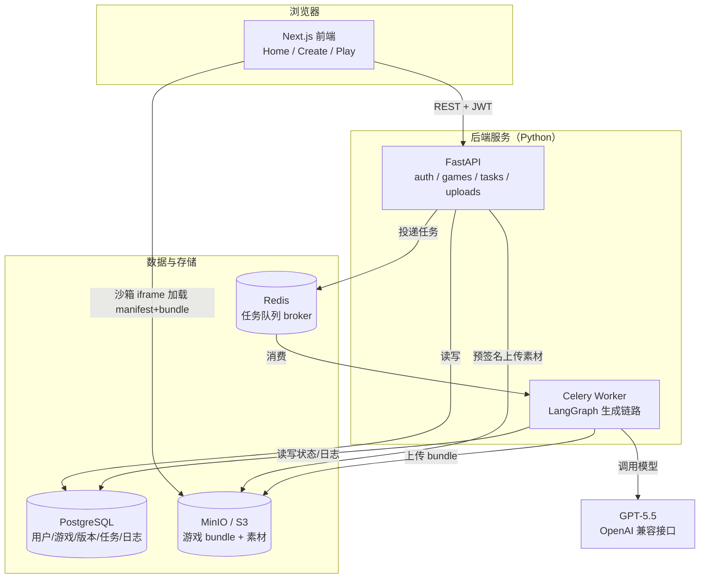
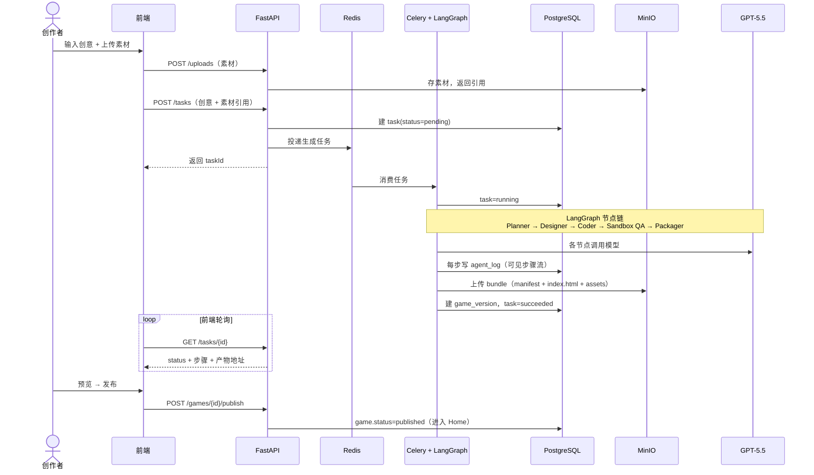
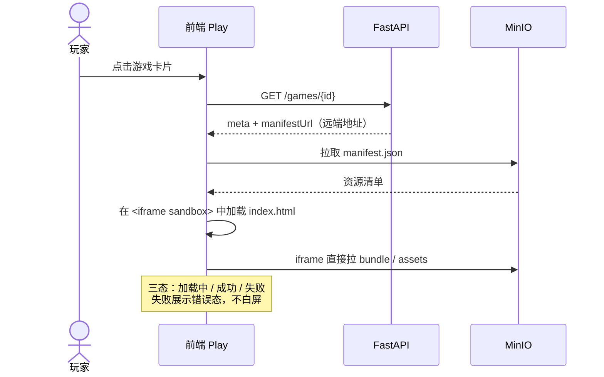

# 系统架构

> 配套文档：[技术选型](技术选型.md)
> 更新日期：2026-06-18
> 说明：以下 Mermaid 图在 GitHub 上可直接渲染。

---

## 1. 总体架构图



**关键边界**

- 前端**不直接读写数据库**，全部走 FastAPI REST 接口（JWT 鉴权）。
- 前端 Play 页**直接从 OSS 拉远端 bundle**（沙箱 iframe），证明产物来自远端地址。
- 所有 OSS 访问走 `boto3`（S3 SDK），换真 S3/OSS 仅改 endpoint。
- 耗时的生成逻辑放在 **Celery Worker**，API 立即返回 `taskId`，前端轮询进度。

---

## 2. 组件职责

| 组件 | 职责 | 关键技术 |
| --- | --- | --- |
| **Next.js 前端** | Home 浏览、Create 多模态输入、Play 沙箱运行、登录态管理 | Next.js 15 / TanStack Query |
| **FastAPI** | REST 接口、鉴权、任务投递、素材预签名上传、发布流程 | FastAPI / fastapi-users / SQLAlchemy |
| **Celery Worker** | 跑 LangGraph 生成链路、写步骤日志、上传产物、回写任务状态 | Celery / LangGraph |
| **PostgreSQL** | 用户、游戏、版本、素材、生成任务、Agent 日志 | SQLAlchemy 2.0 / Alembic |
| **Redis** | Celery broker / 结果后端 | — |
| **MinIO** | 游戏 bundle、上传素材；S3 兼容 | boto3 |
| **GPT-5.5** | Planner / Designer / Coder 等节点的模型推理 | langchain-openai |

---

## 3. Create 生成时序图



---

## 4. Play 加载时序图



---

## 5. 远端产物协议（bundle 结构）

OSS 路径：`games/{gameId}/{version}/`

```
games/{gameId}/{version}/
├── manifest.json     # 入口、资源列表、运行时要求、封面
├── index.html        # 游戏入口（自包含 HTML5）
├── assets/           # 图片/音频/脚本等
└── cover.png         # 封面图
```

`manifest.json` 示例字段：`entry` `assets[]` `runtime` `title` `cover` `createdBy` `version`。Play 页只认 manifest，与具体游戏实现解耦。

---

## 6. Monorepo 目录结构

```
yahaha/
├── docs/                       # 系统设计文档
│   ├── 技术选型.md
│   └── 系统架构.md
├── frontend/                   # Next.js（仅 UI，调后端 API）
│   ├── app/
│   │   ├── (auth)/             # 登录 / 注册
│   │   ├── page.tsx            # Home
│   │   ├── create/            # Create
│   │   ├── games/[id]/        # 游戏详情
│   │   └── play/[id]/         # Play（沙箱 iframe）
│   ├── components/             # UI 组件（shadcn/ui）
│   ├── lib/                    # api client、query hooks、auth
│   ├── package.json
│   └── Dockerfile
├── backend/                    # FastAPI + Celery
│   ├── app/
│   │   ├── main.py             # FastAPI 入口
│   │   ├── core/               # 配置、安全、依赖
│   │   ├── api/                # 路由：auth/games/tasks/uploads
│   │   ├── models/             # SQLAlchemy 模型
│   │   ├── schemas/            # Pydantic 模型
│   │   ├── services/           # 业务逻辑
│   │   ├── auth/               # fastapi-users 配置 + OAuth
│   │   ├── storage/            # boto3 S3 封装
│   │   ├── agents/             # LangGraph 生成链路
│   │   │   ├── graph.py        # 图定义
│   │   │   ├── state.py        # 状态结构
│   │   │   └── nodes/          # planner/asset/codegen/validator
│   │   ├── tasks/              # Celery app + 生成任务
│   │   └── db/                 # session、base
│   ├── alembic/                # 数据库迁移
│   ├── requirements.txt
│   └── Dockerfile
├── docker-compose.yml          # web/api/worker/postgres/redis/minio
├── .env.example                # 必需环境变量
└── README.md                   # 启动方式、测试数据说明
```

---

## 7. 依赖清单

### 7.1 后端 `backend/requirements.txt`

```
# Web 框架
fastapi>=0.115
uvicorn[standard]>=0.30
pydantic>=2.9
pydantic-settings>=2.5
python-multipart>=0.0.9      # 文件上传

# 数据库
sqlalchemy>=2.0
alembic>=1.13
psycopg[binary]>=3.2

# 认证（邮箱 + OAuth）
fastapi-users[sqlalchemy]>=13.0
httpx-oauth>=0.15

# 异步任务
celery>=5.4
redis>=5.0

# 对象存储（S3 兼容）
boto3>=1.35

# Agent / 模型
langgraph>=0.2
langchain-core>=0.3
langchain-openai>=0.2

# 素材处理
pillow>=10.4
```

### 7.2 前端 `frontend/package.json`（dependencies 摘要）

```jsonc
{
  "dependencies": {
    "next": "^15",
    "react": "^19",
    "react-dom": "^19",
    "@tanstack/react-query": "^5",
    "axios": "^1.7",
    "zod": "^3.23",
    "react-hook-form": "^7",
    "lucide-react": "^0.4",
    "class-variance-authority": "^0.7",
    "clsx": "^2",
    "tailwind-merge": "^2"
  },
  "devDependencies": {
    "typescript": "^5",
    "@types/react": "^19",
    "@types/node": "^22",
    "tailwindcss": "^4",
    "eslint": "^9",
    "eslint-config-next": "^15"
  }
}
```

> shadcn/ui 通过 CLI 按需生成组件，不作为单一 npm 包，依赖落在上面的 `cva / clsx / tailwind-merge / lucide-react`。
