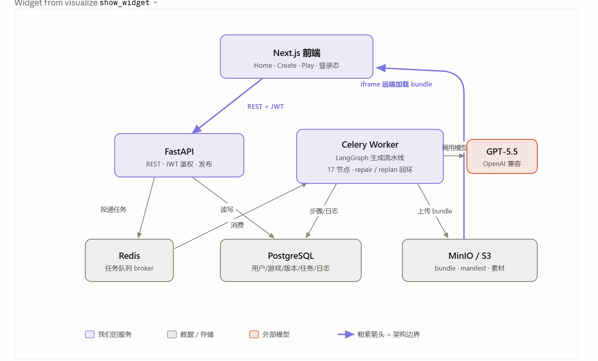
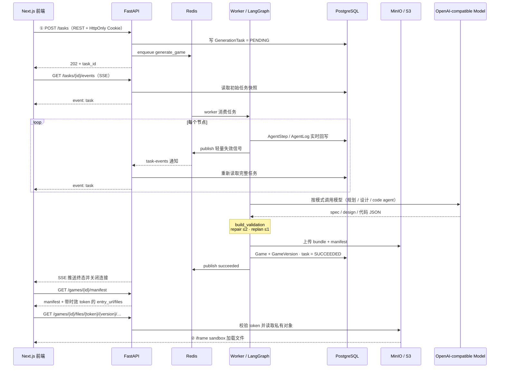

# 系统架构流程讲解

> 基于当前代码整理，重点说明 GameWeave 从用户创建游戏到 AI 生成、发布、播放的完整链路。
> 更新日期：2026-07-16。节点、路由和存储边界以 `backend/app/agents/graph.py`、`services/task_dispatch.py`、`services/runtime_urls.py` 为准。



## 1. 架构总览

这套系统可以理解成两条主流程加一个异步生成核心：

1. 用户在前端操作。
2. FastAPI 处理同步请求。
3. Celery Worker 处理耗时 AI 生成。
4. PostgreSQL 记录状态。
5. MinIO/S3 保存真正可运行的游戏文件。
6. 前端 Play 页通过 FastAPI 文件代理从私有 MinIO/S3 远程加载游戏。

图中的紫色框是我们自己的服务，灰色框是数据或存储，红色框是外部模型服务，粗紫色箭头表示关键架构边界。

### 1.1 两条架构边界（信任边界）

图里的两条粗紫色箭头其实是两条**信任边界**，整套设计的安全性都建立在它们之上：

- **边界①　前端 → FastAPI（REST + HttpOnly Cookie）**：浏览器由 `credentials: include` 自动携带会话，JavaScript 读不到 JWT；鉴权、CSRF Origin 校验、限流、发布均收口在 FastAPI。
- **边界②　API 文件代理 → 前端 iframe**：生成代码在构建/玩法 QA 阶段由独立 `sandbox` 服务运行，发布后作为静态产物保存在私有对象存储。Play 页先从 API 获取带时效 token 的 manifest/file URL，再由 `<iframe sandbox="allow-scripts allow-pointer-lock">` 加载；不可信代码没有宿主同源权限，不能直接绕过 API 访问草稿或历史版本。

中间所有箭头（Redis / PostgreSQL / Celery / 模型）都是为了**异步、可观测、可自愈**地把“一句话”变成边界②里那个 bundle。

### 1.2 完整时序

下图按时间顺序展开同一条链路，①② 标出上面两条架构边界（GitHub 可直接渲染）：



## 2. 组件分工

### Next.js 前端

Next.js 负责用户能看到和操作的页面，包括 Home、Create、Play 和登录态管理。用户输入游戏创意、上传素材、查看生成进度、预览游戏、发布游戏，都从前端发起。

### FastAPI

FastAPI 负责登录鉴权、创建任务、查询任务、发布游戏、点赞、评论等。认证端点维持 async 协议，同步 SQLAlchemy、bcrypt 和对象存储 I/O 均经线程池边界执行；前后端通过 REST + HttpOnly Cookie 通信。

### Redis

Redis 同时承担 Celery broker 和任务事件 Pub/Sub。FastAPI 收到生成请求后把任务投递给 Worker；Worker/API 在数据库事务提交后只发布轻量失效信号，任务状态本身始终保存在 PostgreSQL。

### Celery Worker

Celery Worker 是后台任务执行器，负责真正运行 LangGraph 生成流水线。它会调用模型、生成代码、执行校验、修复失败、上传产物，并把每一步状态写回数据库。

### PostgreSQL

PostgreSQL 是系统的主数据库，保存用户、游戏、游戏版本、生成任务、Agent 步骤、Agent 日志、点赞、收藏、评论、排行榜等结构化数据。

### MinIO / S3

MinIO/S3 是对象存储，保存用户上传素材和生成出来的游戏产物。游戏产物通常包括 `manifest.json`、`index.html`、`style.css`、`game.js`，3D 游戏还可能包含 `three.min.js`。

### OpenAI-compatible Model

模型服务是可配置的 OpenAI-compatible endpoint（默认模型名由 `MODEL_NAME` 决定）。Celery Worker 在需要创造能力的节点里调用它，例如生成游戏规格、玩法设计、代码、Author Team 候选和修复方案。

### 2.1 关键文件索引

| 环节 | 主要文件 |
| --- | --- |
| 登录 / Cookie 鉴权 | `backend/app/api/routers/auth.py`、`backend/app/core/security.py`、`backend/app/api/deps.py` |
| 创建任务 / 投递队列 | `backend/app/api/routers/tasks.py`（`POST /tasks`，第 24 行起） |
| Celery 任务 / broker | `backend/app/tasks/generate.py`、`backend/app/tasks/celery_app.py` |
| 流水线编排 | `backend/app/agents/pipeline.py`（`run_generation`，第 15 行起） |
| LangGraph 顶层图 | `backend/app/agents/graph.py`（节点与连边） |
| 节点实现 | `backend/app/agents/nodes.py` |
| 状态与回环上限 | `backend/app/agents/state.py`（`MAX_REPAIR` 等） |
| 模型客户端 | `backend/app/agents/llm.py`（OpenAI 兼容 `chat()`） |
| 进度追踪 | `backend/app/agents/tracing.py`（`logged()` 装饰器） |
| 发布 / 打包 | `backend/app/services/packaging.py`（`publish_generated`，第 76 行起） |
| 可靠投递 / Outbox | `backend/app/services/task_dispatch.py`、`backend/app/tasks/outbox.py` |
| 构建与浏览器 QA | `backend/app/agents/project_build.py`、`backend/app/agents/validation_nodes.py`、`sandbox/app/main.py` |
| 对象存储客户端 | `backend/app/storage/s3.py`（`put_object`，第 33 行起） |
| 游戏 / manifest / 文件代理 | `backend/app/api/routers/games.py`（`/games/{id}/manifest`、`/games/{id}/files/{token}/…`） |

## 3. 创建游戏流程

用户从 Next.js 的 Create 页面开始。

```text
Next.js Create 页面
-> FastAPI
-> PostgreSQL 创建任务
-> Redis 投递任务
-> Celery Worker 消费任务
-> LangGraph 生成游戏
-> PostgreSQL 写步骤和日志
-> MinIO/S3 上传 bundle
-> PostgreSQL 写游戏和版本
-> Redis Pub/Sub 发任务失效信号
-> FastAPI 从 PostgreSQL 读取快照并经 SSE 推送完成状态
```

### 3.1 前端提交创意

用户在 Create 页输入游戏 prompt，上传参考素材，并选择 2D 或 3D。前端通过 REST + HttpOnly Cookie 调用 FastAPI，Cookie 内的 JWT 证明当前登录用户。

### 3.2 FastAPI 创建任务

FastAPI 收到请求后不会直接生成游戏，因为生成可能耗时较长。它只做同步且快速的事情：

- 校验用户登录态。
- 校验请求参数。
- 把生成任务写入 PostgreSQL。
- 关联用户上传的素材。
- 把任务 ID 投递到 Redis。
- 立刻返回 `task_id` 给前端。

这样 API 请求不会被模型生成过程阻塞，用户能马上进入生成进度页面。

### 3.3 Redis 排队

FastAPI 将任务投递给 Celery，本质上是在 Redis 中放入一条待执行任务。执行期间 Worker/API 还会向按 task id 隔离的 Pub/Sub channel 发布失效信号，唤醒 SSE API 重新查询数据库。Redis 不保存业务最终状态，也不序列化完整任务。

### 3.4 Worker 执行生成

Celery Worker 从 Redis 消费任务后，开始运行 LangGraph 生成流水线（`backend/app/agents/graph.py`）。当前代码定义 **24 个功能节点 + `done` / `failed` 两个终止节点**。同一张图按 `task_kind` 分支支持新建、revision 和 remix；顶层顺序固定，模型只能在节点内部工作，安全、构建、玩法 QA 和发布不能被跳过。

典型流程包括：

```text
安全检查
-> Memory 检索
-> 意图解析
-> prompt 扩展
-> 玩法机制规划
-> 原型路由
-> 素材处理
-> 游戏设计
-> 内容规划
-> 平衡参数
-> 素材生成（可选）
-> 代码生成
-> 项目构建
-> 构建校验
-> 玩法 QA
-> 修复 / 重规划
-> 产物发布 / Revision 发布 / Remix 发布
-> Memory 更新
```

模型只负责部分节点中的创造性工作，主流程由 LangGraph 控制。按阶段分组：

- **安全闸门**：`safety_intake`（拦空 prompt、超长、注入/越权模式）——纯 Python。
- **规划**：`intent_spec` → `gameplay_planning`——分别忠实提取需求，再用一次模型调用同时扩展简报和规划机制。
- **路由**：`archetype_router`（选 2D/3D 原型：射击 / 跑酷 / 俯视收集 / 逻辑格 …）——纯 Python。
- **设计**：`asset_processing` → `game_design` → `content_plan` → `balance_plan` → `asset_generation`；素材供应商按开关启用。
- **生成 + 校验**：`code_generation` → `project_build` → `build_validation`；2D 工程在 sandbox 内执行 TypeScript/Vite 构建，3D bundle 走静态检查。
- **验收**：`gameplay_qa`（冒烟：有没有游戏循环 / 输入 / 重开）——纯 Python。
- **自愈**：`repair_code`、`replan_game_design`、`gameplay_repair`——见第 11 节。
- **发布**：新建走 `publish_artifact`，revision 走 `publish_revision`，remix 走 `publish_remix`，之后统一进入 `memory_update` → `done`。

模型调用数量不是固定常数：`USE_REAL_MODEL=false` 时走离线启发式；real 模式下规划、设计、代码作者/修复和可选 Memory claim 会调用 OpenAI 兼容模型，Author Team 和工具循环还会产生额外的有界请求。所有结果仍必须经过确定性校验和发布门禁。

## 4. 任务状态与前端进度

Worker 每执行一个节点，都会往 PostgreSQL 写入状态和日志，例如：

- 当前执行到哪个 Agent。
- 该步骤是 `running`、`done` 还是 `failed`。
- 日志内容。
- token 消耗。
- repair/replan 次数。
- 中间结果，例如 game spec、game design。

前端 Create 页不会直接连接 Celery，也不会直接读 Redis。它优先通过 SSE 获取快照和 delta，断线时再定时请求 FastAPI：

```text
GET /tasks/{task_id}/events
GET /tasks/{task_id}
```

FastAPI 从 PostgreSQL 读取任务状态、步骤和日志，再返回给前端。所以前端能够展示：

```text
正在检查创意
正在生成游戏设计
正在生成代码
正在验证构建
正在玩法测试
正在准备预览
```

这条链路可以概括为：

```text
Worker -> PostgreSQL 写状态
Next.js -> FastAPI -> PostgreSQL 读状态
```

PostgreSQL 是任务状态的统一事实来源。

## 5. 模型调用流程

Worker 在生成流水线中的部分节点会调用配置的 OpenAI 兼容模型，例如：

- 根据用户 prompt 生成游戏规格。
- 生成玩法设计。
- 生成 Phaser/Vite/TypeScript 工程或 Three.js bundle。
- 根据校验失败原因修复代码。
- 在复杂失败时重新规划更简单的玩法。

但并不是所有步骤都交给模型。安全扫描、静态校验、上传 bundle、写数据库、发布状态更新等都是系统确定性逻辑。这样可以避免模型绕过关键工程关卡。

模型调用统一走 `backend/app/agents/llm.py` 和 Author/Repair runner，底层是 OpenAI 兼容客户端或 Agents SDK（`base_url` / `api_key` / `model` 均来自配置），因此任何兼容 OpenAI 接口的服务都能接入。

## 6. 产物上传流程

生成成功后，Worker 会把游戏产物上传到 MinIO/S3 私有 bucket，常见结构如下：

```text
games/{gameId}/v1/
  manifest.json
  index.html
  style.css
  game.js
  three.min.js
```

其中 `manifest.json` 描述这个游戏的入口、文件列表、运行时类型、权限限制和版本信息。API 在返回 manifest 时为每个文件生成绑定 `game_id + version` 的短时 token URL，浏览器不直接拿 bucket 公网地址。

这一步很关键：游戏代码不是存在 PostgreSQL，也不是打包进 Next.js 前端，而是作为远程 bundle 存在对象存储里。数据库只保存游戏标题、作者、版本、manifest 地址、bundle 地址等元数据。

## 7. 发布流程

生成完成后，游戏通常先处于 `preview` 状态。用户在前端点击发布：

```text
Next.js
-> FastAPI POST /games/{id}/publish
-> PostgreSQL 更新 game.status = published
```

发布后，首页和 Explore 页就能查到这个游戏。发布流程不会重新生成或重新上传 bundle，因为生成阶段已经把产物放到了 MinIO/S3。发布只是改变数据库中的可见状态。

## 8. 玩家 Play 流程

玩家点击游戏后进入 Next.js 的 Play 页面。

```text
Next.js Play 页面
-> FastAPI 获取游戏详情与 manifest
-> API 生成带时效 token 的 entry_url/files
-> iframe 请求 API 文件代理
-> API 校验 token 后读取私有 MinIO/S3
```

图中右侧粗紫色箭头表示：Play 页里的 iframe 会从 MinIO/S3 远程加载游戏 bundle。也就是说，真正运行的游戏代码来自对象存储中的 `index.html` 和相关资源，而不是来自 Next.js 主应用。

这样设计有几个好处：

- 每个游戏都是独立产物。
- 游戏可以版本化。
- 后续可以接 CDN 分发（当前未启用）。
- 主站和生成代码隔离。
- iframe sandbox 和 CSP 可以限制生成代码的权限。

## 9. PostgreSQL 与 MinIO/S3 的职责边界

PostgreSQL 存结构化数据：

```text
用户
游戏标题
作者
游戏状态
版本信息
生成任务
Agent 步骤
Agent 日志
点赞收藏评论
排行榜
```

MinIO/S3 存大文件和静态产物：

```text
用户上传素材
manifest.json
index.html
style.css
game.js
封面
Three.js 引擎文件
```

一句话概括：

```text
PostgreSQL 管“这是什么”
MinIO/S3 管“文件在哪里”
```

## 10. Redis 与 Celery 的意义

AI 生成是慢任务。如果没有 Redis 和 Celery，流程会变成：

```text
前端请求 FastAPI
FastAPI 等模型生成几十秒甚至几分钟
请求超时
用户体验变差
```

当前设计是：

```text
FastAPI 只负责接单
Celery Worker 慢慢干活
Worker/API 提交状态后向 Redis 发布失效信号
FastAPI 经 SSE 推送 PostgreSQL 任务快照
前端仅保留 30 秒低频兜底刷新
```

这样 API 层保持稳定，生成任务也可以失败重试、取消和恢复查看。

## 11. 失败与修复流程

LangGraph 的优势体现在失败处理上。回环上限定义在 `backend/app/agents/state.py`：`MAX_REPAIR = 2`、`MAX_REPLAN = 1`、`MAX_GAMEPLAY_REPAIR = 2`；条件跳转写在 `backend/app/agents/graph.py` 的 `should_continue_after_validation` / `should_continue_after_gameplay_qa`。

如果生成代码没有通过构建校验：

```text
build_validation failed
-> repair_code
-> 再次 build_validation
```

如果 repair 仍然失败：

```text
repair 次数耗尽
-> replan_game_design
-> 重新生成更简单的玩法
```

`replan_game_design` 会简化游戏设计并回到 `balance_plan` 重走后半段；2D 可回退到模块化模板，3D 没有同等模板可退，只能简化设计后继续模型生成。Revision 失败走 `revision_repair`，不会覆盖原版本；Remix 失败也不会创建半成品 Game。

如果玩法 QA 不通过：

```text
gameplay_qa failed
-> gameplay_repair
-> 调整平衡参数
-> 重新生成代码
```

最终只有通过关键关卡后，才会进入产物发布：

```text
publish_artifact
-> 上传 bundle
-> 写 Game/GameVersion
-> task succeeded
```

所以系统不是“模型说生成好了就结束”，而是必须经过工程校验、安全限制和产物发布。

## 12. 总结

这张架构图表达的是一个异步 AI 生成平台：

```text
Next.js 负责交互与 iframe bridge
FastAPI 负责同步业务 API
Redis 负责排队
Celery Worker 负责长时间 AI 生成
LangGraph 负责可控流水线
PostgreSQL 负责状态和元数据
MinIO/S3 负责游戏产物
iframe sandbox 负责安全运行
OpenAI-compatible Model 负责创造性生成
```

最核心的设计思想是：

```text
用户操作和 AI 生成解耦
业务数据和游戏文件解耦
模型创造和工程校验解耦
```
